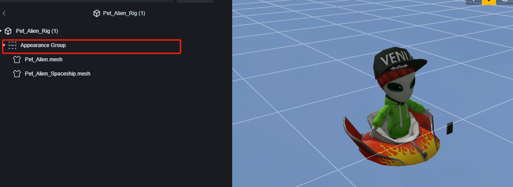
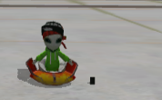

# AVATAR-User Manual

# Appearance Group

The Appearance Group is a concept for categorizing and managing the appearance meshes in a model.

Add a model with a skeleton as a prefab to enter appearance editing:

In the Appearance Group settings, you can set this group as part of a mutually exclusive set:

Appearance groups set in the same exclusive group will not display simultaneously, facilitating operations like skin switching.

Within an appearance group, parts are based on meshes. The number of meshes a model has is determined during its creation.

In the mesh settings, you can modify its binding points and methods with the skeleton, as well as adjust rendering methods:

You can add new meshes to the model by creating a new appearance:

You can select existing mesh resources within the project:

If the new mesh does not match the original skeleton, choose "Connect" as the binding method:

# Using Appearance Groups

Scripts can control the visibility or switch of specified appearance groups.

> Switching appearance groups will hide the original group and display the new one.

The alien pet has two meshes: the alien body and the UFO:

We can create a new appearance group to separate them:

By default, we hide the UFO and display it after the game round starts:

> Global Script

During the game preparation phase, only the alien is visible:

After the round starts, the UFO appears:

By flexibly using scripts to control appearance groups, you can switch part displays, change skins, transform, and more under specific conditions.
