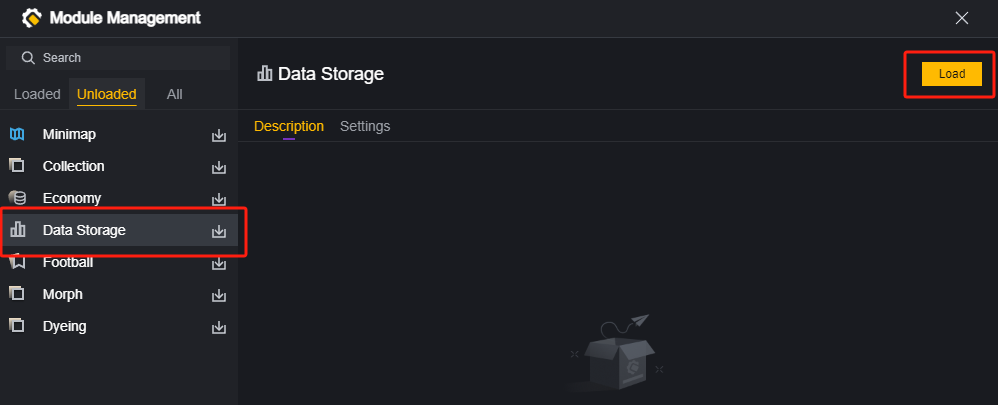
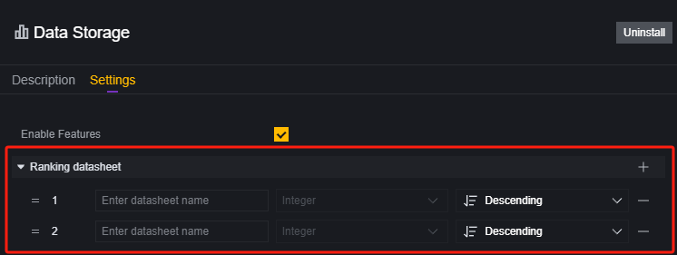
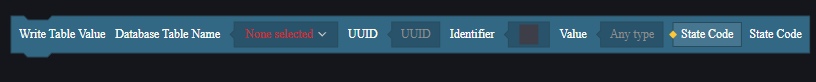
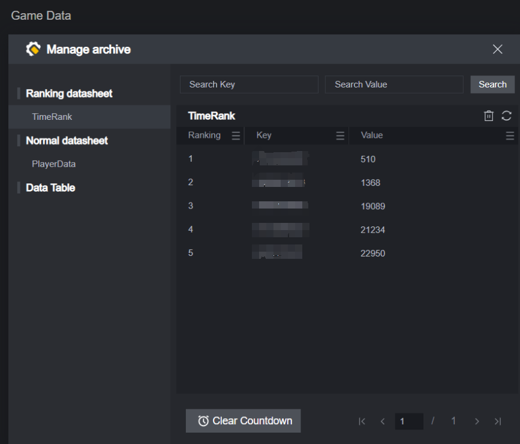
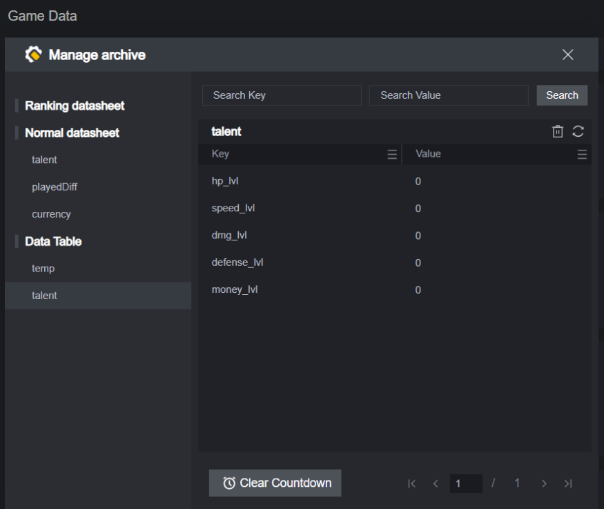
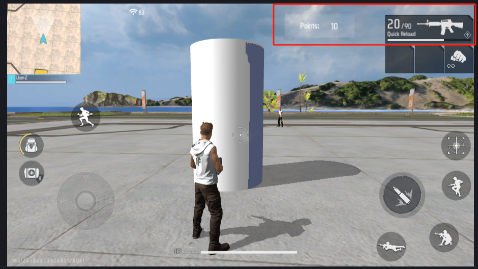
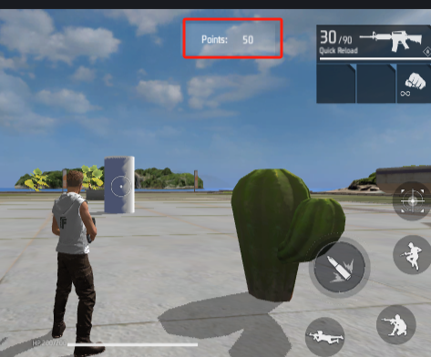

# Data Storage - User Manual

Data storage allows for saving data outside the game process and can be used for features like save files, leaderboards, statistics, and storing game settings.

The purpose of data storage is to enable data sharing between different sessions on the same map.

## Loading the Data Storage Module

To use data storage, you need to load the data storage module first. This is an optional module, and uninstalling it will render previously used related elements, code, and configurations invalid.

## Categories

After loading the data storage module, you will see three configurations: leaderboard data storage, statistics data storage, and regular data storage.

The tables created by data storage are not directly viewable, but this document will provide a description of the table format.

### Regular Data Storage

#### Parameter Description

Add parameters in regular data storage; each parameter represents a data table with the following configurable items:

**Table Name**: The name of the created table.

**Data Type**: The type of data accepted by the table.

Each data table accepts only one type of input.

#### Table Format

DataSheetName

| UUID | Key  | Value |
| ---- | ---- | ----- |
|      |      |       |

**DataSheetName**: The table name added in the data storage module.

**UUID**: The player's unique ID. When writing data, you need to enter the current player's UUID.

**Key**: The index created by the script during a data storage operation.

**Value**: The value entered by the script during a data storage operation, only accepting types set within the data storage module.

#### Use Cases

Used for player save files.

Used in other scenarios where this table's data can be utilized.

### Leaderboard Data Storage

#### Parameter Description

Similar to regular data storage structure, but leaderboard data storage only accepts Int type input and provides an additional sorting feature. The table will be sorted according to your configured sorting method.

**Table Name**: The name of the created table.

**Sorting Method**: Choose whether to sort input Int values in ascending or descending order.

#### Table Format

**DataSheetName**

| Ranking | Key  | Value (Only Int) |
| ------- | ---- | ---------------- |
| 1       |      |                  |
| 2       |      |                  |
| 3       |      |                  |

Leaderboard data storage does not have a UUID but supports custom keys, and values only accept Int type input. The entire table will be sorted based on the values in this column.

#### Use Cases

Player leaderboards, such as kill rankings, score rankings, speedrun rankings.

### Statistics Data Storage

#### Parameter Description

Similar to regular data storage structure, but statistics data storage also only accepts Int type input and requires preset keys.

**Table Name**: The name of the created table.

**Key Management**: Preset key list.

#### Table Format

DataSheetName

| **Key**  | **Value (Only Int)** |
| -------- | -------------------- |
| **KEY1** |                      |
| **KEY2** |                      |

Statistics data storage does not have a UUID; all information with the same key is stored under one entry.

**Key**: Preset index.

**Value**: Value, only accepting Int type data.

#### Use Cases

Server-wide statistics, such as total boss kills or total money spent.

## Usage Methods

### Add and Modify

Adding a piece of data to a data storage table and modifying it are done using write elements.

For leaderboard and statistics data storage, use the corresponding elements.

### Delete

To delete a piece of data, use delete elements.

Different types of data storage use different indexes for their operations.

Statistics data storage does not support deleting entire rows due to preset keys; only values corresponding to keys can be modified.

### Query

Querying data requires using read elements; different types of data storage use different indexes for their operations.

In leaderboard data storage, multiple rows can be retrieved at once based on ranking, with results returned as a list.

## Usage Limitations

Data storage has some usage limitations:

1. There is a limit on read/write operations per minute. You can read 60 times and write 75 times per minute. Try to minimize read/write frequency and check if operations succeed.
2. The maximum value size for one key is 4k.
3. Each leaderboard table can store up to 150 rows; any additional rows will not be recorded.
4. Statistics data storage supports creating up to 120 tables only.

## Data Center

If a published custom map has enabled data storage, you can view it in the Data Center:

Open the corresponding map's data storage to browse stored data:

In the Data Center, data is displayed in table format for easy viewing:

In leaderboard and statistics data storages, you can set periodic cleaning of the data:

In the Data Center, you can search leaderboard and statistics by entering Key or Value:

However, for regular tables, both UID and Key must be entered for queries:

Queries in the Data Center do not support fuzzy search.

You can also directly modify stored data in the Data Center:

## Example

Next, we'll demonstrate how to use data storage for player save files through a simple example.

We plan to create a simple mini-game where players earn 1 point each time they hit a target cylinder.

In save files, we will record player position, orientation, and score. When players re-enter this map, they will inherit their saved game state.

### Creating the Game

First, create a simple game:

Place a target cylinder in the scene with three decorative items for positioning:

Each time players hit this white cylinder, they earn 1 point. Their current score is displayed on a custom UI:

### Creating Save Files

In this example, we only store player position, orientation, and score.

The score is already set as a custom player attribute; all three pieces of information can be obtained from player entities.

Position and orientation are Vector3 types; score is an Int type. Avoid using multiple tables for player data as much as possible since each additional table increases read/write operations proportional to player count. To avoid exceeding usage limits, we store different types of information as an arbitrary type list in one save file table.

Choose regular data storage and set accepted value type as an arbitrary type list for storing save files.

> You could also use arbitrary types with three separate keys for storing information. However, since position and orientation are often used together here we store them as lists representing initial position/orientation info together with player scores.

In global scripts:

Save player state at end-of-rounds or upon exit:

Upon joining set player's score/position/orientation based on saved game state while displaying current scores via UI:

If reading fails due any reason handle failure by logging error message here:

Run game using two debug clients:

After earning points exit then re-enter game notice player's score/position remain unchanged from before exiting session ends naturally saves progress ensuring consistency between sessions without losing progress made previously!

## Local Data Storage Viewing

Data storage applies to published maps and is typically viewable only in the data center.

However, we provide a developer tool for local testing:

After your project uses data storage and data has been stored, clicking this option will open the local file browser, where a generated .json file will be available:

If data storage is not used or no data has been stored, a prompt will indicate that the file does not exist:

This .json file is exported from data storage and can be used to verify the stored data:

> Part of the player's saved game data stored in the above example

The data in this .json file serves as the data source during local debugging. Legally modifying the .json file will directly change the data read by the in-game data storage:

