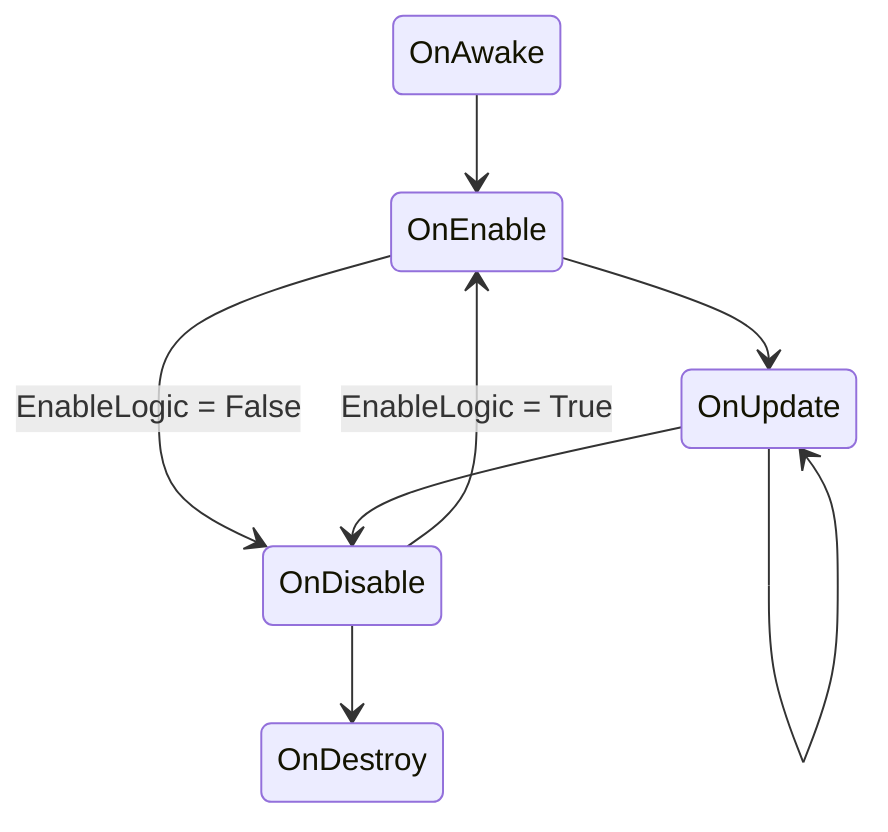
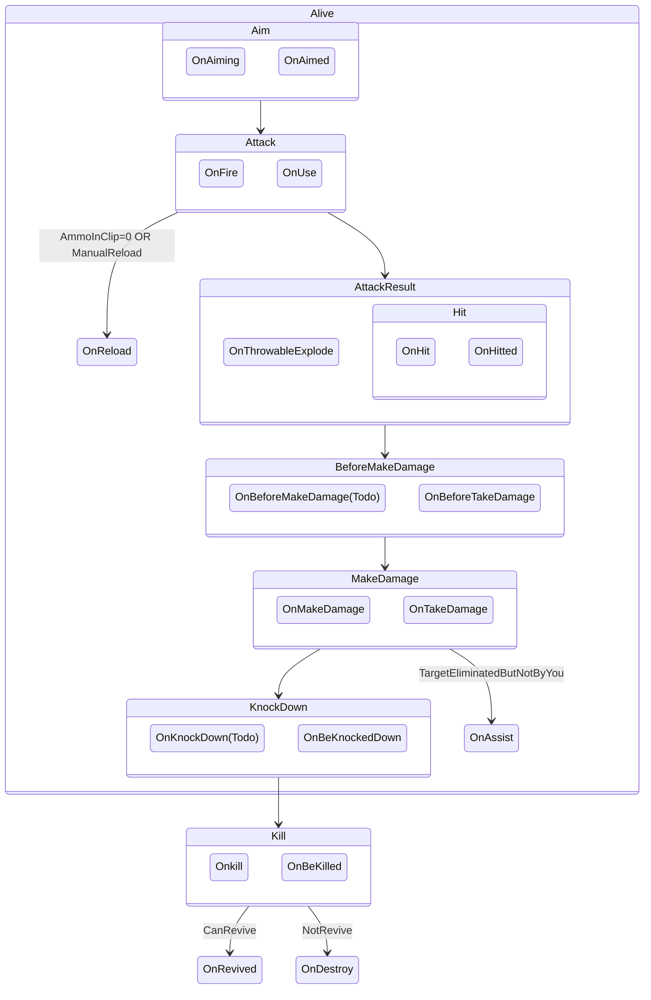
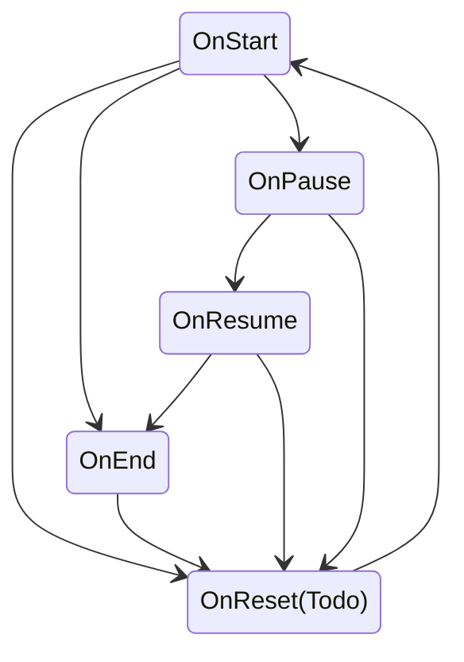
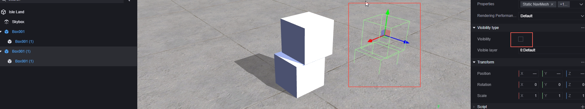

# Key Concepts - User Manual

## Modules

A module is a functional unit with a logical loop, encapsulating internal complexities while providing a simple interface externally. Generally, a module includes related configurations, assets, functions, etc. Once loaded, it allows you to set game-related elements.

You can open the Module Manager in the editor at the top position:

1. You can search all modules.

> The search covers all modules, regardless of whether they are loaded or belong to the currently selected category; you can directly search for the corresponding module.

2. Module categories are divided into Loaded, Unloaded, and All.

3. The module list displays all modules under the category. Click on a module to view its configuration.

### Loading and Unloading Modules

By default, we have already loaded several modules for you. Modules under the Unloaded category are optional.

#### Loading Modules

The icon behind a module indicates that it is not yet loaded. Click this icon to load the module.

You can also load it via the Load button in the module configuration interface.

#### Unloading Modules

For modules that can be unloaded, there will be an Unload button in their configuration interface. Click to unload.

Some modules are essential and cannot be unloaded; only their configurations can be changed. These modules do not have an Unload button.

> Operations on loading/unloading modules will not immediately reflect in the category display; loaded modules may appear in the Unloaded category. Refreshing the category tab will update it.

### Module Configuration

For unloaded modules, there is only one available action: Load. Loaded modules can be specifically configured.

After selecting a loaded module, you can view its description and specific configuration items.

For important module configurations, please refer to the corresponding manual articles.

## Entities

Entities are one of the key concepts of UGC. An entity is a concrete/abstract concept or a collection of concepts. Entities have attributes, and modifying these attributes affects instances created from the entity. The concept of entities is very broad; most concepts in this game exist as entities.

Take "Player" as an example: the "Player" entity refers to this concrete concept, with health points as an attribute of the player entity. Specific players A and B in a game session are two instances of the player entity. Both players A and B have the health attribute of the player entity; however, player A has 150 health points while player B has 200 health points. Health points are an attribute of the entity; 150 and 200 health points are attributes of instances.

Besides tangible entities like players, vehicles, and weapons, there are also abstract entities that cannot be directly visualized, such as Global and Game Flow. Abstract entities also have attributes and create instances. For example, Game Flow is an abstract entity with Preparation Phase Duration as one of its attributes. Suppose two games were played; each game creates an instance of Game Flow. The first game's preparation phase duration is 5 seconds, while the second game's is 10 seconds. The 5-second and 10-second preparation phase durations are instance attributes of the Game Flow entity.

In most cases, when referring to entities in-game, it actually means instances of entities—for example, deleting an entity, obtaining an entity's attribute, or modifying an entity's attribute. The actual objects being operated on are instances of entities. In this text and other articles, unless necessary, we will not specifically distinguish between entity instances and entities.

### Entity Lifecycle

As mentioned above, lifecycles actually apply to instances of entities. A lifecycle means that from creation to destruction, an entity always goes through specific processes. By mastering how to edit an entity's lifecycle, you can operate on it at specific times to achieve design goals. All entities start life with Awake and end with Destroy. Most entities go through Enable after Awake and use Disable before destruction.

> There may be entities that skip the enable or disable stages, but awake and destroy always exist.

**General Process**

Before Awake, all initial values for attributes are ready, and corresponding bridge entities have been created.

Below is part of some entities' lifecycle update sections for reference:

**Combat Unit Process**

**Playable Process**

## Scene Objects, Prefabs, and Components

In the editor, you can arrange various objects in the scene. These can be purely decorative, triggers, generators, etc. You can also customize objects by modifying their components and attributes.

We provide several categories of preset objects in the editor, which can be configured by dragging them into the scene.

Take the basic object cube as an example; we configure two cubes in the scene.

Configured objects are managed on the hierarchy page.

Components define the behavior of objects. Some components must be loaded onto corresponding objects, while others are optional. We provide default component configurations for objects, which you can modify as needed.

Using the aforementioned cube as an example, select any cube to see that several components are already configured by default in the inspector panel.

You can edit which components are configured by using the add component button.

1. Setting components will sync settings across all entities that have this component loaded.

2. Components that are already loaded.

3. Optional components; selecting loads them, deselecting unloads them.

Prefabs are templates for objects. Using prefabs allows you to modify all objects configured from a prefab simultaneously.

Drag an object from the scene into the asset bar to create a prefab.

1. Create a prefab folder—this step is optional but recommended for easier file management.

2. Edit the object you want as a prefab, such as stacking two cubes and establishing a hierarchy to merge them into one unit.

   

3. Drag the modified object from the hierarchy interface into the created prefabs folder.

   

   

   > The same object can create multiple prefabs, but only the latest created prefab will serve as that object's prefab.

4. Objects with prefabs will be marked in blue in the hierarchy.

   

5. Drag a prefab from the asset file into the scene to create an identical object.

   

6. Editing a prefab will sync changes to all objects created from it. You can quickly edit by clicking on the prefab in the inspector window or enter detailed editing mode by double-clicking it.

   

   Here, only the visibility of the main object is turned off because quick operations only edit the cube serving as the parent object in the structure. Double-clicking on a prefab allows for complex editing in detailed mode.

   

   Once in detailed mode, you can edit all structures of a prefab.

7. Editing an object won't affect its prefab or other objects sharing that prefab.

   

8. Deleting a prefab won't affect already created objects, but objects created from it will be marked in red in the hierarchy window.

   

## Assets

Assets are files used to create game content within a project. Resources must be of types supported by the editor. They can be created within or imported from outside the editor and exported for use as assets in other projects.

Assets can be verified in the project interface; only content under the Assets folder supports customization.

### Supported Asset Types

| Asset Type      | Description                                                                 | Operation Guide           |
| --------------- | --------------------------------------------------------------------------- | ------------------------- |
| Material File   | Materials change an object's appearance and are always used through shaders.| [Link Needed]             |
| Physical Material| Physical materials alter an object's physical properties like elasticity and friction.| [Link Needed]             |
| Scene File      | Scenes are interfaces for crafting game content, containing all or part of game resources. Complex games may require multiple scenes.| [Link Needed]             |
| UI File         | UIs are interfaces for user interaction or information display.             | [Link Needed]             |
| Player Data     | Player data customizes player characters, including appearance and actions.| [Link Needed]             |
| Animation Controller | Animation controllers allow you to arrange and manage animation transitions for characters or objects.| [Link Needed]             |
| Behavior Tree File | Behavior tree files set behaviors for characters or objects.              | [Link Needed] - Completed |
| Script Related  | Scripts can be written using nodes or code to add custom logic to games.    | [Link Needed]             |
