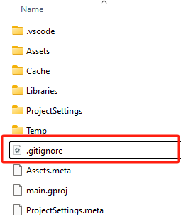
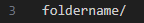

# Workflow Management - Gitignore User Manual

## Introduction

Git is an open-source distributed version control system that efficiently and swiftly handles version management for projects ranging from very small to very large. This document is primarily aimed at users already using Git for version management, introducing them to the gitignore feature and the official gitignore configuration.

### What is gitignore

In a project directory, not all files need to be synchronized to the remote repository, such as personal preference configurations and temporary files. Using gitignore allows you to mark files that Git should not track, preventing excessive synchronization and overwriting collaborators' personal settings, thus enhancing the efficiency of project version management.

## .gitignore File

.gitignore is a special plain text configuration file that contains all the files or folders in a project that need to be ignored. Files or folders configured in the .gitignore file will be ignored and not tracked by Git.

We create this file by default in every project and have already configured recommended files and folders to ignore.

You can find this file in your project:



If you are using a Linux system, you need to use the -a flag with the ls command to display hidden files:

```default
ls -a
```

The default configuration of this file is:

```default
.vscode/
Cache/
Libraries/
Temp/
*.lock
```

Where:

Folder name + "/" indicates ignoring all files under that folder, "*" + file extension indicates ignoring all files with that extension.

.vscode/: This is the configuration folder for VS Code.

Cache/: This is the cache folder.

Libraries/: This is the non-editable official library folder.

Temp/: This is the temporary folder containing runtime logs and other content.

*.lock: These are all locked files.

The above are the officially recommended files for Git to ignore.

## .gitignore File Editing Rules

Generally speaking, you do not need to edit the .gitignore file. However, if there are additional files you want to ignore or add as tracked, you can refer to this section. Note that the gitignore file itself needs to be synchronized to the remote repository, so any changes will affect all collaborators in the corresponding repository.

### Comments

Lines starting with # are comments.


### Ignoring Files and Directories

Entering a string alone will ignore directories and files with the same name:


> Generally, files have extensions, distinguishing them from directory names.

### Ignoring Directories Only



Ignore all files under directories with this name, including same-named directories at multiple levels, e.g., */foldername/

### Using Wildcards

1. Asterisk "*", matches multiple characters. \*.test means ignoring all files ending with .test.
2. Question mark "?", matches any single character except "/". t?st means ignoring all four-character names where the 1st, 3rd, and 4th characters are t, s, t for both files or directories.
3. Square brackets "[]", match any character within the brackets. *.[abc] means all files ending with .a, .b, or .c will be ignored.
   Using a hyphen within square brackets indicates matching characters within a range; [0-9] matches numbers from 0 to 9 sequentially.

### Reversal Operation

Using "!" can add previously ignored files back to the tracking list.


> The filename under foldername will be tracked again.

### Other Rules

1. Each line in a .gitignore file is a matching pattern; blank lines do not match any files.
2. Git tracks files, not directories.
3. If a file is already tracked by Git, it will not be ignored even if added to the .gitignore file.

If you have further needs, you can refer to the gitignore and Git usage guides yourself.
