# Code Script - User Manual

Introduction to Editing Code Scripts

## Concept Overview

### Server Scripts and Client Scripts

Scripts running on different platforms have varying events and interfaces. You can confirm the applicability of an element by querying the library.

Server scripts and client scripts cannot directly call each other; they can only notify the other side through events.

The script file extension is .fcg

### Library

The library file extension is .fcc

After creating a code script, the standard library is automatically added:


Standard library files:


The [platform_server] tag indicates that the element is applicable to the server platform, and only server scripts can use this element.

The [platform_Client] tag indicates that the element is applicable to the client platform, and only client scripts can use this element.

Elements without tags can be used by both server and client.

The [deprecated] tag indicates that the element has been deprecated; please do not use these elements.

Official library files are stored at the editor path: \Craftland Studio\resources\LocalData\Utilities\UGCLanguage\release and can be referenced as needed.

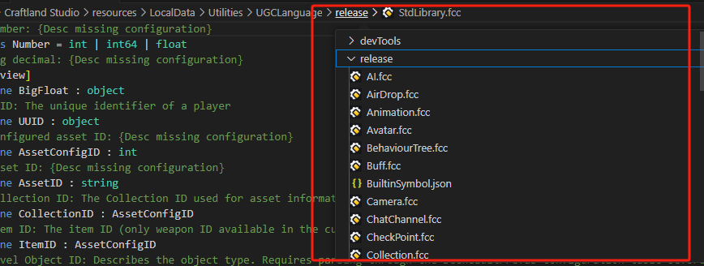

Open any code script that references a library, hold down the Ctrl key, and click on the library to jump directly to it.


> The release path stores official library files.

To use a library, you need to reference it at the top of the file with the syntax:

import "library file" as alias

For official library files and newly created custom library files in the editor, you do not need to add a path.


> EditorGenlib.fcc stores registered assets, mainly used for referencing element scripts.

Player-customized libraries are supported. Please refer to the section on custom libraries below.

## Environment Setup

### VS Code Plugin

#### Installing the Plugin

The plugin has been released on the VS Code marketplace. Search for Free Fire Craftland Code or related keywords in VS Code's plugin section:


Click install to proceed.

Once installed, you will find a plugin named `FFUGCLanguage` in the list of installed plugins. Open a code script file with VS Code, and if you see syntax highlighting working, it means the plugin was successfully installed.


#### Key Features Overview

For detailed information about the plugin, refer to its description in VS Code. Here are some key features:

1. **Code Snippet Completion**: When entering complex code snippets like Bezier curves or vectors, simply inputting keywords will trigger code snippet completion.

   

   

   

   

   

   

   Auto-completion marked with this icon indicates code snippet completion from the plugin.

   

   

   > The first if completion in the image is VS's built-in keyword completion; the second to fourth are three different code snippet completions defined in the plugin.

2. **Intelligent Suggestions and Completion**: Automatically completes variables that have appeared in context, event and API names, suggests function parameters and return values when calling functions, and automatically references libraries when using events or APIs from unreferenced libraries.

   

   

   

3. **Diagnostics**: Code with syntax and semantic errors is highlighted in red.

   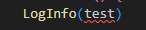

   Hovering over errors displays error messages:

   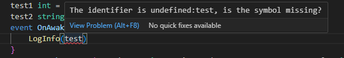

   Should be:

   

4. **Hover Information**: Hovering over interesting code shows detailed information.

   

5. **Go to Definition**: Use F12 or right-click on code to jump to its definition location.

   

   

## Script Structure

Below is an overview of a code script structure. A code script file contains three parts:

- Script Members
  - Variable Definitions
  - Function Definitions
  - Event Definitions

In other words, a script's primary members can only be one of these three types.

```golang
graph ScriptName {
    ScriptVariableName Type = InitialValue

    func FunctionName(ParameterList - optional) {
        //do sth...
    }

    event ListenEventName() {
        //do sth...
    }
}
```

We introduce a concept called `code block`, which refers to code content enclosed by curly braces `{...}`.

For example, writing an expression like a log print call directly as a primary member of a script is incorrect, but it can be written inside a function or event's code block:

```golang
graph Demo {
    //LogInfo("Hello") //This is an incorrect position

    func Hello() {
        LogInfo("Hello") //Can be written inside a function or event's code block
    }

    event OnAwake() {
        LogInfo("Hello") //Can be written inside a function or event's code block
    }
}
```

## Editing Related

### Basic Syntax

For the basic syntax of code scripts, refer to the corresponding section in the link below for detailed information:

[Script Additional Notes - User Manual.md](./脚本附加说明-用户手册.md)

### Data Types

For the data types of code scripts, refer to the corresponding section in the link below for detailed information:

[Script Additional Notes - User Manual.md](./脚本附加说明-用户手册.md)

### Operators

Operators are used to perform mathematical or logical operations during program execution.

Built-in operators include:

- Arithmetic operators
- Relational operators
- Logical operators
- Assignment operators
- Other operators

For the operators of code scripts, refer to the corresponding section in the link below for detailed information:

[Script Additional Notes - User Manual.md](./脚本附加说明-用户手册.md)

### Control Flow

The default execution order of code lines is sequential from top to bottom. To achieve more complex control flow, we need to introduce control flow statements.

For the control flow of code scripts, refer to the corresponding section in the link below for detailed information:

[Script Additional Notes - User Manual.md](./脚本附加说明-用户手册.md)

### Variables

Variables need to be declared in the code before use, i.e., creating the variable. There are several types of variables:

#### Local Variables

The general form for declaring local variables is using the `var` keyword. The type can be automatically inferred by the compiler if there is an assignment statement on the right; otherwise, it should be explicitly declared.

The scope of a local variable is from its declaration position to the end of its containing block.

```go
func Demo() int {
    // Complete statement
    // var value int = 10
    // Omit type declaration
    // var value = 10
    // Omit right-side assignment
    var value int
    value = 10 // ok
    if value == 10 {
        var localVar = 20
        value = localVar // ok
    }
    value = localVar // not ok
    return value
}
```

#### Script Variables

The scope of script variables is the current script. Script variables can also be accessed in other scripts through entity instances.

```go
graph HelloWorldGraph {
    SayTipWords string = "Hello, " // Script variable
    
    func SayHello(name string) {
        std.PrintString(SayTipWords + name)
    }
    
    event OnAwake() {
        start SayHello("FF_UGC")
    }
}
```

#### Component Properties

The scope of component properties is the current component. Component properties are public data and can be accessed in any script through entity instances.

```go
graph EntityDataStore {
    func EntityPropModify(input int) int {
        thisEntity.EcoKillMoney = input
        return thisEntity.EcoKillMoney
    }

    func EntityPropModifyV2(input int) int {
        thisEntity<std.Global>.EcoKillMoney = input
        return thisEntity<std.Global>.EcoKillMoney
    }
}
```

#### Value Types and Reference Types

Basic types like bool, int, float, string, Vector2, Vector3, and Quaternion are value types. Value types cannot be nil and always have a value. When assigning value types, a copy of the value is made.

List<T>, Map<T>, entity<T> are reference types and their values can be nil. When assigning reference types, only their address is changed; changing content at that address will affect all variables pointing to it.

### Functions

A function is a block of statements organized together to perform a specific task. To use a function, you need to:

- Define the function
- Call the function

#### Defining Functions

When defining a function, you declare its related elements. The basic structure is as follows:

```golang
func FunctionName(paramName paramType, ...) returnType {

}
```

Here’s a simple example:

```golang
func TryAddExp(player entity<Player>, exp int) bool {
    //...
    return false
}
```

#### Calling Functions

You can call a function using its name. Here’s a simple example:

```golang
event OnAwake() {
    //...
    // Call user-defined function in current script
    var isSuc = TryAddExp(curPlayer, 15)
    // Standard library call
    LogInfo(Format("AddExp %v:%v", List<object>{curPlayer, isSuc}))
}
```

#### Synchronous and Asynchronous Functions

Synchronous functions are executed and return immediately, with no asynchronous processes in between.

Asynchronous functions use APIs that involve asynchronous waiting, such as `WaitForSeconds`.

In terms of syntax, asynchronous functions must be declared with the `async` keyword:

```golang
async func ShowGameTime(){
    while(thisEntity<Global>.GameTimeMs < 10000){
        LogInfo("GameTime:" + thisEntity<Global>.GameTimeMs)
        WaitForSeconds(1000)
    }
}
```

##### Calling Asynchronous Functions

When calling asynchronous functions, we can choose the execution method:

- start
  - Calls the asynchronous function without blocking, continues to the next line
- wait
  - Calls the asynchronous function, blocks until it finishes, then proceeds to the next line

By default, the wait method is used, which waits for the asynchronous function to execute.

```golang
event OnAwake() {
    LogInfo("1")
    start TryAddExp(curPlayer, 15)
    LogInfo("2")
    wait TryAddExp(curPlayer, 15)
    LogInfo("3")
}
```

##### Infectious Nature of Asynchronous Functions

If an asynchronous function is called within a custom function using the `wait` method, then that custom function must also be declared as `async`:

```golang
async func ShowGameTime(){
    while(thisEntity<Global>.GameTimeMs < 10000){
        LogInfo("GameTime:" + thisEntity<Global>.GameTimeMs)
        //async API
        WaitForSeconds(1000)
    }
}

async func Start() {
    //waited for an async function
    wait ShowGameTime()
    LogInfo("Show End!")
}
```

#### Output Parameters

The return statement can be used to return a single value from a function. However, out can be used to return multiple values from a function. Output parameters assign the data output by the function to themselves.

The basic form is as follows:

```
out var parameterName
```

Here is an example:

```golang
import "StdLibrary.fcc" as std
import "List.fcc" as list
import "EconomyModule.fcc" as economy

graph APIOutParam {
    func CreateWallet() int {
        NewWalletForEntity(nil, thisEntity, out var walletEntity)
        IncreaseMoneyForWallet(walletEntity, MoneyType.Basic, 1)
        return Length(walletEntity<Wallet>.Content)
    }
}
```

Output parameters must be explicitly declared as out when defined and called. Essentially, they define a local variable at the call site and assign a value to this local variable within the function.

### Custom Libraries

Users can create custom library files by creating a new library file when scripting in assets.


Custom libraries support custom events, components, types, and enums.

#### Custom Events

Register necessary events in the library:


Event logic needs to be written in code scripts. Scripts containing event logic must ensure execution when used.


> DispatchEvent is an interface for custom events. When an event is activated, it can send a custom event signal to the library. Calling events in the custom library will receive this signal and trigger event logic.

#### Custom Components

Refer to standard library definitions for components:

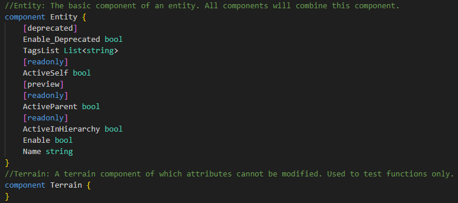

Abstract components:


When defining components, you can also define their properties.

#### Extending Official Component Properties

Use the partial keyword to extend properties of official components:


#### Custom Enums


### Import Script

You can import library files and code scripts.

Library files contain type definitions, component definitions, event definitions, API definitions, script declarations, etc.

Script files include script property definitions, event handler functions, custom functions, and more.

The import method is as follows:

```golang
import "file path" as alias
```

Below is an example of importing standard and custom library files:

```golang
import "StdLibrary.fcc" as std
import "./MyEditorGenLib.fcc" as gen
```

- When the file path is a filename, it will be searched in the standard libraries included by the compiler.
- When the file path is a file path, it will be searched according to the file path.

### Import Graph Script

Graph scripts are stored in the EditorGenLib library with each file as a graph. To reference graph scripts, note:

1. When a graph script is non-static, you need to specify the entity on which the script is mounted when using it.

   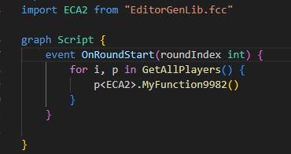

   > ECA2 is a graph script mounted on a player entity with a member MyFunction9982.

2. Graph script names cannot be reserved keywords.

If the graph script name is a keyword, you must change the script using the following method before referencing it smoothly:

Right-click on the graph script and select "Modify Script Name" to change it. This operation will not affect the displayed filename but simply changes the script name used in code.

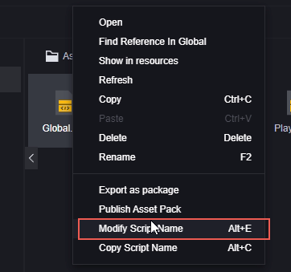


> Keywords cannot be used as user-defined identifiers, not limited to custom graph script names.

For eligible graph scripts, you can use the following statements:

```golang
import scriptName from "EditorGenLib.fcc"

//or

import scriptName as alias from "EditorGenLib.fcc"
```

You can view the script names and path information by accessing the EditorGenLib.fcc library file.


Below is an example of importing:

```golang
import Global1 as GLB from "EditorGenLib.fcc"
```

### Access Assets

Although scripts can use constants or literals to specify asset IDs, this approach has poor maintainability and can easily cause issues. Therefore, accessing assets in scripts requires asset registration.

#### Asset Registration

In the FE editor, click Tools - Script Tools - Script Asset Registration to open the asset registration menu:


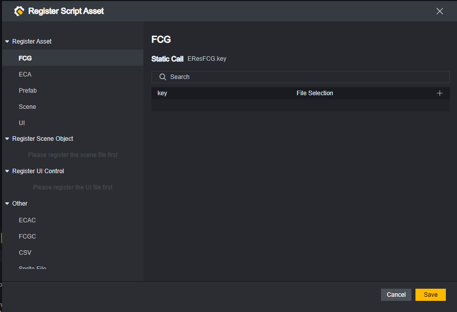

Select the asset category you want to register on the left, then click the plus sign to add a registered asset:

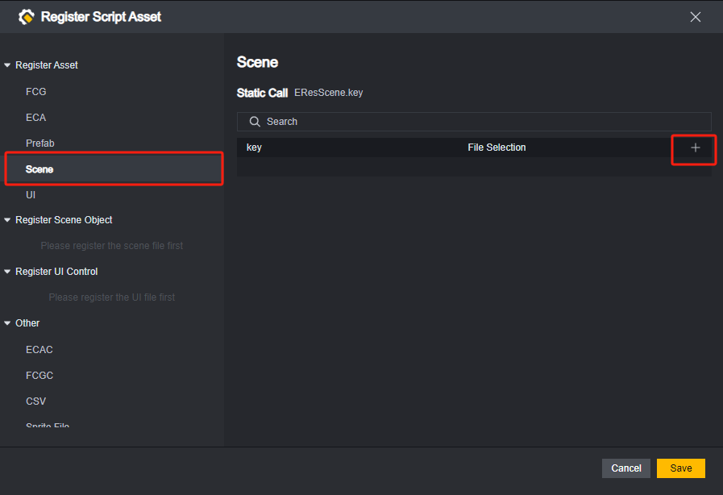


Enter a valid key name and select the corresponding asset.


Click the save button below to complete asset registration.


> For scenes and UI, special attention is needed.
> Scenes contain objects, UI contains widgets. You can register scenes/UI or their objects/widgets.
> However, registration has an order: ensure scene/UI files are registered first before registering their objects/widgets.

#### Static Invocation

Use static invocation syntax from the FE editor menu to call corresponding assets in scripts:


Assets called statically can be viewed in the enumeration section of EditorGenLib.fcc library.


#### Dynamic Invocation

Accessing assets based on enumeration is convenient but lacks flexibility: consider a scenario where an item's texture in-game is determined by a configuration CSV table. In this case, dynamic access to assets is needed.

In EditorGenLib.fcc, a special Res graph will be generated. Its member variables collect maps of each asset type.


The map's value is the corresponding asset ID; thus, an enumeration EResKeyXXX will be generated based on asset types. Registered assets are filled into enumerations via auto-completion:


Using map-based access allows for dynamic asset access needs. For example, an asset key read from CSV can directly be used as a map index.

```go
var CSVKey string 
// ...
// Obtain key by reading CSV table
var MySceneID = Res.Scene[CSVKey]
```

### Compilation

Starting DEBUG or saving a project will automatically compile it.

In VS Code, use shortcut Alt+B to manually compile the current file.

> This is a feature of Free Fire Craftland Code plugin

In FE editor, use shortcut Alt+B for manual compilation.

Compilation errors and information can be viewed in the console of corresponding software.


## Example

Demonstrate how to activate a code script with a simple example:

Customize a function in the element script to log "Start". Implement this custom function in the custom code script to run every time the player fires, and after logging "Start", deduct 25 current HP if the player's HP is above 25. If the player's HP is 25 or less, reduce it to 1.

> This is a pointless requirement setting, only used to demonstrate the use of code scripts.

First, implement the custom function in the element code. The function name is TestFunc. The script name is CustomFunc.


> Since the script file is named CustomFunc and not a reserved keyword, no additional modification to the script name is needed.

Set this element script file as a static script for future reference. If not set as a static script, you need to attach this script to an active entity in the game and use that entity when referencing.


Create a new code script. Since reducing HP requires communication with the server, configure it as a server script. Also, because each time a player fires is an event that needs to listen to player actions, choose to attach this script to the player entity.


Open Player.fcg for editing:

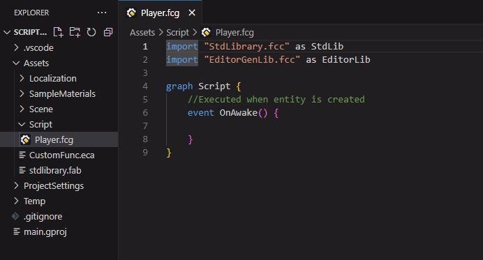

First, confirm that the event trigger is when the player fires, and try using VS Code auto-complete to select the corresponding event:


Auto-completing this event will automatically reference the Player library where this event resides:

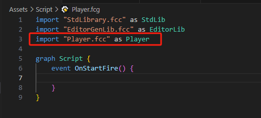

If you can't find the desired event through auto-complete or are unclear about it, you can directly open the corresponding module's library and search.

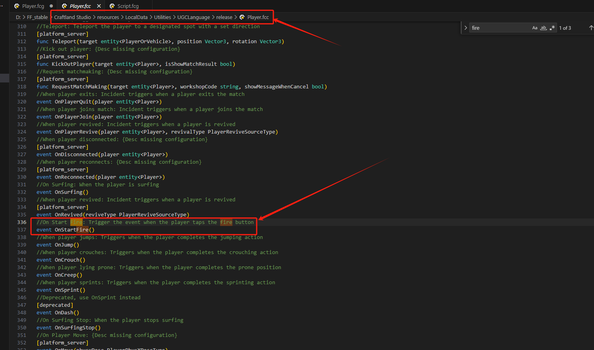

After the player fires, you need to first run the custom function: TestFunc(), which requires referencing CustomFunc.eca.


As a member of CustomFunc, TestFunc() can be quickly filled in using "alias.":


Reduce the current player's HP attribute by 25.


You need to check the player's current HP and set it to 1 if insufficient:


Due to script structure limitations, only functions, events, or variable definitions can exist under one level of structure.

So you need to wrap condition checks in a function.


You can also use the following code for quick processing of HP minus 25 logic:

```golang
thisEntity<Player>.HP -= 25
```

Run tests:


The performance meets expectations.

Below is the code for the code script:

```golang
import "StdLibrary.fcc" as StdLib
import "EditorGenLib.fcc" as EditorLib
import "Player.fcc" as Player
import CustomFunc as Custom from "EditorGenLib.fcc"

graph Script {
    func DmgWhenFire(){
        if thisEntity<Player>.HP>25 {
            thisEntity<Player>.HP = thisEntity<Player>.HP-25
            //thisEntity<Player>.HP -= 25
        }else {
            thisEntity<Player>.HP = 1
        }
    }
    event OnStartFire() {
        Custom.TestFunc()
        DmgWhenFire()
    }
}
```