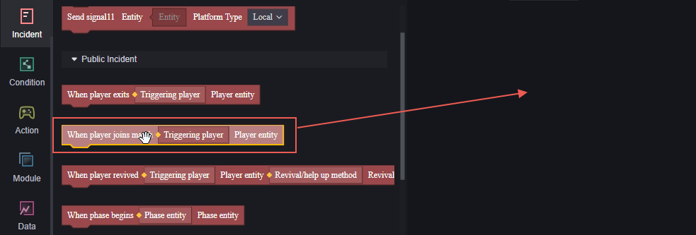
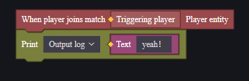
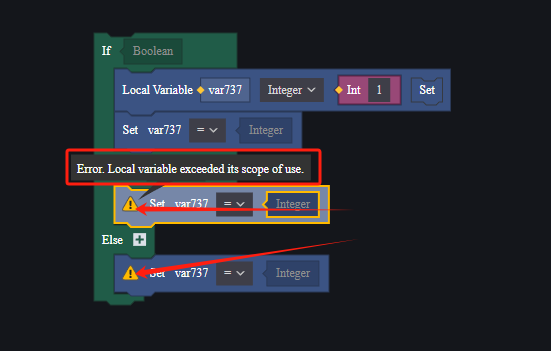
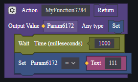
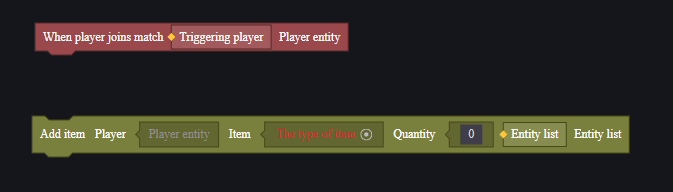
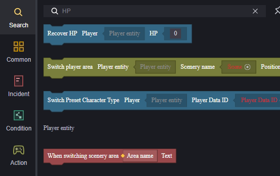

# Element Script - User Manual

This document introduces the editing methods for element scripts.

## Interface Description

1. Canvas, the main editing area
2. The file currently being edited
3. Node categories; clicking any node will expand the node selection interface
4. Property panel

## Node Category Description

The node categories corresponding to area 3 are:

1. Search: Nodes found by entering keywords.
2. Common: Nodes set as commonly used will appear here.
3. Event: Triggers when conditions are met, marking the start of logic.
4. Condition: Used for script flow control.
5. Action: Actual operations on entities/data.
6. Module: Actions specific to certain modules.
7. Data: Processing of data.
8. Variable: Use existing variables or add new ones.
9. Function: Use or create custom functions.
10. External Call: Invoke custom functions from other scripts.

## **Node Usage**

### Node Description

The protrusion below a node indicates that other nodes can be linked after it.

The indentation above a node indicates that other nodes can be linked before it, and it will only run after the preceding node runs.

If there is no indentation above but a protrusion below, it indicates the node is the starting point of a logic sequence, usually an event node.

If there are no protrusions or indentations above or below, it indicates the node is a piece of data that can be applied to other nodes.

Nodes come with input and output parameters:

**Input Parameters**:

Input parameters are blank by default, with the required parameter type indicated inside.

> The script name is also a required parameter, but it uses a resource selector, allowing you to directly select resources within the project without considering type matching.

**Output Parameters**:

Output parameters are colorful blocks by default; you can drag this block into the required input parameter box:

### Node Usage

After selecting the desired node from the category, click or drag it onto the canvas to use the corresponding node.

Using nodes with grooves on top allows you to connect two nodes together:

A set of nodes always follows a top-to-bottom logic:

For a series of connected nodes, necessary input parameters need suitable data to ensure the script works properly. Inappropriate variables will cause errors; clicking on the error with your mouse will display error information:

Dragging an element will also drag along elements below it:

Holding down the Ctrl key while dragging allows you to move only the current node, with lower nodes automatically connecting to the upper one:

## Flow Control

The default execution order for element scripts is top-to-bottom; you may often need flow control in code to achieve complex logic.

Please refer to the link below for detailed instructions on element script flow control:

[Script Additional Instructions - User Manual.md](./脚本附加说明-用户手册.md) 

## Variables

You can define or modify three types of variables:

1. Global Entity Properties: Attributes of global components, customizable. They can be accessed or modified in any script.
2. Script Variables: Variables used only within the current script; other scripts can access and modify them externally.
3. Local Variables: Variables used only within the current code block; they are invalid outside of it.

### Global Entity Properties

You can add global entity properties through entity component properties in component settings.

Once global entity properties are created, you can use "Get Global Node" to obtain these properties:

Use "Set Global Node" to set these properties:

### Script Variables

In the variable category, there's a button to create a variable:

Variables created this way are script variables, used for the current script's data processing.

In other scripts, you can access and set these variables through external references:

> Note when referencing externally in other scripts: You need to specify the entity where the referenced script is mounted when getting and setting.

### Local Variables

You can create variables available only within the current code block using local variable nodes:

You can rename the variable by double-clicking its name:

A code block refers to a continuous section of nodes. It's important to note that the "If-Else" nodes in the condition category are by default two code blocks. Each segment of If, Else, and Else If is an independent code block.

## Custom Functions and Usage

In node scripts, both functions with return values and those without are supported.

Functions with return values cannot link to other nodes when called; the call node itself is the return value.

Functions without return values can link to other nodes when called.

Wait: This node blocks when it's an asynchronous function, waiting for it to complete before executing the next node.

Execute: This node does not block when it's an asynchronous function, continuing to execute the next node.

Asynchronous functions use nodes that handle asynchronous processing within their implementation, like "Wait."

**Note**: Asynchronous nodes are not supported in functions with return values.

If you need a return value from an asynchronous function, use a function without a return value and utilize output variables.

Regardless of whether there is a return value, custom functions can use output variables below the call node to obtain outputs.

## Node Search and Common Use

Enter keywords to search for corresponding nodes.

Right-click a node in the node selection interface to set it as a common node, allowing quick access in the common node category.

## Example

Demonstrating script usage with a simple example:

Design as follows:

1. Each player receives an M4A1 upon joining the match.
2. Each time a player fires, they lose 1 health point.

**Create Script**:

Requirement 1 is global, while 2 targets each player individually. Therefore, scripts need to be mounted globally and on each player. Both item distribution and health deduction require server awareness, so both are created as server scripts.

**Edit Script**:

For 1, each player joining the match triggers item distribution once:

The item addition node requires three parameters: target for item addition, item to be added, and quantity of items added.

The target for item addition is the player triggering the event upon joining the match. The item is selected as M4A1 from the resource manager, with a quantity of 1.

For 2, each time firing occurs, health points need to be deducted once:

We find there isn't actually a node for health deduction:

> Entering negative numbers in the Restore Health node won't deduct health points

However, since health is a player attribute, it can be adjusted by setting attributes:

The Set Attribute node requires parameters for the entity whose attribute is being set, the attribute being set, its value, and operation type.

The entity whose attribute is being set is the current player; hence you can use this entity. Double-clicking this parameter position quickly fills it with this entity.

The attribute value needing change is current health; select current health.

The set value is current health minus 1, so you need to obtain current health.

Use subtraction from the data category to subtract one and fill in parameters:

You can also directly use operations in the Set Attribute node to achieve this logic:

Run debugging to view results:

> Everyone received an M4A1.

> Firing 8 times resulted in losing 8 health points.
>
> The firing trigger activates every time a firing command is executed. Continuous fire weapons count all shots before putting down as one firing event and only trigger this event once.
