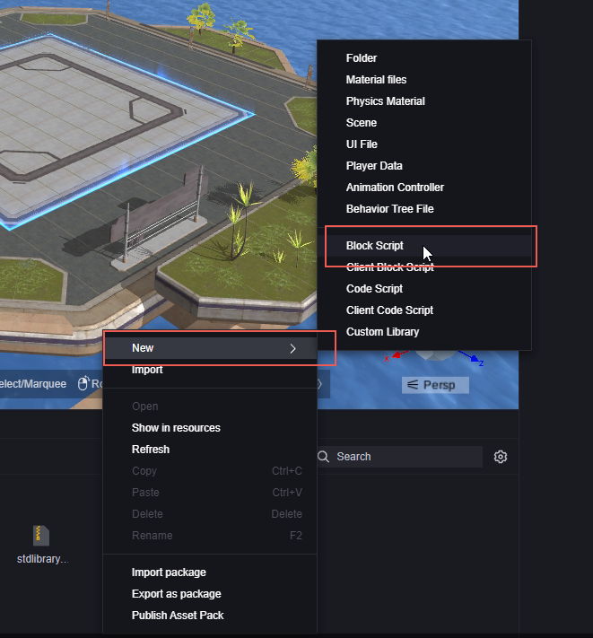
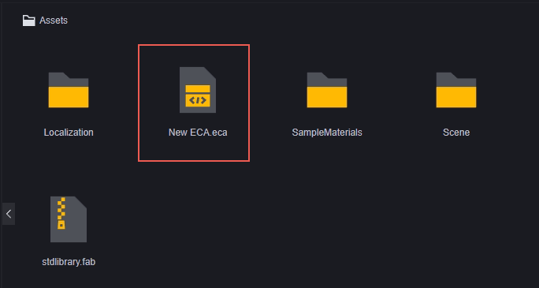
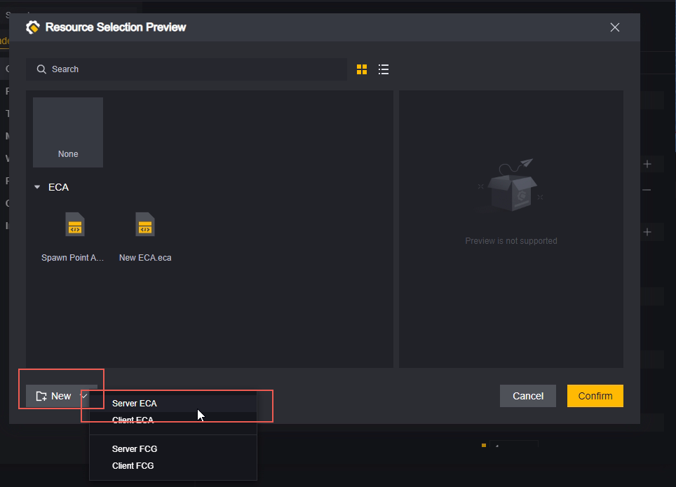
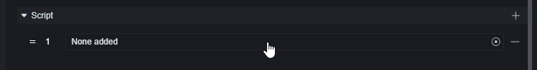
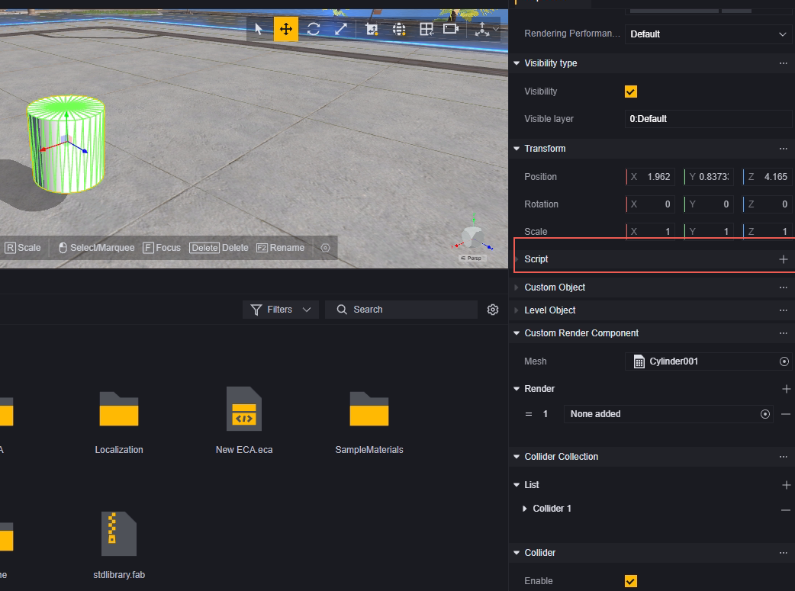
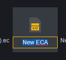

# Script - User Manual

Scripts are used to control the game process, operating on specific objects under appropriate conditions to achieve logic that cannot be easily accomplished with built-in objects.

## Distinction of Script Types

### Visual and Code Scripts

We offer two ways to edit scripts: Visual and Code.

Visual scripts use visual elements for script editing, making it more intuitive and easier to operate. However, complexity increases rapidly when writing complex logic, making maintenance difficult.

Code scripts use code for script editing, offering high flexibility and strong maintainability when handling complex logic.

### Server and Client Scripts

Regardless of visual or code, scripts need to distinguish the running platform: server and client.
Server scripts can only use server-supported events and interfaces, and the same applies to the client.

> Events that can only run on the server platform

### **Static Scripts**

Scripts can be configured as static scripts:

Static scripts always run under the global module.

Static scripts can also be mounted on other entities, but be cautious of conflicts with the logic on global entities.

> Mounting a static script New ECA.eca on a global entity will trigger internal events twice. (Not recommended)

> Configuring New ECA.eca on both Global and Player will trigger internal events once on each entity if supported.

## Creating Scripts

Right-click in the editable assets area to create a new script.

Select "Create New" when mounting a script:

Scripts created this way will automatically mount on the corresponding entity and be named after the current entity.

When creating a script, you need to choose/configure the script type:

1. Server or client script, which affects the events and interfaces available for use.
2. Visual or code script, which affects the editing method.

## Editing Scripts

Double-click the script file to open it for editing. For editing visual and code scripts, please refer to the following documents:

[Visual Script - User Manual.md](Visual Script - User Manual.md) 

[Code Script - User Manual.md](Code Script - User Manual.md) 

## Mounting Scripts

**Mounting on Modules**:

**Mounting on Objects**:

Select the object you want to add a script to, then choose "Add Script" in its inspector panel:

You can choose an existing script or create a new one.

**Adding Scripts via Scripts**:

We provide an interface for mounting scripts on entities:

Add a script:

We recommend using the "Check if Script Exists" interface before adding a script to confirm whether the entity already has the same script.

## Unmounting Scripts

To statically unmount scripts before game launch, simply find the mounting location and click the minus sign:

To dynamically unmount scripts after game launch, use the "Delete Script" interface:

Similarly, we recommend confirming that the entity indeed has the script you want to delete before proceeding:

## Managing Script Files

When creating a new script while adding one, an ECA folder will automatically be created under Assets to store new scripts:

> We also recommend using folders for categorizing created scripts

### Deleting

Use the Delete shortcut key or right-click on assets to delete scripts:

Entities that have this script mounted will show a yellow exclamation error:

### Copying

Use Ctrl+C, Ctrl+V shortcuts or right-click menu to copy scripts. The copied script name will be the original name plus (X), where X is copy number -1.

### Renaming

Use F2 shortcut key or right-click menu to rename scripts.

Scripts cannot have duplicate names; if you attempt to rename with an existing name, an error will occur and cancel the renaming:

