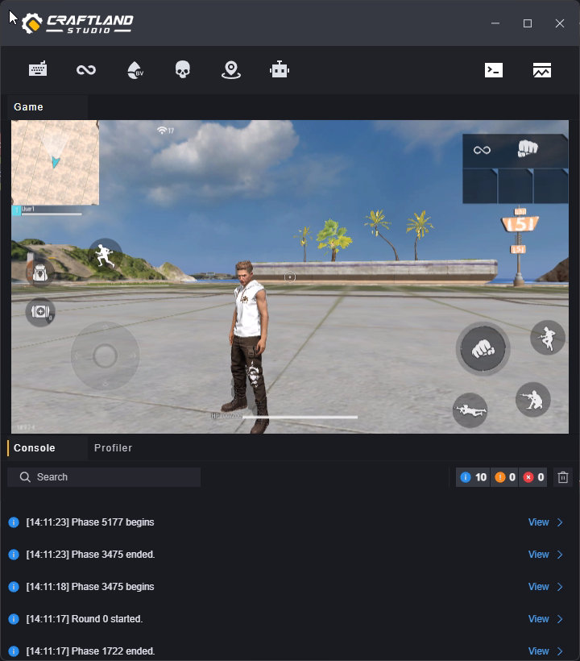
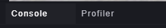
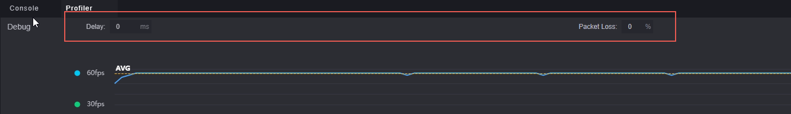
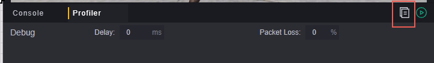
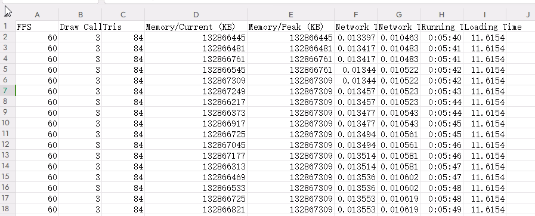

# Debugging

Debugging is a way to intuitively view game content and confirm if its performance meets expectations. Using debugging will open at least one game process, allowing you to check if the game is running as expected.

The entire project is automatically saved when debugging is used.

## Debugging Entry

You can debug from the top of the project editing interface.

## Settings

Click the button on the right to configure debugging settings.

### Multi-client Debugging

Click the client area to choose how many clients to start this debugging session with. Multi-client debugging helps test interactions between different players in multiplayer games.

Supports up to eight clients simultaneously.

> Multi-client debugging may put performance stress on your device.

If debugging has already started, this button will change to add new clients.

You can add up to eight clients for simultaneous debugging. After adding new clients, the topmost client will update to show the current number of open clients, and the number of additional clients you can add will decrease accordingly. As shown in the image above, adding three clients will change it to:

Newly added clients are considered players joining mid-session. This may affect your design validation for players joining mid-game.

Closing a debug window is considered as the corresponding player exiting mid-session. The current and additional client numbers will also change. When the last debug window is closed, this debugging session ends.

Clicking the stop button on the project editor will close all open debug windows, ending this debugging session.

### Debugging Settings

Click the menu key on the far right of debugging to open the debug menu.

#### Launch Language

The launch language determines the language displayed in your debug window.

#### Teaming

---------------------------------To be clarified--------------------------------------------

#### Debugging Tools

##### Strict Mode

In strict mode, if an error occurs in the process, it will exit debug mode. This helps pinpoint issues more accurately.

##### Debug Mode

Breakpoints only take effect in Debug mode.

Breakpoints will be introduced later in the text.

##### Performance

Displays how much local storage space is used by current UI image cache. You can clear cache to free up space, but UI images will need to reload next time they are used.

It's recommended to clear cache when multiple projects are open and there is a lot of unused content in cache.

## Debug Window

### Game Window

In the debug window, you can simulate playing your created map. By default, your mouse can move freely, and you can simulate actions on a mobile screen by clicking or holding down the left mouse button (this might be a bit clunky). Pressing the right mouse button in the screen area enters simulator operation mode, where mouse movement rotates the view, left-click becomes an attack command, and keyboard controls can be used. Refer to the "Key Bindings" interface on the top left for specific keyboard shortcuts:

Clicking the right mouse button again exits simulator operation mode.

### Menu

We provide some default instructions and GM functions for you to use:

**Key Bindings:** Shortcuts for simulator operations.
**Invincibility:** Toggle invincibility status; invincible players do not take damage and turn gold as a status indicator. Note that this command toggles invincibility; using it while invincible cancels invincibility.
**Heal:** Directly set player health to maximum value. Ineffective for dead players.
**Suicide:** Kill the current player.
**Teleport to Spawn Point:** Teleport player to their spawn location. If spawn points available for current player are configured in scene, player will spawn there by default. If no spawn points are configured or available (e.g., team mismatch), player spawns near (0,0,0) with slight Y-axis adjustment.
**Add Bot:** Add a bot to current player's team; command fails if team is full.

### Console and Performance Monitoring

You can switch console or performance monitoring display using buttons at top right and middle bottom:

**Console:**

View server logs, warnings, and errors here. Supports search for displayed information:

Click button on right to filter displayed information types:

> Show errors only
> Searching changes number of displayed items; filtering does not. Their interaction may prevent finding desired information.

Use print nodes in scripts to output desired information into corresponding categories.

**Performance Monitoring:**

Click top right button to start performance testing.

Once testing starts, various performance data are displayed in real-time for monitoring resource consumption while editing maps.

You can manually adjust game latency and packet loss rate to test game performance under weak network conditions.

> The latency and packet loss rate entered here are additional values; actual game latency and packet loss rate equal original values plus those entered here.

Supports exporting debug logs; click log button next to test to open exported csv file locally.

## Logic and Scene Debugging Window

When you start debugging, both the debugging window and a logic and scene debugging window will open simultaneously. By default, it is minimized:

### Logic Debugging

You can monitor specific script segments by setting breakpoints. By adding breakpoints to nodes in the script editor or in the logic debugging area, your game process will pause at the breakpoint and output the node's variable values to the context list below.

For nodes with breakpoints already set, you can disable or remove them via the right-click menu.

Disabling a breakpoint means it won't be active, but you'll still see a gray breakpoint icon on the node.

Edits made to scripts during debugging won't immediately reflect in the game; you'll need to restart debugging for changes to apply. Edits to breakpoints in logic debugging don't affect the script; they're for verifying temporary content during that debug session.

When a breakpoint is active, the game will enter a paused state.

The logic debugging window will default to displaying the current script at the breakpoint with highlighted variables.

Clicking "Step" will advance the game one node at a time.

Clicking "Continue" will run the game to the next breakpoint. If no further breakpoints exist, it will proceed with normal gameplay.

You can also browse all breakpoints in the breakpoint list, arranged by script name and node name where the breakpoint is located.

You can quickly toggle a breakpoint's active status using the checkbox before it (applies only to that debug session).

The dot before a breakpoint: red indicates it's currently stopped at this breakpoint, gray means it hasn't been triggered.

### Scene Debugging

In scene debugging, you can view nearly all entities within the game.

The hierarchy panel in scene debugging displays not only custom entities you've added but also abstract entities (like global or turn-based) and hidden entities.

You can modify entity properties in real-time via the inspector panel on the right and observe corresponding behavior in the debug window. This helps confirm design behavior in real-time.

Clicking the dot next to an entity in the left hierarchy panel adds it to the watch list.

Entities added to the watch list are easy to find there. You can click the minus sign in the watch list to stop watching an entity.

The watch list is only effective for that debug session.

Clicking the restart button at the top right of scene debugging restarts the game. This is equivalent to closing and starting a new debug session, meaning all content relevant to that session will be refreshed.

**Console and Performance:**

Similar to the console and performance monitoring interface of the debugging window.

The console and performance monitoring in scene debugging mainly target client information.

Starting monitoring in performance allows real-time observation of entity count, network data throughput, and memory usage.
