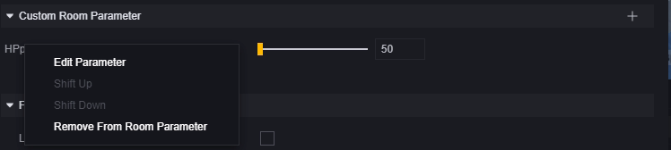
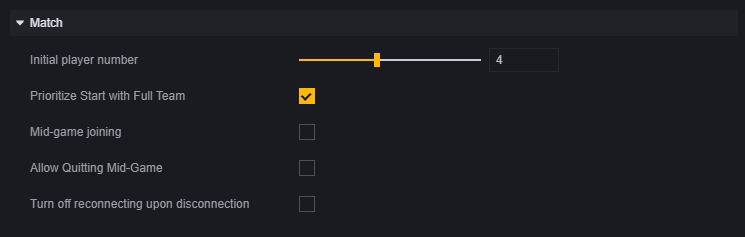
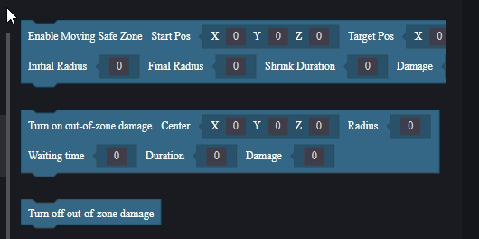

# Global

The global entity is a unique abstract entity representing the entire game. As an abstract entity, it can only be edited in the mod menu within the game editor. You can also use scripts to access its properties or modify those that support changes.

This article will introduce the global entity properties that can be modified in the mod menu and how to use the global module in element scripts.

## Module

You need to edit the global entity under the Module - Global menu.

### Static ECA and Scripts

Both static ECA and scripts mounted on the global entity can be considered global scripts. Once the game starts, the mounted scripts will run.

The difference is that once a static ECA is created, it will always be mounted on the global entity.

Scripts, however, can freely choose which to use or unload any mounted scripts.

Mounting:

> Static ECA will not appear in the script selection interface

Unloading:

Unloaded scripts remain in your project and can be mounted on any supported entity or component.

In global scripts, we recommend performing initialization tasks, such as setting global variables and defining common functions.

### Custom Room Parameters

Custom room parameters are a special type of custom attribute. They can be used as custom attributes for the global entity and modified after creating a room but before starting the game. For example, you can set enemy health between 50%-100% by customizing a health parameter and setting its value before entering the game.

Since custom room parameters are a type of custom attribute, creating a new room parameter is consistent with creating a custom attribute for the global entity, both located in the game entity section of components:

After creating a custom attribute in the game entity component, it will first appear in the lower part of the game entity:

Clicking the plus sign in custom room parameters allows you to set this attribute as a custom room parameter:

Selecting this attribute will bring up the attribute settings interface:

1. Attribute Name: Cannot be edited in this interface.
2. Room Parameter Name: The name you want displayed in the room and used for multilingual translation (KEY).
3. Parameter Display Method: How you want this parameter displayed in the room; in this case, we want it to select an integer from 50 to 100.

You can right-click on custom room parameters to reopen the edit interface or remove this parameter:

Custom attributes added as custom room parameters will no longer appear in the game entity section, while removing them will return them to that section.

### Frame Rate

The frame rate section has only one option: whether to enable low logic frame mode.

Our game defaults to 30 logic frames per second, primarily affecting "on update" events in scripts.

Enabling low logic frame mode means "on update" events will only execute 15 times per second.

> The "on fixed frame update" node is unaffected by this setting and always runs 30 times per second.

### Dynamic Navmesh

Navmesh is an auto-pathfinding system that only affects units needing pathfinding, such as monsters, NPCs, or skills relying on pathfinding.

When disabled, paths on the scene are automatically confirmed at game start, and added or removed obstacles won't change paths. If obstacles are dynamically created on paths, units may pass through them directly.

When enabled, the game recognizes changes in obstacles in real-time and dynamically modifies pathfinding routes.

Disabling this setting saves performance costs.

### Matching

Match Start Number: The number of players needed to start a match.

Prioritize Full Match Start: When checked, even if player numbers meet match start criteria during an initial period (about 10 seconds), the game will wait for a full room. After this period, reaching match start numbers will immediately start the match.

Mid-game Player Addition: Allows players to join during gameplay. If checked, further settings unfold:

​	Limit Match Addition Time: Whether to limit time for adding players mid-game; if enabled, next configuration unfolds for addition duration.
​	Addition Duration: Time allowed for adding players after match start.
​	Limit Addition Quantity: Whether to limit number of players added; if enabled, next configuration unfolds for cumulative addition quantity.
​	Cumulative Addition Quantity: Maximum number of players that can be added.

Allow Mid-game Exit: Allows players to exit voluntarily without penalty when enabled.

Disable Reconnect: When enabled, prevents reconnecting after disconnection. When disabled, allows reconnecting; closing and reopening game defaults to automatic reconnection to current match.

### AFK and Cheating

AFK Detection Time: Duration of inactivity before a player is considered AFK. AFK players will be kicked from the game.

Enable Anti-cheat: Whether to enable anti-cheat features.

## Script Global Module

In element scripts, there is a global module that allows certain operations on global mechanisms.

### Manipulating Safe Zones

Rather than manipulating toxic zones, it's more about manipulating safe zones.

Move Safe Zone: The safe zone moves smoothly from start point to end point over duration, with radius changing from initial to final radius. Players outside take damage equal to damage amount per second.
Enable Safe Zone: Initially generates at center point with set radius size. After waiting duration, moves smoothly towards midpoint over duration until disappearing. Players outside take damage equal to damage amount per second.
Disable Safe Zone: Cancels ongoing damage from toxic zones; this function only closes system-generated toxic zones and is ineffective against those generated by [custom safe zone objects]. However, it creates a large safe zone so players remain safe from other toxic zones. It's not recommended to use system toxic zones with custom safe zone objects simultaneously.

> Both move and enable safe zone functions set a new safe zone replacing previous ones.
> Once executed in script, move and enable safe zone functions continue executing; ensure logical continuity between steps.

### Pause and Resume Game

These nodes only affect triggering of "on fixed frame update" events.

After pausing, "on fixed frame update" events stop triggering; they resume after resuming gameplay.

Pausing and resuming also trigger "on game pause" and "on game resume" events respectively:

> Pause commands are ineffective during pause; same applies for resume commands during resume.
