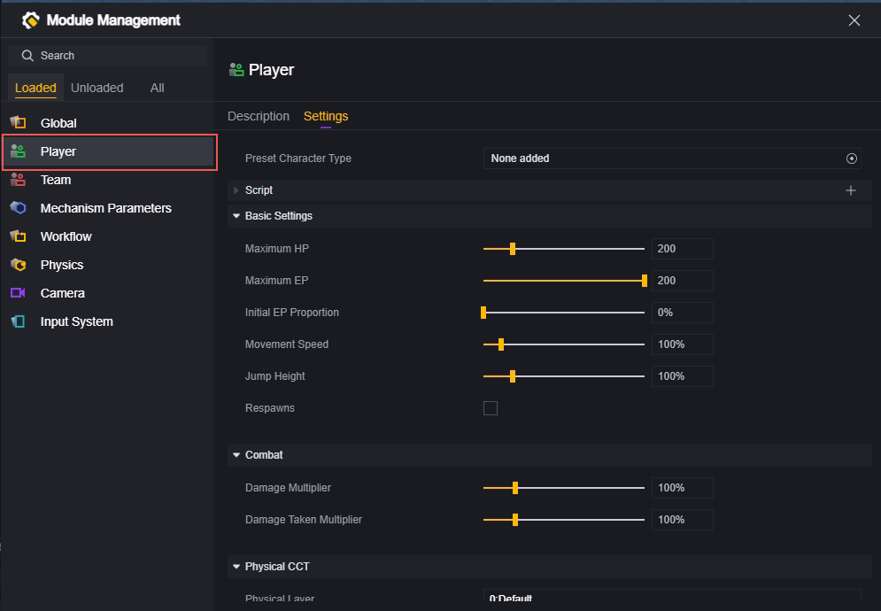
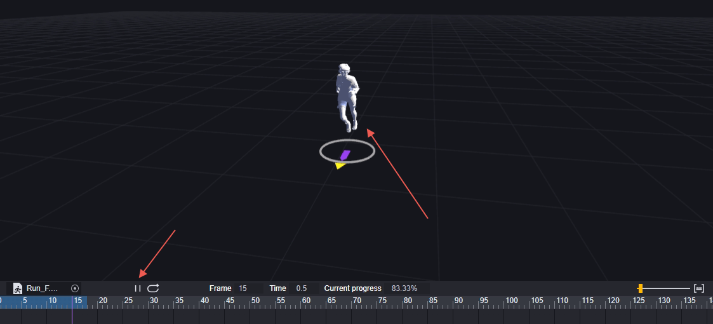
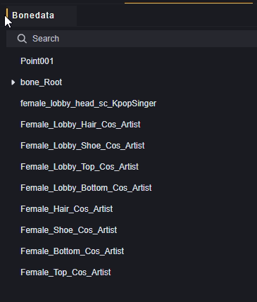
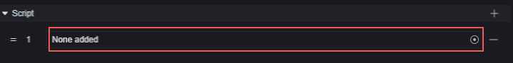
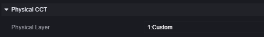
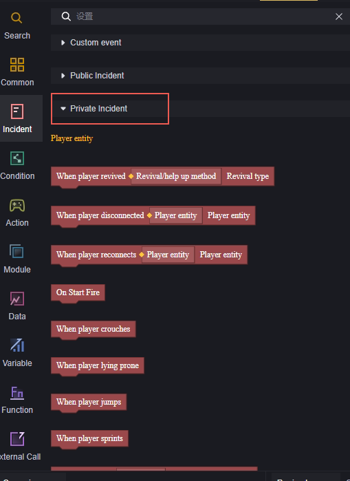

# Player User Manual

## Introduction

The player is a crucial concept in the game. By default, players have basic functionalities such as health, movement, and inventory. You can customize a player's functions, attributes, appearance, and actions through editing. This guide introduces the player concept from two perspectives: player modules and player scripts. Player modules allow you to set up players before the game runs, while player scripts enable adjustments during gameplay.

> Players exist in the game as instances of the player entity, meaning edits in the module will reflect on every created player entity instance. For scripts, be mindful of whether they target a specific player or all players.

## Player Modules

With player modules, you can configure various player attributes to start the game in your desired state. Player modules correspond to player entities, and changes here affect every created player in the game.

Enter the player menu in Editor - Module:

### Preset Player Types

Here, you can use custom player resources instead of the default appearance. This means you can change how players look and use custom actions partially or entirely.

#### How to Create Player Data:

Create a new player data file in Project - Assets:

The player data file contains models and action resources used by the player.

#### How to Edit Player Data:

First, prepare the necessary model and action resources. It's recommended to use character models with skeletons matching the default model located at \resources\LocalData\Utilities\UGC_Cos_Artist_Rig in your local editor path.

Add resources:

Character Model (Example):

Character Actions (Example):

Double-click the newly created player data file to open the edit page:

1. Skeleton Data
2. Preview Window
3. Edit Window

First, in the Edit Window (3), select your desired character model and choose the gender.

> You can also quickly modify the model by dragging it from the asset interface to the Preview Window (2).

Here we use a female model as an example, so select female.

After adding the model, you can see its appearance in the Preview Window (2). For demonstration purposes, it's just a white model.

You can zoom in/out with the scroll wheel and rotate the camera by holding the right mouse button to observe model details.

Add actions you want to preview with this model in the lower-left corner to see how they perform on it:

The action preview window below now shows information about this action; click play to preview:

In Skeleton Data (1), you can view this model's skeletal structure:

Once your model is ready, add action types you want to modify in the character actions window of Edit Window (3), such as changing run or idle animations. Unmodified actions will play default animations.

For demonstration, we add an idle action:

Modify this action so that when the game requires a standing idle animation for players, it plays your custom action.

For demonstration purposes only, we configure a run action for standing idle. Note that this will cause odd behavior; please add appropriate actions for suitable trigger scenarios according to your design during actual operation.

This player data will modify players as follows:

1. Replace player model with a white female model.
2. Replace standing idle with a run action.

#### How to Add Player Data to Players:

Configure it in modules to apply this player data to all players:

In-game performance:

> Everyone performs a running action when supposed to be standing idle without actual displacement.

Other actions still play default animations corresponding to gender:

> This is why using models with default skeletons is recommended; using non-standard skeletons for unmodified actions can result in very odd behavior.

If you only want to modify player data for specific players, use scripts with specific nodes:

This node allows adding specified player data for specific players and triggering based on your needs or suitable conditions.

### Scripts

Scripts can be attached to player entities and will be mounted on each player during runtime.

You can add existing scripts or create new ones:

Refer to the following section on player scripts for script content details.

### Basic Settings

Set basic attributes for players:

**Max Health:** The player's maximum health value ranges from 20 to 1000.

**Max EP:** The player's maximum EP ranges from 0 to 200.

**Initial EP Ratio:** Initial EP owned by players = Initial EP Ratio * Max EP, ranging from 0% to 100%.

**Movement Speed:** Scaling ratio of movement speed; less than 100% is slower than default speed, more than 100% is faster than default speed. Range: 50%-500%.

**Jump Height:** Scaling ratio of jump height; less than 100% is lower than default height, more than 100% is higher than default height. Range: 10%-500%.

**Respawn:** When checked, players automatically respawn after death with additional respawn wait time configuration.

**Respawn Wait Time:** Only appears when Respawn is checked. Time waited after death before respawning ranges from 0 to 9999 seconds.

> Modifications of movement speed and jump height change initial values but keep default scaling attributes at 1. Script modifications are based on module configurations for scaling adjustments.

### Combat

Set player combat attributes:

Damage Multiplier: The amount of damage dealt. Less than 100% is lower than default damage, more than 100% is higher. Range: 0%-500%.

Damage Taken Multiplier: The amount of damage received. Less than 100% is lower than default damage, more than 100% is higher. Range: 0%-500%.

> Similar to movement speed and jump height, modifying the damage multiplier and damage taken multiplier will alter the player's initial damage and damage taken. The player's default damage multiplier and damage taken percentage remain at 1. Modifying these two attributes in the script is based on scaling adjustments within the mod configuration.

### Player Controller with Physical Effects

**Physics Layer:** Determines the player's physical layer. Whether collisions occur between different layers depends on the physics configuration.

Configure a non-default physics layer for the player:

Disable collisions between the Custom layer and the default layer in the physics configuration:

You'll find that players can pass through objects in any default physical layer without feeling it:

Items triggered by collision won't activate either:

**Use Player Controller with Physical Effects:** Check to use a controller with custom physical effects and expand related configurations.

**Total Height, Including Upper and Lower Hemispheres:** The height of the character's capsule collider.

**Radius of Upper and Lower Hemispheres:** Capsule radius, cannot exceed half of the height.

**Mass:** Player mass.

**Maximum Slope Angle:** Slopes exceeding this angle cannot be climbed; the player will start sliding down.

**Step Offset Vertical Displacement:** Allows players to deviate from this configuration without leaving the ground or being blocked, commonly used when moving on stairs.

**Minimum Move Distance:** If the distance the character controller needs to move is less than this value, the player will remain stationary.

**Skin Thickness:** The depth other objects can embed into the character collider to prevent jittering or getting stuck.

**Gravity Acceleration Applied to Self:** Gravity acceleration in three-dimensional directions. For players, this setting overrides global physics settings.

**Enable Custom Thrust:** When enabled, the force applied by characters pushing rigid bodies can be customized. Expand related configurations upon enabling.

**Custom Thrust Force:** The magnitude of force applied when characters push rigid bodies.

**Multi-Jump Height:** The height of jumps during multi-jumping.

**Maximum Number of Multi-Jumps:** The maximum number of jumps supported per multi-jump.

**Air Movement:** When enabled, players can change movement speed and direction in mid-air.

## Player Scripts

Scripts mounted in the mod-player section are attached to each player. Note that global events may trigger multiple times against design intent.

Typically, we perform operations on players and their components in player scripts. By triggering private events, you can limit the range of triggered objects:

For example, grant a respawning player an M4A1 upon revival.

The private event "When Player Revives" triggers only when the current player entity revives.

Adding an item grants this entity an M4A1; this entity is the revived player themselves, fulfilling the requirement.

> In actual editing, consider issues like whether weapon slots are full when adding an M4A1.

Using a public event "When Player Revives" will cause all players' corresponding logic to trigger once when one player revives. Such logic is recommended for global scripts.

> Configuring such a script on a player module will result in all players receiving an M4A1 every time a player revives.

> Configuring such a script on a player module will result in each revived player receiving as many M4A1s as there are total players.
