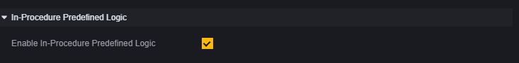
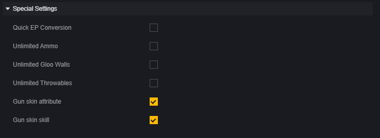
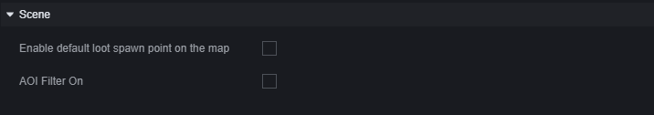
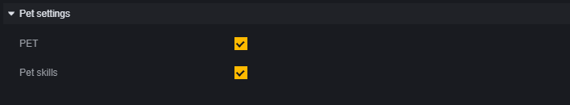

# Cấu hình cơ chế - Hướng dẫn người dùng

Trong module, có một phân loại cấu hình cơ chế.

Phân loại này là bộ cấu hình của một số cơ chế, bạn có thể thay đổi trực tiếp cài đặt của một số cơ chế trong trò chơi thông qua cài đặt trong phân loại này.

## Cài đặt quan sát

Cài đặt quan sát có thể được thiết lập cho việc quan sát từ bên ngoài và quy tắc quan sát.

## Logic mặc định trong quy trình

Logic mặc định trong quy trình là các logic được tích hợp sẵn như vô hại cho người chơi khi bắt đầu vòng, âm thanh khi bắt đầu vòng, v.v.

## Cài đặt đặc biệt

Một số cài đặt cơ chế trò chơi độc đáo.

Trong đó, phương pháp triển khai vũ khí vô hạn, tường băng vô hạn, vật phẩm ném vô hạn không tiêu tốn vật phẩm dự phòng. Vì vậy, bạn cần ít nhất thêm một khẩu súng, một tường băng hoặc một vật phẩm ném để sử dụng các cài đặt này.

## Cảnh

**Kích hoạt điểm xuất hiện chiến lợi phẩm mặc định của bản đồ** : Một số mẫu bản đồ như Bermuda sẽ có các điểm xuất hiện chiến lợi phẩm mặc định. Kích hoạt cài đặt này sẽ làm cho các chiến lợi phẩm xuất hiện trên bản đồ.

**Kích hoạt lọc khu vực theo dõi** : Tắt tính năng này sẽ đồng bộ hóa tất cả các vật thể, kích hoạt tính năng này sẽ tự động bỏ qua các vật thể xa để tiết kiệm hiệu suất.

## Bản đồ nhỏ mặc định

Bản đồ chiều sâu là tính năng hiển thị chiều cao của các vật thể trên bản đồ nhỏ bằng các màu khác nhau.

## Cài đặt kỹ năng

Quyết định xem liệu kỹ năng của nhân vật có được kích hoạt trong trò chơi hay không, và điều chỉnh thời gian chờ giữa các lần sử dụng kỹ năng của nhân vật. Thời gian chờ có thể điều chỉnh từ 0% - 100%, 0% có nghĩa là không có thời gian chờ.

## Thiết lập thú cưng

Xem xét việc hỗ trợ việc sử dụng thú cưng và kỹ năng của thú cưng.
