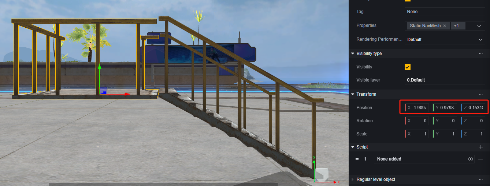
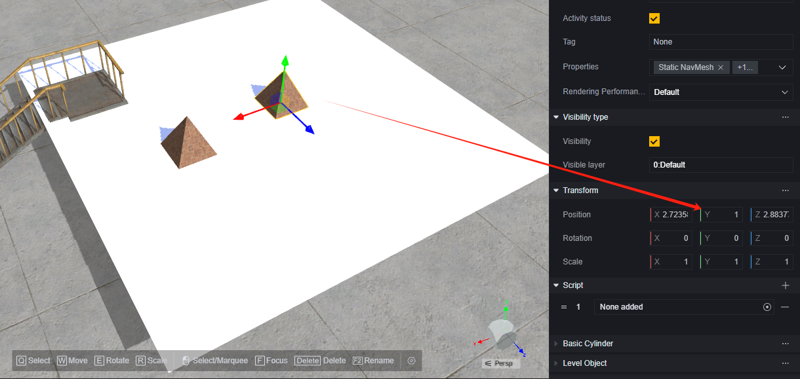
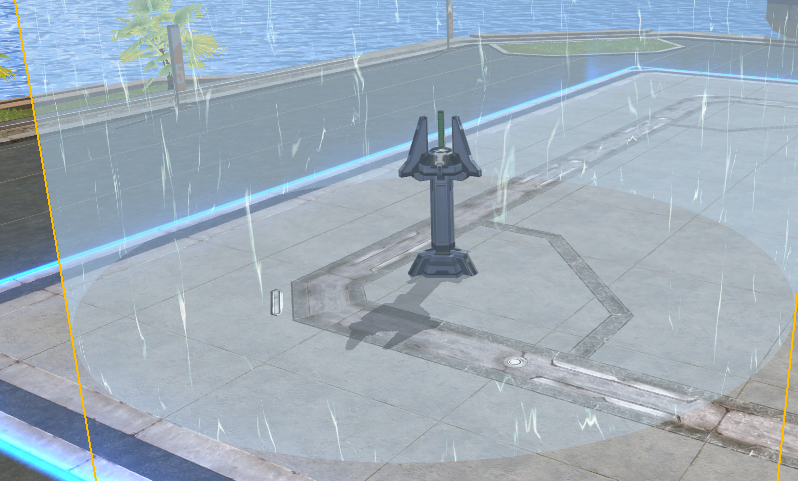
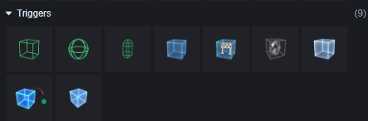
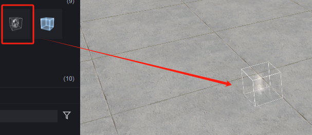
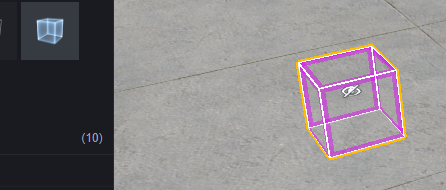
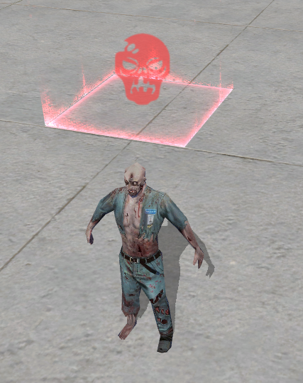

# Đối Tượng Cấp Độ - Hướng Dẫn Người Dùng

Đối tượng cấp độ là một phần quan trọng của cấp độ. Để giúp bạn dễ dàng xây dựng cấp độ nhanh chóng hơn, chúng tôi đã cung cấp một số mẫu đối tượng cấp độ. Chúng chủ yếu được phân thành:

1. Đối tượng cấp độ có chức năng, như lốp xe bật người chơi lên, cổng dịch chuyển.
2. Đối tượng cấu trúc.
3. Đối tượng trang trí.

Một đối tượng có thể có nhiều chức năng trên, ví dụ một lốp xe vừa có thể làm bệ nhảy lên tầng hai, vừa có thể làm đồ trang trí. Điều này phụ thuộc vào thiết kế của bạn.

Trong bộ chọn đối tượng, chúng tôi đã phân loại các đối tượng cấp độ để giúp bạn dễ dàng tìm thấy đối tượng cần thiết hơn:

Tab 1 chứa các đối tượng có chức năng, với logic xử lý mặc định và có thể điều chỉnh hiệu suất chức năng thông qua cấu hình.

Tab 2 chứa các cấu trúc chung và đồ trang trí.

Tab 3 chứa các tòa nhà và nội thất.

Tab 4 chứa các đối tượng chủ đề, cũng là các cấu trúc hoặc đồ trang trí nhưng có ngoại hình đặc trưng theo chủ đề.

Tiếp theo là hướng dẫn về các phương pháp xây dựng và sử dụng các đối tượng cấp độ quan trọng.

## Chung - Phương Pháp Xây Dựng Đối Tượng

Dưới đây là một số phương pháp xây dựng và quản lý đối tượng. Bạn cũng có thể sử dụng phương pháp riêng mà bạn quen thuộc để chỉnh sửa và quản lý cấp độ.

### Căn Chỉnh Chiều Cao

Khi sử dụng các cấu trúc cơ bản để xây dựng, chúng tôi khuyên bạn nên sử dụng kéo thả trong cảnh và transform để điều chỉnh vị trí và chiều cao của các đối tượng.

Ví dụ, trong hình dưới đây, chúng tôi sử dụng một cầu thang và một nền tảng, nhưng nền tảng mặc định được đặt trên mặt đất, cần nâng lên để khớp với chiều cao cuối cùng của cầu thang.

Đầu tiên, biến nền tảng thành con của cầu thang, để vị trí của transform của nền tảng trở thành vị trí tương đối với cầu thang:

Điều chỉnh chiều cao của nền tảng, cố gắng căn chỉnh:

Phát hiện chiều cao của nền tảng so với cầu thang rất gần 1, đoán rằng chiều cao cuối cùng của cầu thang là 1, đặt chiều cao của nền tảng là 1. Sau đó, căn chỉnh theo chiều ngang.

### Chỉnh Sửa Mặt Phẳng Ngang

Khi có nhiều mặt phẳng có độ cao khác nhau trong cùng một hướng thẳng đứng cần chỉnh sửa, bạn có thể đặt một hình học hỗ trợ để sử dụng chức năng dán tự động của trình chỉnh sửa, giúp đơn giản hóa thao tác điều chỉnh chiều cao.

Ví dụ, trong cảnh cầu thang nền tảng vừa rồi, bạn muốn tiếp tục chỉnh sửa mặt phẳng có chiều cao là 1, bạn có thể thêm một hình học phẳng:

> Bạn cũng có thể sử dụng bất kỳ đối tượng nào có mặt phẳng làm tham chiếu, nhưng khi sử dụng đối tượng có độ dày cần điều chỉnh nhẹ chiều cao của đối tượng tham chiếu. Hình học phẳng trong hình học không có độ dày của vật thể va chạm, rất phù hợp làm tham chiếu.

Giả sử phạm vi cần chỉnh sửa là trong vòng 10x10, đặt tỷ lệ phẳng là (10,1,10), đặt chiều cao là 1, sau đó kéo phẳng theo phương ngang vào khu vực cần chỉnh sửa:

Lúc này, trong phạm vi phẳng, tương đương với việc tạo ra một mặt đất có chiều cao là 1, kéo đối tượng vào mặt đất này hoặc sử dụng phím tắt Q để di chuyển nhanh đối tượng đến mặt đất này sẽ tự động đặt chiều cao của đối tượng thành chiều cao của mặt đất:

Sau khi chỉnh sửa xong, xóa đối tượng tham chiếu hoặc đặt thành không kích hoạt là được.

### Quản Lý Cấp Độ

Thông thường, một cảnh sẽ có số lượng đối tượng khá lớn, chúng tôi khuyến nghị sử dụng quản lý cấp độ để nhóm các đối tượng lại với nhau, giúp tăng tính bảo trì.

Bạn có thể nhóm đối tượng theo chức năng, khu vực hoặc bất kỳ phương pháp nào phù hợp với bạn.

> Đặt tên lại đối tượng có thể giúp bạn tìm thấy đối tượng tương ứng dễ dàng hơn.

## Cấu Trúc Cơ Bản

Cấu trúc cơ bản là những cấu trúc thuần túy không có bất kỳ chức năng nào. Chúng có thể được sử dụng để tạo ra các cấu trúc cấp độ tùy chỉnh, làm chướng ngại vật, nền tảng, tấm chắn trong bản đồ.

> Một cầu thang nền tảng đơn giản.

Đối với một nhóm cấu trúc tùy chỉnh đã được lắp ráp sẵn, chúng tôi khuyến nghị bạn nhóm các đối tượng tương ứng vào một đối tượng cha trong cấp độ để dễ dàng quản lý và điều chỉnh:

> Ở đây, cầu thang được chọn làm đối tượng cha, bạn cũng có thể tùy chỉnh tạo một đối tượng trống làm đối tượng cha, chọn bất kỳ đối tượng phù hợp nào làm đối tượng cha hoặc tiếp tục quản lý cấp độ con.

Nếu nhóm cấu trúc này sẽ được sử dụng nhiều lần, bạn có thể đặt nó thành Prefab. Cách thực hiện là kéo từ cấp độ vào thư mục tài sản:

Bằng cách kéo Prefab vào cảnh, bạn có thể tạo nhanh một nhóm cấu trúc này.

Chúng tôi khuyến nghị quản lý Prefab trong thư mục riêng biệt trong tài sản, nếu cần có thể tạo thư mục con để dễ dàng tìm kiếm và bảo trì:

> Chỉnh sửa trực tiếp Prefab sẽ ảnh hưởng đến tất cả các đối tượng sử dụng Prefab đó, còn chỉnh sửa đối tượng thể hiện sẽ không ảnh hưởng đến Prefab.

## Điểm Sinh

Điểm sinh là nơi người chơi xuất hiện khi vào trò chơi. Khi không có bất kỳ điểm sinh nào trên cảnh hoặc không có điểm sinh phù hợp, người chơi sẽ xuất hiện gần tọa độ (0,0,0).

Mũi tên cuộn trên điểm sinh chỉ về phía trước của điểm sinh. Đây cũng là hướng mà người chơi sinh ra sẽ hướng tới.

Điểm sinh có hai cấu hình đặc biệt, số lượng người chứa và đội thuộc về:

**Số lượng người chứa:** Quyết định số lượng người có thể sinh ra tại điểm sinh này cùng một lúc.

**Đội thuộc về:** Quyết định đội nào có thể sinh ra tại điểm sinh này. Nếu không cấu hình là tất cả các đội, chỉ có thể chọn một đội.

Khi cấu hình đội thuộc về một đội cụ thể, điểm sinh sẽ hiển thị đội được cấu hình trong cảnh.

Điểm sinh hỗ trợ cấu hình nhiều điểm trong cảnh.

## Đồ Vật Chiến Đấu

Có hai cách để đối tượng cấp độ tạo ra vật phẩm tại vị trí cụ thể: sử dụng bộ tạo và đơn vị.

Sử dụng bộ tạo để tạo vũ khí hoặc vật phẩm, bạn có thể cấu hình làm mới mỗi vòng, nhưng chỉ có thể chỉ định loại. Nếu khi làm mới, vật phẩm được tạo trước đó chưa bị lấy đi, nó sẽ được thay thế bằng vật phẩm mới tạo ra.

Sử dụng đơn vị để đặt vũ khí hoặc vật phẩm, bạn có thể chỉ định chính xác vũ khí hoặc vật phẩm được tạo, mặc định chỉ tạo một bản của vật phẩm tương ứng.

### Bộ Tạo

Chọn bộ tạo tương ứng dựa trên loại, ví dụ với vũ khí:

Trong cấu hình, bạn có thể chọn loại vũ khí được tạo:

Trong thành phần làm mới mỗi vòng, bạn có thể cấu hình điểm tạo này có làm mới ở mỗi đầu vòng hay không.

Đặc biệt, khi chọn tạo vũ khí, một bộ đạn và phụ kiện đi kèm cũng sẽ được tạo ra.

### Đơn Vị

Sử dụng vũ khí và vật phẩm trong đơn vị, bạn có thể tạo chính xác vũ khí hoặc vật phẩm được cấu hình tại vị trí cụ thể.

Các vật phẩm được đặt theo cách này có thể điều chỉnh thuộc tính:

## Đối Tượng Khu Vực An Toàn

Sử dụng đối tượng khu vực an toàn sẽ tạo ra đồng thời một đối tượng điểm bắt đầu khu vực an toàn và một đối tượng điểm kết thúc khu vực an toàn.

> Đối tượng điểm bắt đầu khu vực an toàn.

> Đối tượng điểm kết thúc khu vực an toàn.

Khu vực an toàn sẽ thay đổi đều đặn từ phạm vi và vị trí của điểm bắt đầu sang phạm vi và vị trí của điểm kết thúc theo cấu hình. Phạm vi hoặc vị trí của điểm bắt đầu và kết thúc không có giới hạn, bạn có thể sử dụng theo nhu cầu để thu hẹp, mở rộng hoặc di chuyển khu vực an toàn.

Cả đối tượng điểm bắt đầu khu vực an toàn và đối tượng điểm kết thúc khu vực an toàn đều có thể cấu hình các thuộc tính liên quan đến khu vực an toàn:

> Cấu hình của chúng được chia sẻ, thay đổi một cái sẽ ngay lập tức có hiệu lực cho cái kia.

**Thời gian hiệu lực khu vực an toàn:** Sau khi vòng bắt đầu, sau bao lâu khu vực an toàn và hiệu ứng gây sát thương ngoài khu vực an toàn bắt đầu có hiệu lực, đơn vị tính là mili giây.

**Thời gian thu hẹp:** Sau bao lâu khu vực an toàn từ vị trí và phạm vi của điểm bắt đầu sẽ biến đổi đều sang vị trí và phạm vi của điểm kết thúc, đơn vị tính là mili giây.

**Khoảng thời gian giữa các lần gây sát thương:** Khoảng thời gian giữa hai lần gây sát thương ngoài khu vực an toàn, đơn vị tính là mili giây.

**Lượng sát thương mỗi lần:** Lượng sát thương gây ra mỗi lần ngoài khu vực an toàn.

**Thời gian biến mất khu vực an toàn:** Sau khi vòng bắt đầu bao lâu, khu vực an toàn sẽ biến mất. Nếu thời gian này ngắn hơn thời gian hiệu lực khu vực an toàn, khu vực an toàn sẽ hoàn toàn không xuất hiện, đơn vị tính là mili giây.

**Bán kính ban đầu của khu vực an toàn:** Kích thước bán kính ban đầu của khu vực an toàn, đơn vị tính là mét. Thay đổi cài đặt này sẽ giúp bạn quan sát phạm vi của đối tượng điểm bắt đầu trong cảnh.

**Bán kính cuối cùng của khu vực an toàn:** Kích thước bán kính cuối cùng của khu vực an toàn, đơn vị tính là mét. Thay đổi cài đặt này sẽ giúp bạn quan sát phạm vi của đối tượng điểm kết thúc trong cảnh.

**Thời gian bắt đầu thu hẹp:** Sau khi vòng bắt đầu bao lâu, khu vực an toàn bắt đầu thay đổi, đơn vị tính là mili giây.

## Bộ Kích Hoạt

Bộ kích hoạt là một loại đối tượng cấp độ sẽ phát hiện khi có thực thể bước vào phạm vi của mình. Chúng thường được sử dụng để kích hoạt các sự kiện cụ thể.

Chúng tôi đã cung cấp một số bộ kích hoạt có hình dạng khác nhau và một số bộ kích hoạt đã có chức năng sẵn.

Các bộ kích hoạt cơ bản chỉ khác nhau về hình dạng và không có logic nào. Nếu muốn sử dụng bộ kích hoạt để kích hoạt sự kiện cụ thể, bạn cần gắn script cho bộ kích hoạt và sử dụng các sự kiện liên quan trong script để phát hiện thực thể kích hoạt.

Bộ kích hoạt có thể phát hiện khi thực thể từ bên ngoài vào khu vực của bộ kích hoạt, hoặc khi thực thể rời khỏi khu vực. Khi người chơi vào hoặc rời khỏi bộ kích hoạt, sự kiện chỉ được kích hoạt khi thực thể người chơi vào hoặc rời khỏi bộ kích hoạt. Còn sự kiện "khi thực thể vào/rời khỏi bộ kích hoạt" sẽ được kích hoạt bởi bất kỳ thực thể nào, chẳng hạn như mìn cảm ứng.

Các sự kiện này cần được sử dụng trong script được gắn vào bộ kích hoạt.

Tiếp theo là một số bộ kích hoạt đã có sẵn chức năng. Bạn cũng có thể gắn script vào các bộ kích hoạt này để xử lý thêm logic, nhưng chúng luôn thực hiện logic của mình:

**Khu vực thay đổi trọng lực**

Trong khu vực thay đổi trọng lực, trọng lực gia tốc và chiều cao nhảy sẽ thay đổi thành giá trị đã cấu hình. Bạn cũng có thể cấu hình liệu khu vực này có thể thấy được hay không.

**Khu vực chết/không thể bị tiêu diệt**

Có thể cấu hình để trở thành khu vực chết hoặc khu vực không thể bị tiêu diệt.

Người chơi hoặc thực thể AI vào khu vực chết sẽ chết ngay lập tức, giống như với bất kỳ logic chết ngay nào khác, người chơi hoặc thực thể AI đang trong trạng thái không thể bị tiêu diệt sẽ không bị ảnh hưởng.

Người chơi hoặc thực thể AI vào khu vực không thể bị tiêu diệt sẽ nhận được trạng thái không thể bị tiêu diệt cho đến khi rời khỏi khu vực không thể bị tiêu diệt. Khi rời khỏi khu vực không thể bị tiêu diệt, trạng thái không thể bị tiêu diệt sẽ bị xóa, ngay cả khi trước đó đã nhận được hiệu ứng không thể bị tiêu diệt khác.

Bạn có thể cấu hình liệu khu vực này có thể thấy được hay không.

**Bộ kích hoạt trèo qua**

Khi người chơi vào bộ kích hoạt trèo qua từ hướng ngược lại, họ có thể thực hiện trèo qua. Điều này chủ yếu được sử dụng để trèo qua cửa sổ hoặc chướng ngại vật.

Bộ kích hoạt trèo qua trong cảnh có thể xem trước hướng trèo qua, người chơi phải cùng hướng với trèo qua mới có thể kích hoạt phím trèo qua. Nếu muốn thực hiện trèo qua hai chiều, cần thiết lập hai bộ kích hoạt này.

Bạn có thể cấu hình chiều cao và khoảng cách khi trèo qua.

## Zombie

Zombie là một loại quái vật có AI. Bạn có thể sử dụng điểm tạo zombie để liên tục tạo zombie, hoặc sử dụng đơn vị zombie để đặt zombie cụ thể trong cảnh.

Dù sử dụng phương pháp nào để tạo zombie, bạn đều có thể cấu hình loại và thuộc tính của zombie.

Để biết thêm về thực thể AI, bạn có thể tham khảo hướng dẫn sử dụng thực thể AI:

[Liên kết đến tài liệu về thực thể AI](../17.AI僵尸/AI%20Zombie%20-%20Sổ%20Tay%20Người%20Dùng.md)

Bộ tạo có một số cài đặt đặc biệt so với đơn vị:

**Số lượng zombie mỗi đợt:** Số lượng zombie được tạo mỗi lần.

**Số lượng đợt:** Số lần tạo zombie mỗi vòng, khi không liên tục tạo.

**Liên tục:** Liên tục tạo zombie, không quan tâm đến cài đặt số lượng đợt, tiếp tục tạo zombie.

**Thời gian bắt đầu tạo:** Sau khi vòng bắt đầu bao lâu, bắt đầu tạo zombie đợt đầu tiên, đơn vị tính là giây.

**Khoảng thời gian giữa các đợt:** Khoảng thời gian giữa hai đợt tạo zombie, đơn vị tính là giây.

Zombie được tạo ra bởi bộ tạo sẽ bị tiêu diệt toàn bộ khi vòng mới bắt đầu và không tạo ra bất kỳ vật phẩm rơi nào.

## Hệ Thống Cửa Hàng và Kinh Tế

[Phần giao diện tương tác của cửa hàng đang được phát triển, sẽ bổ sung sau]
