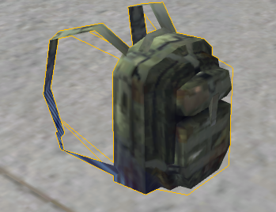
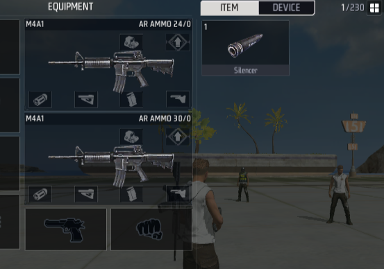

# Vật phẩm - Sổ tay người dùng

Một khẩu súng, một quả lựu đạn, một số viên đạn, tất cả đều là vật phẩm. Trong quá trình chơi game, khi liên quan đến trang bị hoặc đạo cụ thì không thể thiếu khái niệm về vật phẩm.

Vật phẩm khi ở trên người chơi phụ thuộc vào sự tồn tại của balo người chơi. Balo người chơi chứa đựng những vật phẩm này.

## Phân loại vật phẩm

Vật phẩm có các phân loại sau:

### Trang bị

Trang bị bao gồm vũ khí, giáp, balo, phụ kiện, và trang bị chức năng.

Trong đó balo đề cập đến đạo cụ balo cụ thể, chứ không phải khái niệm chứa đựng vật phẩm đã đề cập ở trên.

> Balo

### Đạo cụ

Đạo cụ bao gồm lựu đạn, đạo cụ chữa trị, đạo cụ đặc biệt và các loại đạn.

## Balo người chơi

Balo người chơi ở đây khác với balo, nó là khái niệm trừu tượng về không gian vật phẩm mà người chơi sở hữu. Balo có thể tăng không gian của balo người chơi và cung cấp thay đổi về giao diện.

> Balo người chơi

### Phân loại nội dung balo

#### Ngăn trang bị

Phần 1 trong hình trên là ngăn trang bị trong balo người chơi. Ngăn trang bị chứa vũ khí, giáp, balo và trang bị chức năng mà người chơi đang sử dụng.

#### Ngăn đạo cụ

Phần 2 trong hình trên là nút ngăn đạo cụ trong balo người chơi, khu vực ngay dưới hiển thị đạo cụ.

> Khi có đạo cụ

Tất cả các đạo cụ có thể thấy sẽ được lưu trữ ở đây.

#### Ngăn thiết bị

Phần 3 trong hình của balo là nút ngăn thiết bị. Đối với trình biên tập, hiện tại chỉ có một thiết bị là máy tạo tường băng.

Thiết bị có thể được kích hoạt bằng kịch bản, sau khi kích hoạt trang bị sẽ hiển thị trong phân loại này của balo.

#### Không gian hố đen

Trang bị và đạo cụ không hiển thị trong giao diện balo sẽ tồn tại trong không gian hố đen. Người chơi không thể trực tiếp xem đạo cụ đó trong balo.

### Sử dụng vật phẩm trong balo

Thông thường, hầu hết các vật phẩm đều có thể sử dụng ngoài balo hoặc tự động sử dụng. Bao gồm vũ khí, phụ kiện, lựu đạn,...

Tuy nhiên vẫn có thể thực hiện một số thao tác nhất định trong balo.

Sử dụng vật phẩm chỉ định:

Tháo/gỡ/thay thế/lắp đặt phụ kiện:

> Tháo phụ kiện

Vứt bỏ vật phẩm trong balo:

## Bố trí vật phẩm trong cảnh

Có hai cách để tạo ra vật phẩm tại vị trí chỉ định: máy tạo và đơn vị.

Sử dụng máy tạo để tạo ra vật phẩm có thể thiết lập làm mới mỗi lượt nhưng chỉ có thể chỉ định loại. Nếu khi làm mới mà vật phẩm tạo ra lần trước chưa được lấy đi thì sẽ thay thế bằng vật phẩm mới tạo ra.

Sử dụng đơn vị để đặt vật phẩm có thể thiết lập chính xác loại vũ khí hoặc đạo cụ được tạo ra. Theo mặc định chỉ tạo ra một bản tương ứng của vật phẩm.

### Máy tạo

Chọn máy tạo tương ứng theo loại, lấy vũ khí làm ví dụ:

Trong cấu hình có thể chọn loại vũ khí được tạo ra:

Trong thành phần làm mới mỗi lượt có thể thiết lập điểm tạo này có làm mới vào đầu mỗi lượt hay không.

Đặc biệt, khi chọn tạo vũ khí sẽ tạo ra một bộ đạn dược và phụ kiện đi kèm.

### Đơn vị

Sử dụng vũ khí và đạo cụ trong đơn vị có thể tạo ra vũ khí hoặc đạo cụ đã cấu hình tại vị trí chỉ định.

Vật phẩm được đặt theo cách này có thể chỉnh sửa thuộc tính:

## Sự kiện vật phẩm

Bạn có thể lắng nghe một số sự kiện liên quan đến vật phẩm để thực hiện logic mà bạn mong muốn.

Dưới đây là một số sự kiện thường dùng:

| Tên                  | Tên script   | Mô tả                                                            | Tham số 1                                     | Tham số 2                                                                  | Tham số 3                                                                                                                        | Thực thể phụ thuộc |
| -------------------- | ------------ | ---------------------------------------------------------------- | --------------------------------------------- | -------------------------------------------------------------------------- | -------------------------------------------------------------------------------------------------------------------------------- | ------------------ |
| Khi nhận vật phẩm    | OnObtainItem | Kích hoạt khi người chơi nhận vật phẩm từ bất kỳ nguồn nào       | ID vật phẩm, ID vật phẩm người chơi nhận được | Thực thể vật phẩm, thực thể vật phẩm người chơi nhận được, có thể để trống |                                                                                                                                  | Người chơi         |
| Khi sử dụng vật phẩm | OnUseItem    | Kích hoạt khi người chơi sử dụng vật phẩm                        | ID vật phẩm, ID vật phẩm người chơi sử dụng   | Thực thể vật phẩm, thực thể vật phẩm người chơi sử dụng, có thể để trống   | Thực thể đạo cụ mới được tạo sau khi sử dụng. Các đạo cụ như tháp pháo di động có thể lấy thực thể tạo ra thông qua tham số này. | Người chơi         |
| Khi vứt bỏ đạo cụ    | OnDropItem   | Kích hoạt khi người chơi vứt bỏ vật phẩm                         | ID vật phẩm, ID vật phẩm người chơi vứt bỏ    | Thực thể vật phẩm, thực thể vật phẩm người chơi vứt bỏ, có thể để trống    |                                                                                                                                  | Người chơi         |
| Khi bị nhặt          | OnPickup     | Kích hoạt khi vật phẩm bị nhặt, cần gắn vào thực thể vật phẩm    | Người chơi nhặt vật phẩm                      |                                                                            |                                                                                                                                  | InventoryBase      |
| Khi bị sử dụng       | OnUsed       | Kích hoạt khi vật phẩm bị sử dụng, cần gắn vào thực thể vật phẩm |                                               |                                                                            |                                                                                                                                  | InventoryBase      |
| Khi bị vứt bỏ        | OnDrop       | Kích hoạt khi vật phẩm bị vứt bỏ, cần gắn vào thực thể vật phẩm  | Người chơi vứt bỏ vật phẩm                    |                                                                            |                                                                                                                                  | InventoryBase      |

## API Vật Phẩm

Sử dụng API Vật Phẩm để thao tác với các vật phẩm.

Dưới đây là một số API thường dùng theo từng loại:

**Thêm Vật Phẩm**

| Tên           | Tên script      | Mô tả                                  | Tham số vào 1                 | Tham số vào 2      | Tham số vào 3     | Tham số ra 1                                                                                |
| ------------- | --------------- | -------------------------------------- | ----------------------------- | ------------------ | ----------------- | ------------------------------------------------------------------------------------------- |
| Thêm Vật Phẩm | AddItemToPlayer | Gửi vật phẩm vào túi đồ của người chơi | Người chơi được thêm vật phẩm | Vật phẩm được thêm | Số lượng vật phẩm | Danh sách các vật phẩm được thêm. Dù số lượng là bao nhiêu cũng trả về dưới dạng danh sách. |
| Tạo Vật Phẩm  | AddItemInScene  | Tạo vật phẩm tại vị trí chỉ định       | Vị trí của vật phẩm           | Vật phẩm được tạo  | Số lượng vật phẩm |

**Xóa Vật Phẩm**

| Tên                             | Tên script          | Mô tả                                                                                                           | Tham số vào 1         | Tham số vào 2       | Tham số vào 3        | Tham số ra 1                |
| ------------------------------- | ------------------- | --------------------------------------------------------------------------------------------------------------- | --------------------- | ------------------- | -------------------- | --------------------------- |
| Xóa Vật Phẩm                    | - PlayerRemoveItem  | - Xóa các vật phẩm trên người chơi                                                                              | - Người chơi bị xóa - | - Vật phẩm bị xóa - | - Số lượng vật phẩm- | -                           |
| - Hủy Trang Bị Của Người Chơi - | - DeleteEquipment - | - Hủy trang bị đã được trang bị của người chơi theo vị trí chỉ định, chỉ có thể xóa những thứ có thể trang bị - | - Người chơi bị xóa - | - Vị trí -          | - Số lượng -         | - Có thành công hủy không - |
| - Dọn Sạch Túi Đồ -             | - ClearInventory -  | - Dọn sạch tất cả các món đồ trên người chơi, bao gồm cả những món đã trang bị -                                | - Người chơi bị xóa - |

**Truy vấn Vật Phẩm**

| Tên                       | Tên script    | Mô tả                                                   | Tham số vào 1           | Tham số vào 2 | Tham số ra 1           | Tham số ra 2                     |
| ------------------------- | ------------- | ------------------------------------------------------- | ----------------------- | ------------- | ---------------------- | -------------------------------- |
| Lấy Trang Bị Trong Túi Đồ | GetEquipments | Lấy trang bị của người chơi theo vị trí chỉ định        | Người chơi mang theo đồ | Vị trí        | Thực thể trang bị      | Danh sách phụ kiện của món đồ đó |
| Lấy Số Lượng Vật Phẩm     | GetItemCount  | Lấy số lượng của một món đồ trong túi đồ của người chơi | Người chơi mang theo đồ | ID Vật Phẩm   | Số lượng của món đồ đó |

**Chỉnh sửa Vật Phẩm**

| Tên                              | Tên script     | Mô tả                                                                    | Tham số vào 1 | Tham số vào 2 | Tham số vào 3 | Tham số ra 1         | Tham số ra 2      |
| -------------------------------- | -------------- | ------------------------------------------------------------------------ | ------------- | ------------- | ------------- | -------------------- | ----------------- |
| Cấp Phụ Kiện Cho Người Chơi      | AddAttachments | Cấp phụ kiện cho vũ khí ở vị trí chỉ định cho người chơi                 | Người Chơi    | Vị trí        | ID phụ kiện   | Có thành công không? | Thực thể phụ kiện |
| Chuyển Đổi Vũ Khí Của Người Chơi | SwitchWeapon   | Chuyển đổi vũ khí ở vị trí chỉ định thành vũ khí hiện tại của người chơi | Người Chơi    | Vị trí        |               | Có thành công không? |
