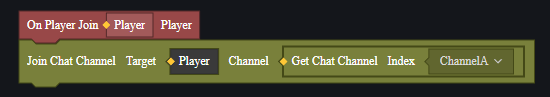

# Kênh thoại - Hướng dẫn sử dụng

Khi người chơi sử dụng giao tiếp bằng giọng nói, chỉ những người chơi trong cùng kênh thoại mới có thể giao tiếp với nhau.

Chúng tôi mặc định cung cấp 6 kênh thoại tùy chỉnh để bạn sử dụng khi chỉnh sửa bản đồ tùy chỉnh.

## Thay đổi kênh thoại của người chơi

Thông qua script, bạn có thể cho phép người chơi tham gia vào kênh thoại chỉ định trong quá trình chơi:

Cũng có thể cho phép người chơi rời khỏi kênh thoại:

Sau khi người chơi tham gia kênh thoại mới, mặc định họ sẽ rời khỏi kênh thoại ban đầu.

## Sự kiện liên quan đến kênh thoại

Thông qua sự kiện, bạn có thể theo dõi thời điểm người chơi vào và ra khỏi kênh thoại trong trò chơi, từ đó thực hiện các logic khác.

【Hình ảnh sẽ được bổ sung sau】

## Trạng thái chat nhanh

Chat nhanh là tính năng cho phép người chơi nhanh chóng gửi một số nội dung chat đã được cài đặt sẵn.

Thông qua script, bạn có thể điều chỉnh quyền cho phép người chơi sử dụng tính năng này trong quá trình chơi:

