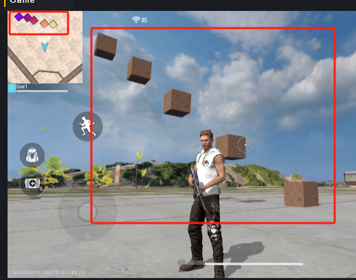
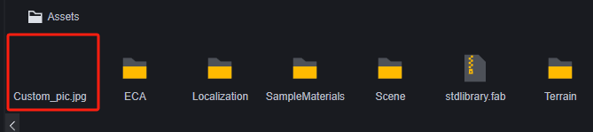
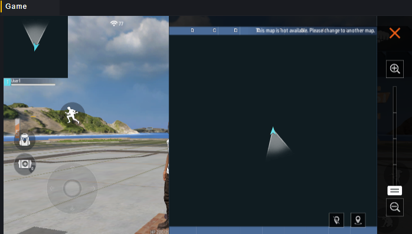

# Bản đồ nhỏ - Hướng dẫn sử dụng

Bản đồ nhỏ là hình thu nhỏ của bản đồ trong suốt trận đấu, có thể hiển thị vị trí và hướng của người chơi theo thời gian thực, giúp người chơi định vị bản thân và thông tin khác trên bản đồ.

A: Bản đồ nhỏ thu nhỏ thường trực.

B: Bản đồ nhỏ chi tiết mở rộng sau khi nhấn vào A.

1: Người chơi, hướng mũi tên chỉ là hướng đi, phạm vi hình nón trước mũi tên là tầm nhìn của người chơi.

2: Đồng đội của người chơi, hướng mũi tên chỉ là hướng đi.

3: Đối tượng trên bản đồ. Trên bản đồ nhỏ, các ô màu biểu thị đối tượng được gọi là điểm ảnh.

4: Kẻ địch bị phát hiện, chỉ hiển thị trên hình thu nhỏ.

Bản đồ nhỏ thu nhỏ luôn giữ hướng hiện tại của người chơi lên trên, trong khi bản đồ nhỏ chi tiết có hướng cố định:

Sau khi mở rộng bản đồ nhỏ, có thể phóng to hoặc thu nhỏ thông qua menu bên phải:

Có thể đánh dấu hoặc hủy đánh dấu bản đồ nhỏ bằng nút ở góc dưới bên phải:

## Bản đồ độ sâu

Bản đồ nhỏ mặc định hỗ trợ tính năng bản đồ độ sâu, có thể đánh dấu màu sắc khác nhau dựa trên độ cao của đối tượng để phân biệt độ cao của chúng.

Trong mục Module - Tham số cơ chế, có thể tìm thấy phân loại bản đồ nhỏ mặc định với tính năng bật/tắt bản đồ độ sâu:

Khi tắt tùy chọn này, các đối tượng trên bản đồ sẽ được đánh dấu cùng một màu:

Khi bật tùy chọn này, các đối tượng trên bản đồ sẽ được đánh dấu màu sắc khác nhau dựa trên bề mặt cao nhất của khối va chạm:

Đối với các đối tượng kết hợp nhiều đối tượng, lấy bề mặt có khối va chạm cao nhất.

Kết hợp đối tượng cao nhất và thấp nhất trong hình trên lại với nhau, lấy đối tượng thấp nhất làm đối tượng cha, biểu hiện như sau:

> Có thể thấy các đối tượng ở vị trí thấp được coi là ở vị trí cao, và việc xác định độ sâu không liên quan đến mối quan hệ cha con.

Giữ nguyên mối quan hệ cha con đã đề cập ở trên nhưng tắt va chạm của ô cao nhất:

> Số sau ô càng lớn thì vị trí của ô càng cao, số chỉ đại diện cho thứ hạng chứ không phải chiều cao tuyệt đối.

Biểu hiện lúc này là:

Có thể thấy ô đã tắt va chạm không còn hiển thị trên bản đồ nhỏ và tổ hợp thấp nhất và cao nhất cũng được xử lý theo ô thấp nhất còn va chạm.

### Bổ sung

1. Độ chính xác của bản đồ độ sâu là 1 mét.
2. Một số đối tượng sẽ không được đọc vào bản đồ nhỏ như các đối tượng mô hình trắng cơ bản:

3. Cài đặt bản đồ độ sâu cũng sẽ ảnh hưởng đến cách hiển thị độ sâu của các đối tượng được đánh dấu trên bản đồ nhỏ tùy chỉnh sẽ đề cập sau đây.

## Bản đồ nhỏ tùy chỉnh

Bạn có thể tùy chỉnh nền bản đồ nhỏ, các biểu tượng khác và hiển thị những vật thể nào,

Để tùy chỉnh bản đồ nhỏ, cần tải module bản đồ nhỏ tùy chỉnh. Module này là module tùy chọn, sau khi gỡ bỏ thì nội dung và biểu tượng đã sử dụng trước đó sẽ không còn hiệu lực.

Sau khi bật tính năng module bản đồ nhỏ tùy chỉnh, phần bản đồ nhỏ sẽ tự động hiển thị nội dung của bản đồ nhỏ tùy chỉnh. Nếu chưa chỉnh sửa thì sẽ biểu hiện như sau:

### Thuộc tính của bản đồ nhỏ tùy chỉnh

Bản đồ nhỏ tùy chỉnh có một số thuộc tính

**Trung tâm và kích thước bản đồ**: Bản đồ nhỏ lấy điểm nào trong tọa độ thế giới làm trung tâm và hiển thị nội dung khu vực lớn bao nhiêu trên bản đồ. Kích thước UI nhìn từ người chơi không thay đổi; kích thước bản đồ càng lớn thì khu vực mà UI cố định biểu thị càng lớn. Nếu nền bạn sử dụng cho bản đồ nhỏ mô tả địa hình cảnh quan thì cần điều chỉnh trung tâm và kích thước để phù hợp với cảnh thực tế.

**Có bật tính năng độ sâu hay không**: Thuộc tính này có thể thay đổi thông qua cấu hình module và có thể thay đổi động trong kịch bản.

### Cài đặt biểu tượng cho bản đồ nhỏ

Sử dụng các biểu tượng có sẵn trong module để thêm vào bản đồ nhỏ:

Biểu tượng có các thuộc tính sau:

#### Cài đặt nền

Điều chỉnh cấp độ và kích thước biểu tượng để sử dụng làm nền.

Chúng tôi nhập một hình ảnh đen tuyền:

Đặt cấp độ của hình ảnh này là -1 và điều chỉnh tỷ lệ thành 10.

#### Cài đặt đơn vị chú ý cao

Bạn có thể cần làm nổi bật rương kho báu hoặc người chơi quan trọng trên bản đồ. Sử dụng thuộc tính theo dõi mục tiêu của biểu tượng để gắn biểu tượng vào vật thể đó.

Chúng tôi thêm một máy bán hàng tự động vào trong bản đồ:

Thêm một biểu tượng cửa hàng cho nó:

Thêm một biểu tượng theo dõi cho mỗi người chơi khác:

Như vậy cửa hàng và những người chơi khác sẽ hiển thị trên bản đồ:

### Cài đặt điểm ảnh

Như đã đề cập trước đó, các vật thể trên bản đồ khi hiển thị lên bản đồ nhỏ sẽ là một ô màu gọi là điểm ảnh.

Trong bản đồ nhỏ tùy chỉnh, mặc định không hiển thị bất kỳ điểm ảnh nào.

Thông qua biểu tượng có thể cài đặt những vật thể nào hiển thị dưới dạng điểm ảnh:

Cài đặt điểm ảnh cho tất cả vật thể trong cấp độ:

> Trong hình là biểu hiện khi bật cài đặt độ sâu.
