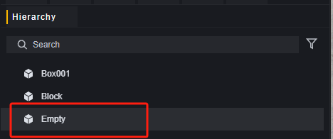
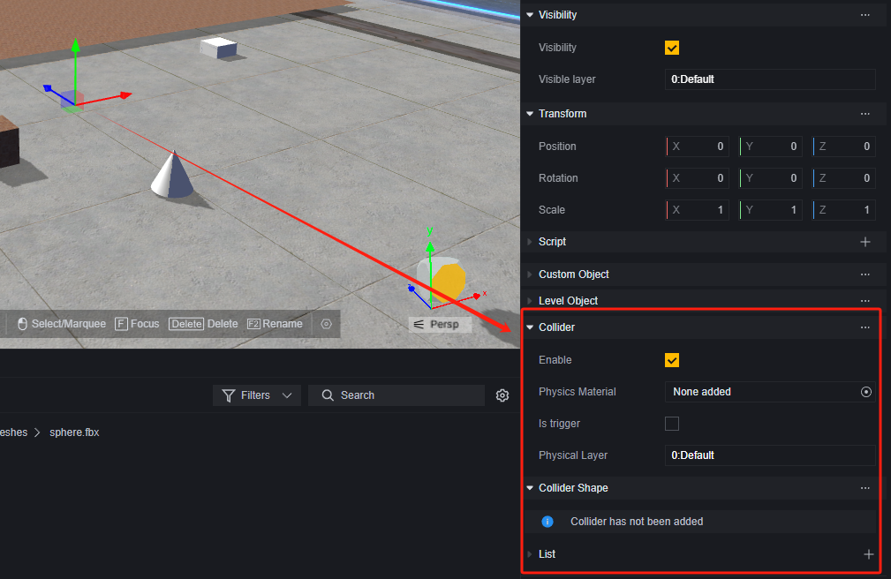
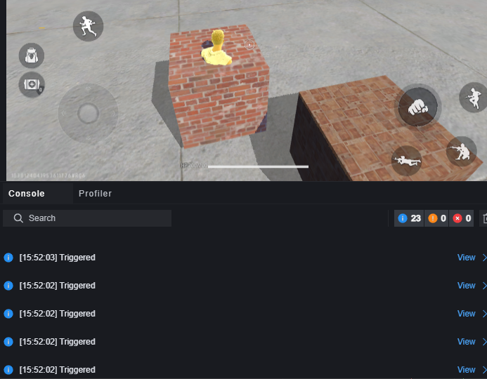
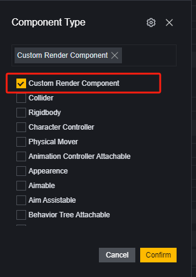
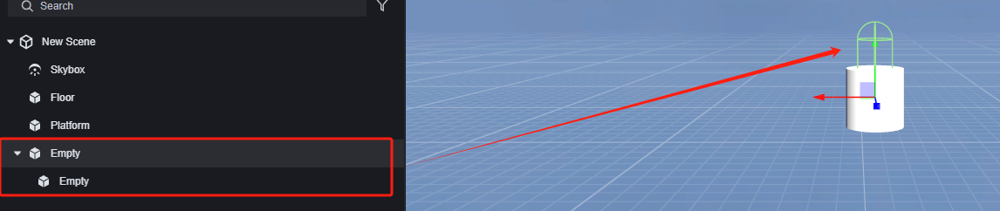
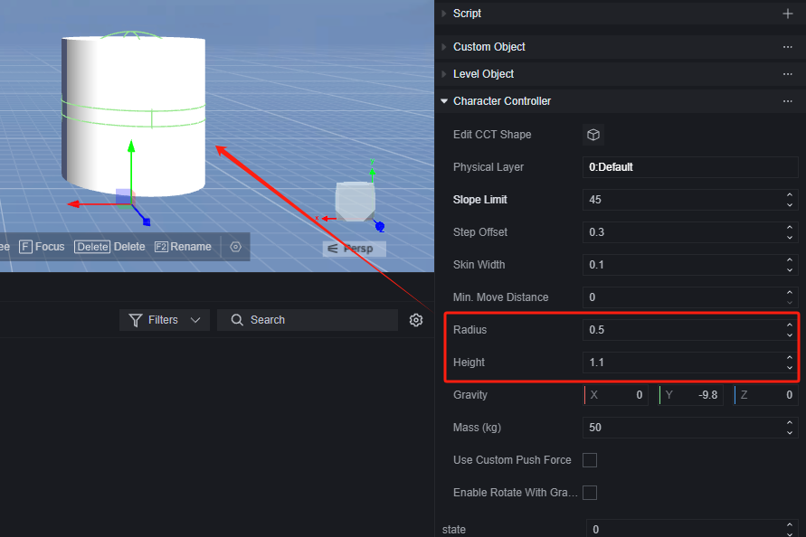
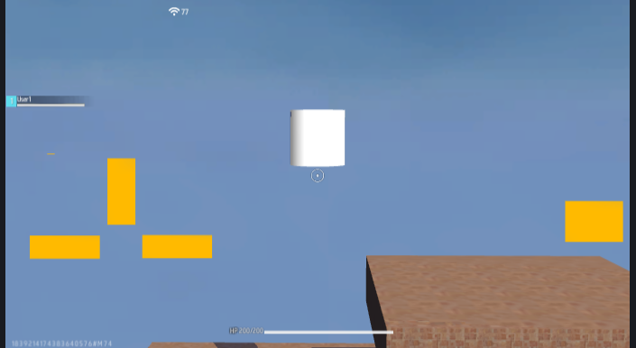

# Vật lý - Hướng dẫn sử dụng

Hệ thống vật lý giúp bạn mô phỏng các hiện tượng vật lý như va chạm và lực tác động trong thực tế.

## Mô-đun Vật lý

Vật lý là một mô-đun được tải mặc định.

Bạn có thể chỉnh sửa cài đặt vật lý toàn cầu tại đây:

1. **Hướng và độ lớn của trọng lực**.
2. **Vật liệu vật lý mặc định**. Vui lòng tham khảo phần vật liệu va chạm - vật liệu vật lý bên dưới.
3. **Ngưỡng năng lượng toàn cầu**. Tính toán động năng của vật thể, công thức là

$$
Ek=1/2*m*v^2
$$

​	m là khối lượng của vật thể, đơn vị là kg.

​	v là tốc độ vật lý, đơn vị là m/s.

​	Khi động năng của vật thể nhỏ hơn ngưỡng này, nó sẽ không còn chuyển động. Ví dụ, nếu ngưỡng được đặt là 0.5, một vật thể 1kg sẽ ngừng chuyển động khi tốc độ nhỏ hơn 1m/s.

4. **Ngưỡng va chạm của bộ điều khiển nhân vật**. Chỉ áp dụng khi mô-đun người chơi mở [Có sử dụng bộ điều khiển người chơi có hiệu ứng vật lý] hoặc bộ điều khiển nhân vật tùy chỉnh hoàn toàn.

   Công thức động lượng là:
   $$
   p=mv
   $$
   m là khối lượng, đơn vị là kg.

   v là tốc độ, đơn vị là m/s.

   Khi xảy ra va chạm, trừ động lượng của người chơi và vật thể bị va chạm và so sánh thành phần động lượng trên pháp tuyến va chạm với ngưỡng va chạm của bộ điều khiển nhân vật. Nếu nhỏ hơn ngưỡng này, sẽ đẩy nhẹ nhàng vật thể đó, nếu không sẽ xảy ra va chạm mạnh.

​	Nói một cách đơn giản, các yếu tố ảnh hưởng đến việc có xảy ra va chạm mạnh hay không bao gồm:

​	1. Khối lượng của người chơi hoặc nhân vật càng lớn thì càng dễ xảy ra va chạm mạnh.

​	2. Tốc độ tương đối giữa người chơi hoặc nhân vật và vật thể bị va chạm càng nhanh thì càng dễ xảy ra va chạm mạnh.

​	3. Ngưỡng va chạm của bộ điều khiển nhân vật càng lớn thì càng khó xảy ra va chạm mạnh.

​	Ví dụ, khi ngưỡng va chạm của bộ điều khiển nhân vật được đặt là 50, một người chơi nặng 50kg với tốc độ 1m/s có thể gây ra va chạm mạnh với bất kỳ vật thể tĩnh nào có khối lượng gần bằng người chơi hoặc nhân vật đó trong trường hợp va chạm trực diện.

5. **Cấp độ vật lý**. Việc có xảy ra va chạm giữa các cấp độ khác nhau hay không phụ thuộc vào cấu hình vật lý.

   Cấu hình cho người chơi một cấp độ vật lý không mặc định:

   

   Trong cấu hình vật lý, hủy bỏ va chạm giữa cấp độ Custom và cấp độ mặc định:

   

​	Bạn sẽ thấy người chơi có thể đi xuyên qua bất kỳ đối tượng nào thuộc cấp độ vật lý mặc định mà không cảm nhận được:

​	Các đối tượng phụ thuộc vào kích hoạt va chạm cũng sẽ không được kích hoạt:

## Hình dạng và Va chạm

Để áp dụng đối tượng tùy chỉnh vào hệ thống vật lý cần hai thành phần cơ bản:

Thành phần hình dạng và thành phần va chạm.

Đối với hầu hết các đối tượng, bạn chỉ có thể tìm thấy một thành phần va chạm trên chúng.

Vì chúng thường không có thành phần đối tượng tùy chỉnh:

Đối với nhu cầu tùy chỉnh hình dạng và vật liệu vật lý, chúng tôi khuyên bạn nên tạo một nút rỗng mới và thao tác trên nút rỗng này:

### Hình dạng Va chạm

Thành phần hình dạng quyết định biên giới mà tại đó đối tượng xảy ra va chạm.

Loại hình dạng:

Loại hình dạng quyết định hình dạng cơ bản của va chạm, chúng tôi cung cấp ba loại cơ bản: lập phương, hình cầu, hình viên thuốc và lưới va chạm.

Lưới va chạm được mô phỏng theo biên giới của mô hình để gần giống với ngoại hình trực quan của mô hình.

Đối với nút rỗng tạo ra, cần thêm thành phần hiển thị tùy chỉnh để quy định hình dạng và kích thước lưới của nó.

Đối với các hình dạng cơ bản của hình dạng va chạm, bạn có thể chỉnh sửa vị trí, kích thước hoặc tinh chỉnh ngoại hình bằng cách thủ công:

> Kéo điểm vàng trên hộp va chạm để tinh chỉnh hình dạng

Hình dáng lưới có tùy chọn liệu có phải là đa giác lồi hay không

Đa giác lồi: Liệu có xảy ra va chạm với các lưới khác hay không. Lưới chưa kích hoạt đa giác lồi chỉ hỗ trợ trên các đối tượng trò chơi không có thành phần thân cứng. Để sử dụng lưới cho thành phần thân cứng, hãy chọn tùy chọn đa giác lồi.

### Va Chạm

#### Vật liệu Vật lý

Vật liệu quyết định một số thuộc tính vật lý của thân cứng đó.

Đối với đối tượng tùy chỉnh, bạn có thể tự tạo ra các thuộc tính cho nó. Nhưng đối với hầu hết các đối tượng do nhà phát triển cung cấp thì không thể thay đổi được thuộc tính này.

Tệp tin về vật liệu có thể được tạo ra.

Bạn có thể chỉnh sửa các thuộc tính sau trong bảng điều khiển inspector của tệp tin để tất cả các đối tượng gắn kết với nó nhận được thuộc tính tương ứng.

#### Có phải là Trình kích hoạt

Khi chọn hộp kiểm này, thân cứng sẽ bỏ qua các logic va chạm nhưng vẫn có thể kích hoạt sự kiện.

Điều này nghĩa là đối tượng sẽ không tham gia vào logic va chạm mặc định:

Nhưng vẫn có thể kích hoạt sự kiện va chạm:

#### Cấp độ Vật lý

Quyết định cấp độ mà thân cứng nằm trong đó; việc có xảy ra va chạm giữa các cấp độ khác nhau hay không phụ thuộc vào cấu hình trong mô đun Vật lý.

## Thân Cứng

Thành phần thân cứng giúp cho đối tượng chịu sự kiểm soát của lực tác động trong môi trường trò chơi.

Để thêm thành phần thân cứng, trước tiên phải có thành phần va chạm.

Thân cứng chia làm ba loại: tĩnh, động và kinematic (động học).

**Thân cứng tĩnh** là những đối tượng không di chuyển như mặt đất hay tường; chúng không chịu tác động lực nào cả. Việc thay đổi vị trí hay kích thước của những đối tượng này sẽ tăng chi phí hiệu suất xử lý.

**Thân cứng động** là những đối tượng có đặc tính cơ học như khối lượng và tốc độ; chúng chịu tác động lực từ môi trường xung quanh.

Bạn có thể chỉnh sửa các thông số liên quan đến lực như trọng tâm hay khối lượng trong tùy chọn thân cứng động.

Thân cứng kinematic cho phép bạn điều khiển thủ công việc di chuyển và xoay nhưng không chịu tác động từ lực hay va đập từ các thân cứng khác; thường dùng trong việc tạo hiệu ứng hoặc hoạt ảnh.

## Bộ điều khiển nhân vật

### Bộ điều khiển người chơi FF

Theo mặc định, thao tác của người chơi đối với nhân vật người chơi được kế thừa từ bộ điều khiển người chơi của FreeFire.

### Bộ điều khiển người chơi có hiệu ứng vật lý

Trong mô-đun người chơi, khi chọn [Có sử dụng bộ điều khiển người chơi có hiệu ứng vật lý hay không], bạn có thể chỉnh sửa một số tham số vật lý của bộ điều khiển người chơi. Trong trường hợp này, người chơi sẽ tham gia vào mô phỏng vật lý trong game ở một mức độ nhất định, chẳng hạn như cấu hình [Ngưỡng va chạm bộ điều khiển nhân vật] trong mô-đun vật lý sẽ bắt đầu có hiệu lực.

​	**Có sử dụng bộ điều khiển người chơi có hiệu ứng vật lý hay không:** Chọn để sử dụng bộ điều khiển với hiệu ứng vật lý tùy chỉnh và mở rộng cấu hình liên quan.

​	**Tổng chiều cao, bao gồm nửa cầu trên và dưới:** Chiều cao của thân va chạm dạng viên nang của nhân vật.

​	**Bán kính của nửa cầu trên và dưới:** Bán kính của thân viên nang, không thể vượt quá 1/2 chiều cao.

​	**Khối lượng:** Khối lượng của người chơi.

​	**Góc dốc tối đa:** Dốc vượt quá góc này sẽ không thể đi lên được, người chơi sẽ bắt đầu trượt xuống.

​	**Độ lệch dọc bước chân:** Cho phép người chơi lệch khỏi khoảng cách cấu hình này mà không rời khỏi mặt đất hoặc bị chặn lại, thường được sử dụng khi di chuyển trên cầu thang.

​	**Khoảng cách di chuyển tối thiểu:** Nếu khoảng cách mà bộ điều khiển nhân vật cần di chuyển nhỏ hơn giá trị này, người chơi sẽ đứng yên.

​	**Độ dày da:** Độ sâu cho phép các vật thể khác nhúng vào thân va chạm của nhân vật, dùng để tránh rung lắc hoặc kẹt.

​	**Gia tốc trọng lực tác động lên bản thân:** Gia tốc trọng lực tác động theo hướng ba chiều. Đối với nhân vật người chơi, thiết lập này sẽ ghi đè cài đặt vật lý toàn cục.

​	**Kích hoạt lực đẩy tùy chỉnh:** Khi bật, lực tác động lên thân cứng khi nhân vật đẩy có thể được tùy chỉnh. Khi bật, mở rộng cấu hình liên quan.

​	**Lực đẩy tùy chỉnh:** Độ lớn của lực tác động lên thân cứng khi nhân vật đẩy.

​	**Chiều cao nhảy nhiều lần:** Chiều cao nhảy khi thực hiện nhảy nhiều lần.

​	**Số lần nhảy tối đa trong nhảy nhiều lần:** Số lần nhảy tối đa hỗ trợ cho mỗi lần nhảy nhiều lần.

​	**Di chuyển trên không:** Khi bật, người chơi có thể thay đổi tốc độ và hướng di chuyển trên không.

### Bộ điều khiển nhân vật hoàn toàn tùy chỉnh

Trong bộ điều khiển nhân vật hoàn toàn tùy chỉnh, bạn có thể bỏ qua tất cả các giới hạn và tùy chỉnh hoàn toàn bất kỳ thao tác và hiệu ứng nào, nhưng không có bất kỳ chức năng mặc định nào.

Để sử dụng bộ điều khiển nhân vật hoàn toàn tùy chỉnh, cần sử dụng thành phần bộ điều khiển nhân vật và đối tượng là nhân vật được kiểm soát không thể có các thành phần va chạm, hình dạng va chạm, thân cứng v.v.

Vui lòng tham khảo ví dụ dưới đây để biết cách sử dụng cụ thể.

## Ví dụ

Chúng tôi sẽ giải thích cách sử dụng bộ điều khiển nhân vật tùy chỉnh thông qua việc tạo một bộ điều khiển nhân vật chế độ ngang đơn giản.

### Xây dựng cảnh

Xây dựng một cảnh đơn giản.

### Tạo nhân vật người chơi

Ở đây chúng tôi chỉ tạo một nhân vật người chơi đơn giản.

Tạo một đối tượng trống:

Thêm thành phần bộ điều khiển nhân vật cho đối tượng này.

Thêm thuộc tính tùy chỉnh cho bộ điều khiển nhân vật: trạng thái. Chúng tôi sẽ sử dụng trạng thái để kiểm soát việc di chuyển trái phải của nhân vật người chơi sau này.

Hiện tại nhân vật chưa có ngoại hình, vì vậy hãy thêm một nút con trống vào nút trống này để hiển thị ngoại hình.

Thêm thành phần kết xuất tùy chỉnh cho nút con trống.

Chọn Mesh là hình trụ.

Lúc này chọn nút cha và quan sát nhân vật của chúng ta trong trình chỉnh sửa cảnh.

Thân viên nang là thành phần bộ điều khiển nhân vật của đối tượng cha, còn hình trụ là thành phần kết xuất tùy chỉnh của đối tượng con. Chúng tôi nhận thấy rằng bộ điều khiển nhân vật dường như cao hơn ngoại hình một chút và phạm vi nhỏ hơn mô hình.

Điều chỉnh chiều cao tương đối của đối tượng con và ngoại hình của bộ điều khiển nhân vật để đạt được mức độ phù hợp giữa hai bên.

Hãy chú ý đặc biệt rằng đối với bộ điều khiển nhân vật, chiều cao của nó phải lớn hơn gấp đôi bán kính.

Đặt tên lại cho nhân vật đã tạo thành prefab là New_player (hoặc bất kỳ tên nào bạn thích). Xóa đối tượng trống đã sử dụng để tạo trong cảnh đi.

### Khởi tạo

Tạo một script toàn cục để che giấu người chơi mặc định, tạo người chơi mới và thiết lập phương pháp di chuyển.

#### 1. Xóa UI mặc định

Để sử dụng bộ điều khiển nhân vật tùy chỉnh, trước tiên cần giải quyết bộ điều khiển người chơi tích hợp sẵn. Nhân vật người chơi không thể bị xóa khỏi game, nhưng chúng ta có thể sử dụng một số cách để khiến cho nhân vật không thể bị kiểm soát hoặc nhìn thấy được.

Sử dụng giao diện tắt UI mặc định, chúng ta có thể che giấu tất cả UI có thể trực tiếp kiểm soát người chơi mặc định.

#### 2. Sử dụng camera tùy chỉnh

Camera mặc định theo dõi nhân vật người chơi mặc định, chúng ta cần sử dụng một camera tùy chỉnh mới chỉ để quan sát nhân vật người chơi mới mà chúng ta tạo ra.

#### 3. Lưu trữ dữ liệu người chơi

Tạo một biến toàn cục để lưu trữ bộ điều khiển nhân vật tùy chỉnh của mỗi người chơi.

#### 4. Thiết lập phương pháp di chuyển

Chúng ta áp dụng phương pháp kiểm soát di chuyển bằng cách xác định trạng thái của bộ điều khiển nhân vật, thiết lập 0 đại diện cho đứng yên, 1 đại diện cho di chuyển sang trái và 2 đại diện cho di chuyển sang phải.

Mỗi lần cập nhật đều cho tất cả các bộ điều khiển tùy chỉnh thực hiện phương pháp di chuyển một lần, trong phương pháp di chuyển kiểm tra trạng thái của bộ điều khiển người chơi, nếu nó đang ở trạng thái di chuyển thì di chuyển một khoảng nhỏ.

> Khi sự kiện cập nhật khung cố định kích hoạt với tần suất 30 lần mỗi giây thì tương đương với việc bộ điều khiển nhân vật di chuyển với tốc độ 30*0.1=3m/s.

### Tạo UI thao tác tùy chỉnh

Tạo một UI để kiểm soát việc di chuyển của bộ điều khiển nhân vật tùy chỉnh.

Ba nút dùng để làm cho người chơi di chuyển sang trái, sang phải và nhảy lên tương ứng.

Thêm script vào thực thể UI và xử lý logic bằng callback:

1. Nhảy lên

   Thực hiện nhảy lên bằng cách áp lực lên bộ điều khiển nhân vật tùy chỉnh.

   

   > Giao diện áp lực có thể trực tiếp chọn áp tốc độ, tránh tính toán giữa lực và khối lượng.
   
2. Di chuyển

   Chúng ta kiểm soát việc di chuyển bằng cách thay đổi trạng thái và xử lý trạng thái của người chơi lúc nhấn xuống và thả ra nút tương ứng.
   
   
   
   
   
Thêm callback vào các nút tương ứng để gọi các phương pháp này:

1. Nhảy lên
   
   
   
2. Di chuyển
   
   
   
   
   
### Gỡ lỗi

Logic chạy bình thường.
  
Tuy nhiên, trong quá trình sử dụng camera tùy chỉnh đôi lúc rất khó xác định thông số camera phù hợp.
  
Chúng ta có thể thêm một UI kiểm soát camera để tinh chỉnh camera trong giai đoạn phát triển. Sử dụng cùng ý tưởng này giúp bạn liên tục tối ưu hóa hiệu suất của bộ điều khiển nhân vật trong giai đoạn gỡ lỗi.
  
#### 1. Tạo UI
  
Chúng ta sử dụng các nút để kiểm soát camera di chuyển lên xuống trái phải trước sau và thông qua một nút in ra độ lệch hiện tại của camera.
  

  
#### 2. Viết script
  
Thêm script vào thực thể UI.
  
Di chuyển camera, ví dụ như di chuyển lên:
  

  
In ra thông số camera:
  

  
#### 3. Thêm callback
  
Thêm callback cho mỗi nút:
  
Di chuyển ví dụ như di chuyển lên:
  

  
In ra thông số camera:
  

  
Như vậy bạn có thể tinh chỉnh camera trong quá trình gỡ lỗi game để đạt được hiệu quả mong muốn:

