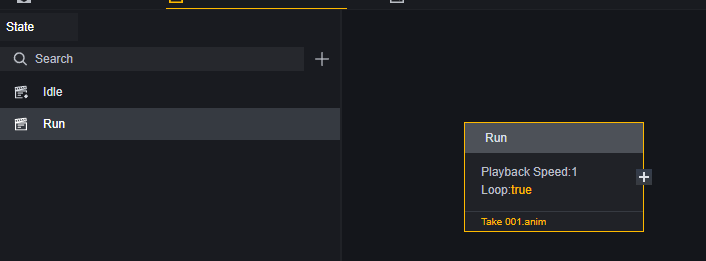
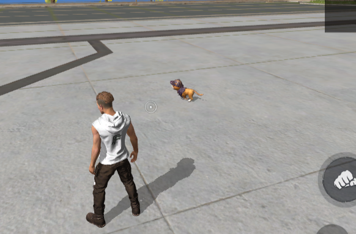

# Hệ Thống Hoạt Hình - Hướng Dẫn Sử Dụng

# Tổng Quan Về Hệ Thống Hoạt Hình

Khái niệm cơ bản của hệ thống hoạt hình là đoạn hoạt hình (Clip), một đoạn hoạt hình là thông tin về sự thay đổi vị trí, xoay hoặc các thuộc tính khác của đối tượng theo thời gian. Thông qua thông tin ghi chép tuyến tính này, có thể thực hiện các hiệu ứng hoạt hình như mở cửa, đi bộ hoặc nhảy. Thông thường, một đoạn hoạt hình chỉ chứa thông tin hoạt hình có thời lượng ngắn.

Thông qua bộ điều khiển hoạt hình, các đoạn hoạt hình có thể được phát một cách có tổ chức, từ đó thực hiện các tình huống sử dụng hoạt hình phức tạp và logic hơn.

Hệ thống hoạt hình hỗ trợ bạn nhập các đoạn hoạt hình tùy chỉnh và sử dụng để tạo ra các hoạt hình độc đáo hoặc thay thế hoạt hình mặc định của nhân vật.

# Định Dạng Hỗ Trợ

Craftland Studio PC chỉ hỗ trợ nhập hoạt hình định dạng FBX.

# Nhập Hoạt Hình

Giống như nhập bất kỳ tài nguyên nào khác, bạn có thể kéo trực tiếp tài nguyên hoạt hình vào thư mục Assets hoặc sử dụng chức năng nhập.

# Xem Trước Hoạt Hình

Mở tệp FBX đã nhập, trong đó sẽ có tệp đoạn hoạt hình.

Nhấp đúp vào hoạt hình, sẽ có thông báo cần mô hình để phát hoạt hình.

Kéo mô hình tương ứng đã chuẩn bị sẵn vào, bạn có thể xem trước hoạt hình.

# Sử Dụng Hoạt Hình

Hoạt hình đã nhập trở thành tài sản trong dự án game của bạn, dưới đây là hai cách chính để sử dụng hoạt hình.

## Thay Thế Hành Động Người Chơi

Trong dữ liệu người chơi, bạn có thể sử dụng hoạt hình để thay thế hành động mặc định của người chơi.

Khi thay thế hành động, cần đảm bảo rằng hành động phù hợp với bộ xương được sử dụng trong dữ liệu người chơi. Trong ví dụ này, sử dụng hành động idle của một con mèo, do đó cũng cần thay thế mô hình người chơi bằng mô hình mèo.

Trong cài đặt này, người chơi sẽ được thay thế bằng một con mèo và chỉ phát hành động khi ở trạng thái idle, không phát bất kỳ hành động nào khi thực hiện các hành động khác.

Thông tin thêm về dữ liệu người chơi có trong hướng dẫn sử dụng [Người Chơi].

## Máy Trạng Thái Hoạt Hình

Thông qua máy trạng thái hoạt hình, bạn có thể quy định thứ tự phát của một nhóm hành động và phát toàn bộ nhóm khi cần thiết.

### Tạo Máy Trạng Thái Hoạt Hình

### Chỉnh Sửa Máy Trạng Thái Hoạt Hình

1. Thanh trạng thái: Tại đây bạn có thể cài đặt nhiều trạng thái cho máy trạng thái hoạt hình để dễ dàng chuyển đổi sang trạng thái tương ứng trong điều kiện thích hợp. Máy trạng thái hoạt hình ít nhất phải có một trạng thái Idle.
2. Đoạn hoạt hình trong trạng thái hiện tại: Tại đây bạn có thể chỉnh sửa đoạn hoạt hình được phát trong một trạng thái và thứ tự phát của chúng.
3. Bảng thuộc tính: Tại đây bạn có thể chỉnh sửa cấu hình của trạng thái hoặc đoạn hoạt hình.

Trong thuộc tính của trạng thái, bạn có thể sửa tên, thiết lập toàn bộ nhóm trạng thái có lặp lại hay không.

> Thuộc tính của trạng thái Idle mặc định không thể chỉnh sửa.

Thuộc tính lặp lại của trạng thái nghĩa là khi tất cả các đoạn hoạt hình trong trạng thái đó đã phát xong, sẽ bắt đầu phát lại từ đoạn đầu tiên. Cần lưu ý rằng nếu bạn cài đặt cách phát cho một đoạn nào đó trong trạng thái là lặp lại thì thường trạng thái đó sẽ không tự động kết thúc và cũng không chuyển sang vòng lặp tiếp theo.

> Đoạn hoạt hình lặp lại sẽ không tự động chuyển sang đoạn tiếp theo và cũng không làm cho trạng thái hiện tại lặp lại.

### Ví Dụ Ứng Dụng Máy Trạng Thái Hoạt Hình

Chúng ta đặt một mô hình mèo trong cảnh và muốn nó chạy đến địa điểm chỉ định khi bắt đầu lượt, sau đó lặp lại tổ hợp nhàn rỗi + ăn uống.

1. Thêm Thành Phần

   Máy trạng thái hoạt hình phụ thuộc vào thành phần máy trạng thái hoạt hình có thể thêm:

   

2. Chỉnh Sửa Máy Trạng Thái Hoạt Hình

   Chỉnh sửa máy trạng thái đã thêm vào thành phần.

   Thêm hai trạng thái: Idle và Run.

   

   Trong trạng thái Idle thêm hai hành động: Idle và Eat.

   

   Ở đây chế độ phát của trạng thái idle là lặp lại nên đặt cả hai clip không lặp lại để đáp ứng nhu cầu phát liên tục idle+Eat.

   Trong trạng thái Run thêm một đoạn chạy và đặt đoạn này là lặp lại hoặc đặt Run là lặp lại. Hai cách cài đặt này sẽ ảnh hưởng đến một tham số trong biểu đồ kịch bản sau này. Ở đây chúng ta chỉ đặt chế độ phát của đoạn chạy là lặp lại.

   

3. Chỉnh Sửa Kịch Bản

   Thêm kịch bản cho mô hình mèo này và viết logic. Vì các hoạt động thêm vào không bao gồm di chuyển thực tế nên chúng ta cần sử dụng playable để thêm hướng và di chuyển cho mô hình:

   

   > Chúng ta đã thêm một Box001 vô hình ở điểm cuối di chuyển trên bản đồ để giúp mèo luôn hướng về điểm cuối di chuyển.

4. Kiểm Tra

   Giai đoạn chuẩn bị vì đã thêm máy trạng thái nên tự động bắt đầu phát trạng thái Idle.

   

​	Di chuyển giai đoạn.

​	Đến đích cuối cùng.

 