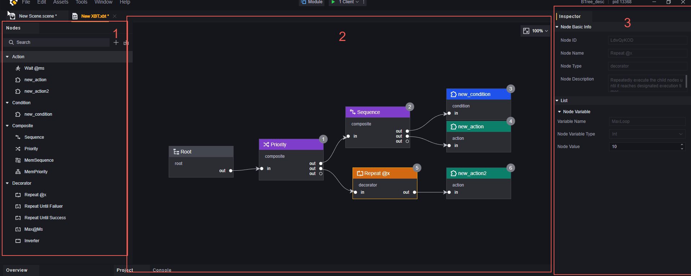
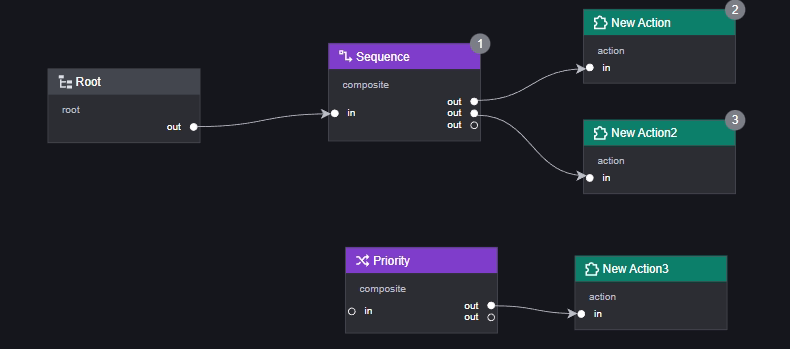
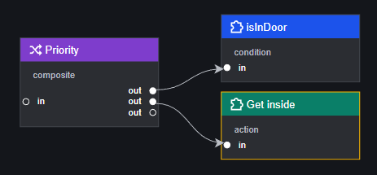

# BehaviourTree- Cây hành vi

Cây hành vi là một mô hình quyết định hành vi, có thể được sử dụng để thiết lập hành vi của các đối tượng có thể gắn các thành phần cây hành vi, chẳng hạn như quái vật hoặc NPC tùy chỉnh.
Cây hành vi sử dụng cấu trúc dạng cây phù hợp với cách suy nghĩ của con người, giúp thiết kế hành vi trực quan hơn. Tính mô-đun cũng giúp các nhà phát triển thực hiện các thay đổi và điều chỉnh.
Trong hướng dẫn này, bạn sẽ học về nguyên lý hoạt động của cây hành vi và cách tạo một cây hành vi. Trong ví dụ, sẽ trình bày cách tạo một cây hành vi cho xác sống có thể tuần tra và truy đuổi người chơi.

## Cấu trúc và logic hoạt động của cây hành vi

Cây hành vi bao gồm các nút logic, nút lá và một nút gốc đặc biệt.

Cây hành vi sẽ duyệt tất cả các nút có thể thực thi theo thứ tự định nghĩa trong mỗi Tick (một khung hình hoặc nhiều khung hình, có thể được thay đổi trong thuộc tính của cây hành vi) và cuối cùng dừng lại tại một nút.

Cây hành vi sẽ bắt đầu từ nút gốc, thực hiện theo thứ tự từ trái sang phải, từ trên xuống dưới, cho đến khi dừng lại ở nút dừng hoặc duyệt qua tất cả các nút của cây hành vi kết nối.

> Cây hành vi luôn bắt đầu thực thi từ nút gốc, vì vậy chỉ có các nút trực tiếp hoặc gián tiếp kết nối với nút gốc mới được thực thi.
> Thứ tự thực thi các nút sẽ được đánh số trong trình chỉnh sửa, các nút không được thực thi sẽ không có số.
> Mỗi Tick, khi cây hành vi dừng lại ở một nút nào đó, thứ tự thực thi của các nút sau nút đó sẽ không được thực hiện.

## Các nút của cây hành vi

Nút gốc: Là nút khởi đầu của mỗi cây, tất cả các logic đều bắt đầu từ nút gốc. Nút gốc được tạo tự động và không thể xóa.

Nút logic: Là các nút phân loại là Composite, Decorator. Nút logic quyết định logic thực thi của các nút con. Nút logic không thể được sử dụng làm nút cuối cùng của một nhánh.

Nút lá: Là các nút phân loại là Condition, Action. Nút lá quyết định hành vi thực tế của thực thể. Nút lá phải được sử dụng làm nút cuối cùng của một nhánh.

## Tạo cây hành vi

Bạn có thể nhấp chuột phải trong cửa sổ Assets để tạo file cây hành vi. Và bạn có thể quản lý các file cây hành vi trong cửa sổ Assets. Phần mở rộng của file cây hành vi là .xbt.

## Gắn cây hành vi

Trước khi gắn cây hành vi cho bất kỳ thực thể nào, bạn phải thêm thành phần “Thực thể có thể gắn cây hành vi” trong bảng điều khiển inspector.
Sau khi thêm thành phần “Cây hành vi có thể gắn”, bạn có thể nhanh chóng gắn file cây hành vi.

Mỗi thực thể chỉ có thể gắn một cây hành vi.

## Chỉnh sửa cây hành vi

Mở file cây hành vi đồng nghĩa với việc mở bảng chỉnh sửa cây hành vi.

Bảng chỉnh sửa cây hành vi được chia thành ba phần:

1. Danh sách nút

2. Canvas

3. Bảng điều khiển (inspector)

### Danh sách nút

Tất cả các nút chính thức, tùy chỉnh và nhập khẩu sẽ được hiển thị ở đây.
Kéo và thả nút vào canvas để tạo một nút tương ứng mới.
Hỗ trợ tìm kiếm nút.
Nút ở góc trên bên phải có thể tạo nút tùy chỉnh hoặc nhập nút.
### Danh sách nút

Tất cả các nút do chính thức cung cấp, tùy chỉnh và nhập khẩu sẽ hiển thị ở đây.
Kéo thả nút vào khung vẽ để tạo một nút tương ứng hoàn toàn mới.
Hỗ trợ tìm kiếm nút.
Nút ở góc trên bên phải có thể tạo nút tùy chỉnh hoặc nhập khẩu nút.

#### Nút tùy chỉnh

Nhấp vào dấu “+” ở góc trên bên phải để mở bảng tạo nút, trong bảng tạo nút, bạn có thể tùy chỉnh các thuộc tính sau của nút:

1. Tên nút.
2. Loại nút, hiện chỉ hỗ trợ loại Action và Condition tùy chỉnh.
3. Kịch bản của nút, hiện tại chỉ hỗ trợ thêm kịch bản có sẵn vào nút tùy chỉnh trong bảng tạo, sau khi tạo có thể chỉnh sửa.
4. Loại biến của nút, có thể tạo thuộc tính tùy chỉnh cho nút này để kịch bản gọi.
5. Mô tả của nút.

Trong các nội dung trên, ngoại trừ 2. loại nút, tất cả đều hỗ trợ chỉnh sửa sau khi tạo.

#### Nhập khẩu nút

Nhấp vào nút nhập khẩu ở góc trên bên phải để mở giao diện chọn tệp nhập khẩu.
Có thể nhập khẩu các nút từ dự án khác, hậu tố của tệp là .xbttemp.
Khi nhập khẩu cần chú ý, các nút nhập khẩu có thể mang theo kịch bản không tồn tại trong dự án này.

> Quan trọng! Việc chỉnh sửa các nút trong danh sách sẽ không ảnh hưởng đến các nút đã kéo vào khung vẽ.

### Khung vẽ

Khung vẽ là khu vực chính để chỉnh sửa cây hành vi, kéo các nút từ danh sách vào khung vẽ, bạn có thể sắp xếp tự do các nút cây hành vi và kết nối bất kỳ hai nút nào bằng cách kết nối từ “out” đến “in” để chỉnh sửa thứ tự thực thi của chúng. Khung vẽ luôn bao gồm một nút gốc cố định.

Khi kết nối từ tab “out” của một nút đến tab “in” của một nút khác, chúng ta gọi nút được kết nối từ “out” là nút cha (nút xuất), và nút được kết nối từ “in” là nút con (nút nhập).
Tùy theo loại nút khác nhau, một nút có thể có một hoặc nhiều “out”, nhưng chỉ có và chỉ duy nhất một “in”. (Ngoại trừ nút gốc, không có đầu vào tương ứng)

Cây hành vi chỉ thực thi các nút kết nối trực tiếp hoặc gián tiếp với nút gốc, gọi là các nút kích hoạt. Khung vẽ sẽ tự động nhận diện các nút kích hoạt và sắp xếp chúng theo thứ tự từ trái sang phải, từ trên xuống dưới. Số màu xám ở góc trên bên phải của mỗi nút là thứ tự được gọi, các nút không kích hoạt sẽ không hiển thị số.

> Có thể giữ chuột trái hoặc chuột giữa để kéo di chuyển bảng.
> Sử dụng Ctrl + bánh xe chuột để phóng to thu nhỏ bảng.

### Bảng kiểm tra nút

Mỗi nút trong khung vẽ chứa thông tin sau hoặc một phần trong số đó: thông tin cơ bản về nút, kịch bản, danh sách biến của nút.

Thông tin cơ bản về nút: bao gồm ID của nút, tên của nó, loại và mô tả của nó.
Kịch bản: kịch bản gắn liền với cây hành vi tại điểm này. Một cây hành vi chỉ có thể gắn liền với một kịch bản duy nhất. Kịch bản điều khiển hành vi cần thực thi khi cây hành vi chạy đến điểm này.
Danh sách biến của nút: một số biến cần thiết cho việc chạy của điểm này, một phần do chính thức cung cấp và một phần do người sáng tạo thêm vào khi tạo điểm này.

> ID trong thông tin cơ bản về điểm được phân bổ tự động, các thông tin khác trong danh sách điểm bên trái có thể chỉnh sửa toàn bộ nhưng điểm đã kéo vào khung vẽ chỉ có thể chỉnh sửa tên điểm.
> Kịch bản có thể thêm khi tạo điểm hoặc chỉnh sửa trong khung vẽ nhưng mỗi điểm chỉ có thể gắn liền với một kịch bản duy nhất.
> Danh sách biến của điểm có thể thiết lập khi tạo hoặc thiết lập trong khung vẽ.
> Luôn lưu ý rằng danh sách biến trong bảng và điểm trên khung vẽ không bằng nhau, dữ liệu sử dụng cụ thể phải dựa trên điểm trên khung vẽ.

## Loại điểm cây hành vi

Cây hành vi có 4 loại điểm: Action, Condition, Composite và Decorator.

Trong đó Composite và Decorator là loại logic không thể sử dụng làm điểm cuối cùng trên một nhánh.
Action và Condition là loại lá chỉ có thể sử dụng làm điểm cuối cùng trên một nhánh.

### Action

Điểm loại Action đại diện cho “hành động” mà cây hành vi cần thực thi. Ngoại trừ điểm chính thức “Wait @ms”, tất cả các hành động còn lại đều do người sáng tạo tạo ra và định nghĩa. Action thường được sử dụng để khiến thực thể cây hành vi hoặc thực thể thuộc sở hữu của nó thực hiện hành động cụ thể. Sử dụng điểm Action có thể tạo ra hành động tùy chỉnh mô-đun hóa như đi đến địa điểm cụ thể, phát hành kỹ năng cụ thể hoặc kích hoạt hiệu ứng chỉ định.
Kết quả thực thi của điểm Action chỉ có hai loại: Hoàn thành (Complete) và Đang chạy (Running).

- Wait @ms: Điểm này chứa một biến “WaitTime”, dùng để chờ đợi thời gian cụ thể (được tính bằng mili giây) trong quá trình thực thi cây hành vi (thời gian chờ cụ thể là giá trị của biến “WaitTime”). Khi thời gian chờ chưa kết thúc, điểm này sẽ luôn trả về “Đang chạy”, còn sau thời gian chờ sẽ trả về “Hoàn thành”.

> Lưu ý: Vì cây hành vi thực thi mỗi Tick một lần nên khi sử dụng biểu tượng “chờ đợi” trong các điểm cây hành vi, có thể gây ra tình trạng chờ đợi lặp lại mỗi Tick dẫn đến cây hành vi bị treo. Do đó nên sử dụng điểm Wait @ms thay vì biểu tượng “chờ đợi” trong kịch bản cây hành vi.

### Condition

Điểm loại Condition đại diện cho điều kiện mà cây hành vi cần kiểm tra. Tất cả các điểm Condition đều do người sáng tạo tạo ra và định nghĩa. Điểm Condition thường được sử dụng để kiểm tra xem điều kiện cụ thể có đúng hay không.
Kết quả thực thi của điểm Condition chỉ có hai loại: Đúng (True) và Sai (False).

### Composite

Điểm loại Composite chỉ có bốn cái đều là chính thức cung cấp. Loại này chủ yếu dùng để kiểm soát thứ tự thực thi của các điểm con.

- Priority: Thực hiện mối quan hệ hoặc giữa các điểm con theo thứ tự định nghĩa cho đến khi gặp một điểm con trả về true thì dừng lại và trả về true. Nếu tất cả các điểm con trả về false thì trả về false. Không hỗ trợ lưu trữ kết quả thực thi đơn lẻ cho lần tiếp theo.
- Sequence: Thực hiện mối quan hệ và giữa các điểm con theo thứ tự định nghĩa cho đến khi gặp một điểm con trả về false thì dừng lại và trả về false. Nếu tất cả các điểm con trả về true thì trả về true. Không hỗ trợ lưu trữ kết quả thực thi đơn lẻ cho lần tiếp theo.
- MemPriority: Giống như Priority nhưng hỗ trợ lưu trữ kết quả thực thi đơn lẻ cho lần tiếp theo.
- MemSequence: Giống như Sequence nhưng hỗ trợ lưu trữ kết quả thực thi đơn lẻ cho lần tiếp theo.

> Lưu ý: Chức năng kiểm soát thứ tự thực thi của Composite chỉ hiệu lực đối với tất cả "điểm con" kết nối với Composite đó.
> Không hỗ trợ tùy chỉnh đối với Composite.

### Decorator

Điểm loại Decorator chủ yếu dùng để kiểm soát logic thực thi của cây hành vi. Hiện tại chỉ có năm Decorator chính thức cung cấp.

- Repeat @X: Điểm này chứa một biến “MaxLoop”, chức năng chính là khiến các điểm con trực tiếp kết nối lặp lại "MaxLoop" lần và trả về kết quả lần cuối cùng thực hiện.
- Repeat Until Failure: Điểm này khiến các điểm con trực tiếp kết nối lặp lại cho đến khi trả về kết quả "Failure" tức là "Sai".
- Repeat Until Success: Điểm này khiến các điểm con trực tiếp kết nối lặp lại cho đến khi trả về kết quả "Success" tức là "Đúng".
- Max @Ms: Điểm này chứa một biến “MaxTime”. Khi thực hiện các điểm con trực tiếp kết nối, nó sẽ kiểm tra xem liệu đã quá thời gian chưa, nếu quá thời gian thì trả về "Sai".
- Inverter: Điểm này sẽ lấy giá trị ngược lại với kết quả thực thi của các điểm con trực tiếp kết nối với nó. Ví dụ lấy ngược lại "Sai" thành "Đúng".

> Không hỗ trợ tùy chỉnh cho nút Decorator.

## Quy tắc cơ bản của kịch bản nút cây hành vi

Mỗi nút có thể chỉnh sửa trên cây hành vi hỗ trợ thêm tối đa một kịch bản.
Các nút có thể chỉnh sửa đều thuộc loại Action hoặc Condition, tùy theo loại mà kịch bản nút phải trả về giá trị chỉ định.

Kịch bản của nút Condition phải trả về một giá trị Bool.
Kịch bản của nút Action phải trả về giá trị thuộc loại "trạng thái chạy của nút cây hành vi", tức là "hoàn thành" hoặc "đang tiến hành".

> Giả sử kịch bản trả về nhiều giá trị cho cây hành vi, cây hành vi mặc định sẽ lấy giá trị đầu tiên trả về làm kết quả chạy của nút đó.
> Các nút cơ bản do chính thức cung cấp đã được thiết lập sẵn giá trị trả về, chi tiết xem loại nút.
> Nút logic sẽ thực hiện phán đoán logic dựa trên giá trị trả về của các nút lá, chi tiết cũng xem loại nút.

Trong nút cần có một hàm đặc biệt, hàm này phải chỉ định loại tham số đầu vào và đầu ra để cây hành vi có thể gọi.
Yêu cầu về hàm đặc biệt sẽ được giải thích dưới đây.

Khuyến nghị sử dụng sự kiện "khi nút vào" để thực hiện công việc khởi tạo, viết logic của nút vào hàm đặc biệt.
Như vậy khi nút trả về kết quả "đang tiến hành" mỗi tick có thể trực tiếp thực thi hàm đặc biệt mà không cần lặp lại việc khởi tạo.

### Cách trả về kết quả chạy trong nút

Cây hành vi thông qua việc đọc giá trị của một hàm đặc biệt để phán đoán giá trị trả về, loại hàm này trong cùng một kịch bản của nút chỉ có và chỉ được phép có một.

Trong kịch bản Condition và Action, cách viết hàm này khác nhau.

Cách viết dưới nút Condition như hình:

Tham số đầu vào là: thực thể có thể gắn cây hành vi (Owner, tức là thực thể mà chúng ta đã gắn tệp cây hành vi tương ứng).

Giá trị trả về là: Bool (kết quả chạy của nút đó).

Cách viết dưới nút Action như hình:

Tham số đầu vào là: thực thể có thể gắn cây hành vi (Owner, tức là thực thể mà chúng ta đã gắn tệp cây hành vi tương ứng).

Giá trị trả về là: trạng thái chạy của nút cây hành vi (kết quả chạy của nút đó).

> Cây hành vi sẽ tự động đọc hàm loại này trong kịch bản của nút (cần đảm bảo chỉ có và chỉ có một hàm cùng định dạng), và gọi hàm này mỗi tick để nhận một giá trị trả về. Không cần gọi riêng hàm loại đặc biệt này.
> Mỗi lần chạy cây hành vi, thứ tự kích hoạt các sự kiện lần lượt là: khi vào nút, gọi hàm đặc biệt, khi thoát khỏi nút.
> Loại hàm đặc biệt này mỗi kịch bản chỉ tồn tại một cái, không thiết kế các hàm có cùng loại tham số đầu vào và giá trị trả về. Có thể nhúng các logic khác mà bạn muốn thực thi vào trong hàm này, chỉ cần đảm bảo rằng cuối cùng hàm này có thể trả về giá trị tương ứng.
> Các hàm không thuộc định dạng đặc biệt có thể tồn tại vô hạn trong kịch bản, không ảnh hưởng đến hoạt động bình thường và phán đoán logic của cây hành vi.
> Trong hàm đặc biệt này, tạm thời không hỗ trợ gọi các hàm bất đồng bộ, phải trả về kết quả ngay lập tức khi tick.

## Ví dụ

Lấy một yêu cầu đơn giản làm ví dụ, tạo và áp dụng một cây hành vi.

> Việc viết kịch bản thực tế sẽ không xuất hiện trong ví dụ này

Giả sử một yêu cầu:
Trong cảnh có: một con zombie, hai cây dừa. Sử dụng cây hành vi để zombie tuần tra liên tục giữa hai cây dừa, khi phát hiện người chơi gần đó thì truy đuổi và sau khi mất mục tiêu người chơi thì quay lại tuần tra.

Đầu tiên, tạo một tệp cây hành vi và chỉnh sửa nó:

Phân tích yêu cầu, các hành động có thể của zombie bao gồm:

1. Tuần tra
2. Truy đuổi người chơi
3. Quay lại đường tuần tra

Điều kiện thay đổi hành động của zombie gồm:

1. Phát hiện người chơi
2. Mất dấu người chơi
3. Phát hiện mình không ở trên đường tuần tra
4. Phát hiện mình đang ở trên đường tuần tra

Trong đó 1 và 2 với 3 và 4 đều là hai mặt của cùng một điều kiện. Vì vậy chỉ cần tạo hai nút Condition.
Tạo tất cả các nút tùy chỉnh:

Nút Action:

1. Tuần tra
2. Truy đuổi người chơi
3. Quay lại đường tuần tra

Nút Condition:

1. Có phát hiện người chơi không
2. Có đang ở trên đường tuần tra không

Phân tích điều kiện của các nút Action:

| Nút Action     | Điều kiện 1         | Điều kiện 2      |
| -------------- | ------------------- | ---------------- |
| Tuần tra       | Zombie không phát hiện người chơi | Đang ở trên đường tuần tra |
| Truy đuổi người chơi | Zombie phát hiện người chơi   |                  |
| Quay lại đường tuần tra | Zombie không phát hiện người chơi | Không ở trên đường tuần tra |

将需要最少条件的行为: truy đuổi người chơi, cùng với các điều kiện của nó, sử dụng node Sequence để tạo thành một nhóm:

> Node Sequence: Các node con thực hiện lần lượt, dừng lại khi một node con trả về false và trả về false; nếu tất cả các node con trả về true, thì trả về true.

Trong nhóm này, hành động truy đuổi phải được thực hiện sau khi node phát hiện người chơi trả về true.

Nếu zombie không phát hiện người chơi, thì cần dựa vào một điều kiện khác: kết quả của việc có nằm trên đường tuần tra hay không để quyết định hành động thực tế của zombie. Vì vậy, chúng ta cần một node logic để kết nối nhóm trước đó và điều kiện mới.
Vì lúc này đang xử lý logic khi zombie không phát hiện người chơi, nên giá trị trả về của node Sequence trong nhóm trước đó chắc chắn là false. Do đó, node logic mới cần một node có thể tiếp tục chạy ngay cả khi nhận được false.

Đó chính là node Priority:

> Node Priority: Các node con thực hiện lần lượt, dừng lại khi một node con trả về true và trả về true; nếu tất cả các node con trả về false, thì trả về false.

Nhóm này sẽ kiểm tra xem zombie có nằm trên đường tuần tra hay không trong trường hợp không phát hiện người chơi. Dựa vào đặc tính của node Priority, chúng ta có thể kết nối trực tiếp hành động của zombie khi node "có nằm trên đường tuần tra" trả về false: quay lại đường tuần tra.

Khi node "có nằm trên đường tuần tra" trả về true, node Priority sẽ dừng lại vì nhận được true và trả về giá trị true. Chúng ta cần một node logic để tiếp tục thực hiện hành động cuối cùng của zombie: tuần tra khi các node con của nó trả về true.

Như vậy, một cây hành vi đã được xây dựng hoàn chỉnh.

Tiếp theo, chúng ta cần gắn cây hành vi này lên thực thể zombie:

Chọn zombie và thêm thành phần "thực thể có thể gắn cây hành vi".

Thêm cây hành vi vừa chỉnh sửa xong:

Hoàn tất

> Ví dụ chỉ mang tính chất minh họa một phương pháp tạo cây hành vi và chỉ dùng để tham khảo.
> Cùng một logic có thể được vẽ thành nhiều cách khác nhau trên canvas cây hành vi tùy theo sở thích cá nhân.
> Sau khi thêm cây hành vi vào thực thể, bạn vẫn có thể tiếp tục chỉnh sửa cây hành vi mà không nhất thiết phải tuân theo quy trình như ví dụ.

## Bổ sung

### Điều kiện tiên quyết

Khi hành động X phải được thực hiện sau khi thỏa mãn điều kiện A, điều kiện A được gọi là điều kiện tiên quyết của hành động X. Sử dụng node Sequence có thể xây dựng đơn vị logic.
Điều kiện tiên quyết dùng để đáp ứng nhu cầu logic kiểu if-then, ví dụ như phải mở cửa thì mới vào nhà được:

### Điều kiện hậu

Khi sau khi thực hiện hành động X, điều kiện B chắc chắn sẽ thỏa mãn, điều kiện B được gọi là điều kiện hậu của hành động X. Sử dụng node Priority có thể xây dựng đơn vị logic.
Điều kiện hậu dùng để đảm bảo rằng khi khối logic tổng thể thực hiện thành công thì điều kiện đó chắc chắn sẽ thỏa mãn. Ví dụ nếu hành động vào nhà thành công, đơn vị chắc chắn sẽ ở trong nhà:

### Mô hình PPA (Postcondition-Precondition-Action)

Kết hợp hai loại điều kiện trên, chúng ta có thể sử dụng một phương pháp thiết kế phổ biến là mô hình PPA.

Lợi ích của mô hình này là toàn bộ cây hành vi có thể coi như đang hoạt động dưới tiền đề của điều kiện hậu, giúp hỗ trợ tốt hơn cho việc thiết kế phân tầng. Ví dụ như cửa có thể ở trạng thái khóa:

Logic mới chủ yếu ảnh hưởng đến việc cửa có mở hay không. Đặt mở cửa làm điều kiện hậu và chỉnh sửa logic mở rộng tương ứng.
