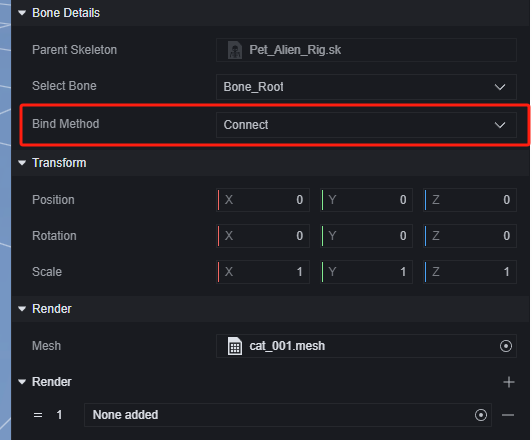

# AVATAR - Hướng dẫn sử dụng

# Nhóm ngoại hình

Nhóm ngoại hình là khái niệm quản lý phân loại mesh ngoại hình trong mô hình.

Thêm mô hình có xương vào làm prefab, bạn có thể vào chỉnh sửa ngoại hình:

Trong cài đặt nhóm ngoại hình, bạn có thể đặt nhóm này là một trong các ngoại hình loại trừ lẫn nhau:

Tất cả các nhóm ngoại hình được đặt vào cùng một nhóm loại trừ sẽ không hiển thị đồng thời. Điều này tiện lợi cho việc chuyển đổi skin và các thao tác khác.

Trong nhóm ngoại hình, các bộ phận được tính theo đơn vị mesh, số lượng mesh của một mô hình được xác định khi tạo mô hình.

Trong cài đặt mesh, bạn có thể chỉnh sửa điểm nối với xương, cách thức kết nối; chỉnh sửa cách thức render và các thao tác khác:

Có thể thêm mesh mới cho mô hình bằng cách tạo ngoại hình mới:

Có thể chọn tài nguyên mesh có sẵn trong dự án:

Nếu mesh mới thêm không khớp với xương gốc, hãy chọn cách kết nối là liên kết:

# Sử dụng nhóm ngoại hình

Thông qua script, bạn có thể điều khiển việc ẩn/hiện hoặc chuyển đổi nhóm ngoại hình cụ thể.

> Chuyển đổi nhóm ngoại hình sẽ ẩn nhóm cũ và hiển thị nhóm mới.

Trong thú cưng ngoài hành tinh có hai mesh, lần lượt là thân ngoài hành tinh và đĩa bay:

Chúng tôi tạo nhóm ngoại hình mới để tách hai phần này ra:

Ở trạng thái mặc định, chúng tôi ẩn đĩa bay và hiển thị nó sau khi vòng chơi bắt đầu:

> Script toàn cục

Trong giai đoạn chuẩn bị của trò chơi, chỉ thấy ngoài hành tinh:

Sau khi vòng chơi bắt đầu, đĩa bay được hiển thị:

Sử dụng linh hoạt script để điều khiển nhóm ngoại hình, bạn có thể thực hiện các thao tác như chuyển đổi hiển thị bộ phận, thay đổi skin, biến hình trong điều kiện cụ thể.
