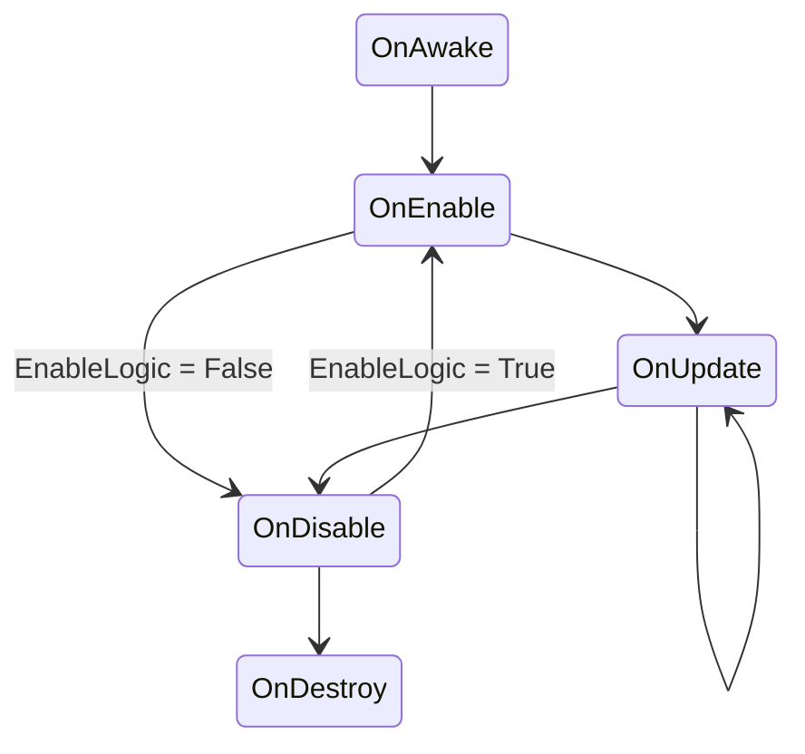
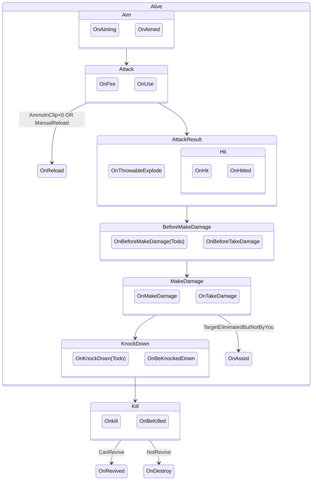
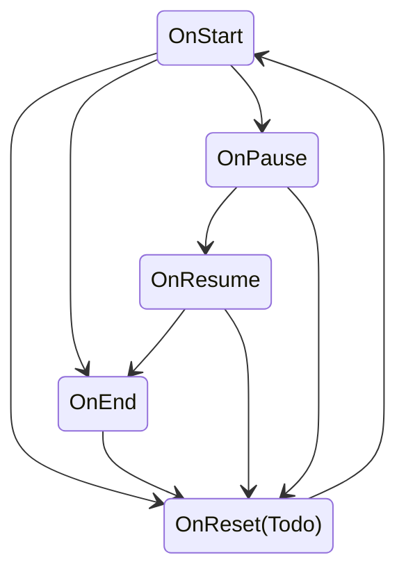

# Các Khái Niệm Quan Trọng - Hướng Dẫn Sử Dụng

## Mô-đun

Mô-đun là một khối chức năng độc lập, nó bao bọc sự phức tạp bên trong và cung cấp giao diện đơn giản bên ngoài. 
Mô-đun thường bao gồm các cài đặt, tài sản, chức năng liên quan với nhau. Sau khi tải mô-đun, bạn có thể thiết lập các yếu tố liên quan trong trò chơi.

Trong trình chỉnh sửa, bạn có thể mở trình quản lý mô-đun tại vị trí trên:

1. Bạn có thể tìm kiếm tất cả các mô-đun.

> Phạm vi tìm kiếm là tất cả các mô-đun, bất kể mô-đun đã được tải hay không trong danh mục hiện tại.

2. Danh mục mô-đun, chia thành Đã Tải, Chưa Tải và Tất Cả.

3. Danh sách mô-đun, hiển thị tất cả các mô-đun trong danh mục đó, nhấp vào mô-đun để xem cài đặt của nó.

### Cài đặt và Gỡ bỏ Mô-đun

Mặc định, chúng tôi đã tải trước một số mô-đun cho bạn. Các mô-đun trong danh mục Chưa Tải là các mô-đun tùy chọn.

#### Tải Mô-đun

Biểu tượng phía sau mô-đun cho biết mô-đun đó chưa được tải. Nhấp vào biểu tượng đó để tải mô-đun.

Bạn cũng có thể tải mô-đun thông qua nút tải trong giao diện cài đặt mô-đun.

#### Gỡ bỏ Mô-đun

Đối với các mô-đun có thể gỡ bỏ, trong giao diện cài đặt sẽ có nút gỡ bỏ. Nhấp vào nút đó để gỡ bỏ mô-đun.

Một số mô-đun cần thiết không thể gỡ bỏ, chỉ có thể thay đổi cài đặt. Những mô-đun này không có nút gỡ bỏ.

> Việc tải/gỡ bỏ mô-đun sẽ không được phản ánh ngay lập tức trong danh mục, có thể mô-đun đã tải vẫn xuất hiện trong danh mục Chưa Tải, nhưng sẽ được cập nhật sau khi làm mới trang.

### Cài đặt Mô-đun

Đối với mô-đun chưa tải, chỉ có một thao tác khả dụng: Tải. Sau khi tải, bạn có thể thực hiện các cài đặt cụ thể.

Khi chọn mô-đun đã tải, bạn có thể xem mô tả và các cài đặt cụ thể của nó.

Đối với các cài đặt quan trọng của mô-đun, vui lòng tham khảo bài viết trong tài liệu hướng dẫn tương ứng.

## Thực Thể

Thực thể là một trong những khái niệm quan trọng của UGC. 
Một thực thể là một khái niệm cụ thể/ trừu tượng hoặc tập hợp của các khái niệm. Thực thể có thuộc tính, và thay đổi thuộc tính sẽ ảnh hưởng đến các phiên bản của thực thể đó.
Khái niệm thực thể rất rộng rãi, hầu hết các khái niệm trong trò chơi đều tồn tại dưới dạng thực thể.

Ví dụ về "Người chơi", thực thể "Người chơi" chỉ khái niệm cụ thể này, và giá trị sinh mạng là thuộc tính của thực thể người chơi. Một người chơi cụ thể A và B trong một trò chơi là hai phiên bản của thực thể người chơi. Người chơi A có 150 điểm sinh mạng, còn người chơi B có 200 điểm sinh mạng. Điểm sinh mạng là thuộc tính của thực thể, còn 150 và 200 điểm sinh mạng là thuộc tính của phiên bản.

Ngoài các thực thể có thể hiện hữu như người chơi, phương tiện, vũ khí, còn có các thực thể trừu tượng như toàn cục, quy trình trò chơi. Các thực thể trừu tượng cũng có thuộc tính và tạo ra các phiên bản. Ví dụ, quy trình trò chơi là một thực thể trừu tượng, thời gian giai đoạn chuẩn bị là một thuộc tính của nó. Giả sử có hai lần chơi, mỗi lần chơi sẽ tạo ra một phiên bản của quy trình trò chơi. Thời gian chuẩn bị của trò chơi đầu tiên là 5 giây, còn trò chơi thứ hai là 10 giây. 5 giây và 10 giây là thuộc tính phiên bản của quy trình trò chơi.

Trong hầu hết các trường hợp, khi nói đến thực thể trong trò chơi, thường là đề cập đến các phiên bản của thực thể, ví dụ như xóa thực thể, nhận thuộc tính của thực thể, thay đổi thuộc tính của thực thể. Trên thực tế, đối tượng thao tác là các phiên bản của thực thể. Trong phần dưới đây và các bài viết khác, nếu không cần thiết, sẽ không đặc biệt nhấn mạnh sự phân biệt giữa phiên bản thực thể và thực thể.

### Vòng Đời Của Thực Thể

Như đã nói ở trên, trên thực tế vòng đời áp dụng cho các phiên bản của thực thể. 
Vòng đời có nghĩa là thực thể từ khi được tạo ra cho đến khi bị hủy diệt, luôn trải qua một quy trình cụ thể. Bạn có thể hiểu và chỉnh sửa vòng đời của thực thể để thực hiện các thao tác vào thời điểm cụ thể nhằm đạt được mục đích thiết kế. Tất cả thực thể đều bắt đầu với Awake và kết thúc với Destroy. Hầu hết các thực thể sau Awake đều trải qua giai đoạn Enable kích hoạt và sử dụng Disable trước khi bị hủy.

> Có thể tồn tại những thực thể bỏ qua giai đoạn enable hoặc disable, nhưng Awake và Destroy luôn tồn tại.

**Quy Trình Chung**

Trước khi Awake, tất cả các giá trị thuộc tính ban đầu đã sẵn sàng, và thực thể cầu nối tương ứng cũng đã được tạo.

Dưới đây là một phần vòng đời của một số thực thể để bạn tham khảo:

**Quy Trình Đơn Vị Chiến Đấu**

**Quy Trình Có Thể Phát Lại**

## Đối Tượng Cảnh, Prefab và Thành Phần

Trong trình chỉnh sửa, bạn có thể đặt các đối tượng khác nhau trong cảnh, chúng có thể là đồ trang trí, trình kích hoạt, trình tạo, v.v. Bạn cũng có thể tùy chỉnh đối tượng bằng cách chỉnh sửa thành phần và thuộc tính của nó.

Chúng tôi cung cấp sẵn các đối tượng mẫu trong trình chỉnh sửa, có thể kéo và thả vào cảnh để cấu hình.

Ví dụ, với đối tượng cơ bản là hình khối, chúng tôi thêm hai hình khối vào cảnh.

Các đối tượng được cấu hình quản lý trên trang cấp bậc.

Các thành phần xác định hành vi của đối tượng. Một số thành phần phải được tải lên đối tượng tương ứng, một số khác là tùy chọn. Chúng tôi sẽ cung cấp cấu hình thành phần mặc định cho đối tượng, bạn có thể chỉnh sửa theo nhu cầu.

Lấy ví dụ về khối lập phương ở trên, chọn bất kỳ khối lập phương nào, bạn có thể thấy rằng nó đã được cấu hình một số thành phần mặc định trên bảng điều khiển inspector.

Bạn có thể chỉnh sửa các thành phần cấu hình bằng cách nhấn nút thêm thành phần.

1. Cài đặt các thành phần, các cài đặt thành phần sẽ đồng bộ đến tất cả các thực thể đã tải thành phần đó.

2. Các thành phần đã được tải.

3. Các thành phần tùy chọn, chọn để tải lên, bỏ chọn để gỡ bỏ.

Prefab là mẫu của đối tượng, thông qua prefab bạn có thể chỉnh sửa tất cả các đối tượng được cấu hình bởi prefab cùng lúc.

Kéo đối tượng trên cảnh vào thanh tài sản để tạo một prefab.

1. Tạo một thư mục prefab, bước này không bắt buộc nhưng được khuyến nghị để quản lý tệp dễ dàng hơn.

2. Chỉnh sửa đối tượng bạn muốn làm prefab, chẳng hạn như chồng hai khối lập phương và xây dựng cấu trúc cấp bậc, gộp chúng thành một thể thống nhất.

   

3. Kéo đối tượng đã chỉnh sửa từ giao diện cấp bậc vào thư mục prefabs đã tạo.

   

   

   > Một đối tượng có thể tạo nhiều prefab, nhưng chỉ prefab mới nhất sẽ được coi là prefab của đối tượng đó.

4. Các đối tượng có prefab sẽ được đánh dấu bằng màu xanh trong cấp bậc.

   

5. Kéo và thả prefab từ thư mục tài sản vào cảnh để tạo một đối tượng giống hệt.

   

6. Chỉnh sửa prefab sẽ đồng bộ đến tất cả các đối tượng được tạo từ prefab này. Bạn có thể nhanh chóng chỉnh sửa bằng cách nhấp vào prefab trong cửa sổ inspector, hoặc nhấp đúp vào prefab để vào giao diện chỉnh sửa chi tiết.

   

   Chỉ có tính khả dụng của đối tượng chính bị tắt, vì trong giao diện thao tác nhanh chỉ chỉnh sửa khối lập phương đóng vai trò là đối tượng cha trong cấu trúc. Bạn có thể vào giao diện chi tiết để thực hiện các chỉnh sửa phức tạp.

   

   Sau khi mở giao diện chi tiết, bạn có thể chỉnh sửa tất cả các cấu trúc của prefab.

7. Chỉnh sửa đối tượng sẽ không ảnh hưởng đến prefab, cũng như không ảnh hưởng đến các đối tượng khác cùng prefab.

   

8. Xóa prefab sẽ không ảnh hưởng đến các đối tượng đã tạo, nhưng các đối tượng được tạo từ prefab này sẽ được đánh dấu bằng màu đỏ trong cửa sổ cấp bậc.

   

## Tài Sản

Tài sản là các tệp được sử dụng để tạo nội dung trò chơi trong dự án. Tài nguyên phải là loại được hỗ trợ bởi trình chỉnh sửa. Hỗ trợ tạo trong trình chỉnh sửa hoặc nhập từ bên ngoài, đồng thời cũng hỗ trợ xuất và sử dụng cho các dự án khác.

Tài sản có thể được xác nhận trong giao diện dự án, chỉ nội dung trong thư mục Assets mới hỗ trợ tùy chỉnh.

### Các loại tài sản được hỗ trợ

| Loại tài sản | Mô tả                                                                 | Hướng dẫn thao tác             |
| ------------ | --------------------------------------------------------------------- | ------------------------------ |
| Tài liệu vật liệu   | Vật liệu có thể thay đổi ngoại hình của đối tượng, luôn được sử dụng thông qua shader. | Sẽ được cập nhật sau           |
| Vật liệu vật lý   | Vật liệu vật lý có thể thay đổi các thuộc tính vật lý của đối tượng, chẳng hạn như độ đàn hồi và ma sát. | Sẽ được cập nhật sau            |
| Tài liệu cảnh  | Cảnh là giao diện xử lý nội dung trò chơi, chứa tài nguyên của toàn bộ hoặc một phần nội dung trò chơi. Đối với trò chơi phức tạp hơn, bạn có thể cần nhiều cảnh để thực hiện thiết kế. | [LINK](https://github.com/trivyGameCTV/Craftland-Tutorial/blob/c2b5f8fea07b701fd331818993ceadb3ab75a9b9/Ti%E1%BA%BFng%20Vi%E1%BB%87t/12.%20V%E1%BA%ADt%20ph%E1%BA%A9m%20m%C3%A0n%20ch%C6%A1i/V%E1%BA%ADt%20ph%E1%BA%A9m%20m%C3%A0n%20ch%C6%A1i%20-%20S%E1%BB%95%20tay%20ng%C6%B0%E1%BB%9Di%20d%C3%B9ng.)            |
| Tài liệu UI     | UI là giao diện dùng để người dùng thao tác hoặc hiển thị thông tin cho người dùng. | [LINK](https://github.com/trivyGameCTV/Craftland-Tutorial/blob/c2b5f8fea07b701fd331818993ceadb3ab75a9b9/Ti%E1%BA%BFng%20Vi%E1%BB%87t/13.%20Giao%20di%E1%BB%87n/Giao%20di%E1%BB%87n%20-%20S%E1%BB%95%20tay%20ng%C6%B0%E1%BB%9Di%20d%C3%B9ng.)            |
| Dữ liệu người chơi   | Dữ liệu người chơi có thể tùy chỉnh nhân vật người chơi, bao gồm ngoại hình, hành động, v.v. | [LINK](https://github.com/trivyGameCTV/Craftland-Tutorial/blob/c2b5f8fea07b701fd331818993ceadb3ab75a9b9/Ti%E1%BA%BFng%20Vi%E1%BB%87t/7.%20Ng%C6%B0%E1%BB%9Di%20ch%C6%A1i/Ng%C6%B0%E1%BB%9Di%20ch%C6%A1i%20-%20S%E1%BB%95%20tay%20ng%C6%B0%E1%BB%9Di%20d%C3%B9ng%20.md?plain=1#)            |
| Bộ điều khiển hoạt ảnh | Bộ điều khiển hoạt ảnh cho phép bạn sắp xếp và duy trì một tập hợp các hoạt ảnh cho nhân vật hoặc đối tượng, thiết lập các thiết lập cho từng đoạn hoạt ảnh. | Sẽ được cập nhật sau            |
| Tài liệu cây hành vi | Tài liệu cây hành vi có thể thiết lập hành vi của nhân vật hoặc đối tượng. | [LINK](https://github.com/trivyGameCTV/Craftland-Tutorial/blob/c2b5f8fea07b701fd331818993ceadb3ab75a9b9/Ti%E1%BA%BFng%20Vi%E1%BB%87t/25.%20C%C3%A2y%20h%C3%A0nh%20vi/C%C3%A2y%20h%C3%A0nh%20vi%20-%20Behaviour%20Tree.) |
| Liên quan đến mã nguồn  | Có thể viết mã thông qua các thành phần hoặc mã nguồn, thêm logic tùy chỉnh cho trò chơi.   | [LINK](https://github.com/trivyGameCTV/Craftland-Tutorial/blob/de0158940c4497559be3ac6dca466733f76c00f5/Ti%E1%BA%BFng%20Vi%E1%BB%87t/4.%20K%E1%BB%8Bch%20b%E1%BA%A3n%20v%C3%A0%20logic/Ghi%20ch%C3%BA%20b%E1%BB%95%20sung%20k%E1%BB%8Bch%20b%E1%BA%A3n%20-%20H%C6%B0%E1%BB%9Bng%20d%E1%BA%ABn%20s%E1%BB%AD%20d%E1%BB%A5ng.)            |
