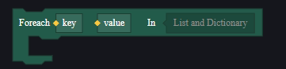

# Đăng Ký Phiên Bản

| Phiên bản | Thời gian | Ghi chú                                  |
| --------- | --------- | ---------------------------------------- |
| 1.1       | 2024-07-23| Phiên bản đầu tiên, bao gồm các phần giải thích trong sổ tay người dùng ban đầu |
|           |           |                                          |
|           |           |                                          |

# Hướng Dẫn Sử Dụng Bổ Sung Cho Script

Giải thích chi tiết cho một số mục:

## Script Đồ Họa

### Kiểm Soát Luồng

#### **Câu Lệnh Điều Kiện:**

if:


Nếu điều kiện được thỏa mãn, các nút bên dưới IF sẽ được thực thi. Nhấp vào dấu "+" để thêm ELSE: nếu điều kiện không được thỏa mãn, các nút bên dưới ELSE sẽ được thực thi:


Nhấp thêm vào dấu "+" để thêm ELSEIF, nếu điều kiện không thỏa mãn thì tiếp tục kiểm tra điều kiện tiếp theo.


#### Câu Lệnh Lặp:

Foreach:

Đối với mỗi KEY trong danh sách/thư viện tham số, thực thi một lần các nút bên dưới.



for index:

Biến i bắt đầu từ giá trị nhỏ nhất, mỗi lần thực thi các nút bên dưới thì i sẽ tăng thêm giá trị bước, cho đến khi i lớn hơn hoặc bằng giá trị lớn nhất.


> Khoảng giá trị [giá trị nhỏ nhất, giá trị lớn nhất) của nút này là đóng ở bên trái và mở ở bên phải, tức là i bằng giá trị lớn nhất thì sẽ không thực thi các nút bên dưới. Trong ví dụ này, vòng lặp sẽ chạy tổng cộng 10 lần, giá trị của i lần lượt từ 0 đến 9.

Vòng lặp while:


Chừng nào điều kiện được thỏa mãn, vòng lặp sẽ tiếp tục thực thi các nút bên dưới.

break:


Ngắt vòng lặp và tiếp tục thực thi các nút sau vòng lặp.

continue:


Bỏ qua vòng lặp hiện tại và chuyển sang vòng lặp tiếp theo.

## Script Code

### Cú Pháp Cơ Bản

#### Chú Thích

##### Chú Thích Dòng

```go
// Chú thích một dòng
```

##### Chú Thích Nhiều Dòng

```go
/* 

Chú thích nhiều dòng
Chú thích nhiều dòng

 */
```

##### Định Danh

Định danh được sử dụng để định nghĩa một biến, hàm, tên loại, và các mục do người dùng định nghĩa khác. Định danh được tạo thành từ các chữ cái, số, và dấu gạch dưới, và không thể bắt đầu bằng số.

##### Từ Khóa

Từ khóa dự trữ không thể được sử dụng làm định danh do người dùng định nghĩa:

| Từ khóa      | Giải thích                                           | Ví dụ                                                  |
| ------------ | --------------------------------------------------- | ----------------------------------------------------- |
| define       | Định nghĩa loại cơ bản                                | define AssetID : string                               |
| alias        | Định nghĩa bí danh loại, hỗ trợ biểu thức OR, AND     | alias Number = int \| int64 \| float                  |
| enum         | Định nghĩa liệt kê                                   | enum SortType { AscIgnoreZero = 0 Desc = 1 Asc = 2 }  |
| component    | Định nghĩa thành phần                                | component XXX{ … }                                    |
| abstract     | Bổ nghĩa cho định nghĩa thành phần, thành phần trừu tượng | abstract component XXX { }                            |
| partial      | Bổ nghĩa cho định nghĩa thành phần, mở rộng thành phần, thêm thuộc tính dựa trên định nghĩa ban đầu | partial component XXX { }                             |
| accept       | Bổ nghĩa cho định nghĩa loại, loại được bổ nghĩa có thể chấp nhận các loại khác trong phép gán | [accept Vector3]                                      |
| combine      | Bổ nghĩa cho định nghĩa thành phần, gắn kết thành phần | [combine Visibility]                                  |
| graph        | Định nghĩa script                                    | graph XXX{ … }                                        |
| import       | Nhập script                                          | import "StdLibrary.fcc" as stdlibrary                 |
| from         | Nhập một phần script                                 | import XXX from "EditorGenLib.fcc"                    |
| static       | Bổ nghĩa cho định nghĩa script, script tĩnh          | static graph XXX                                      |
| readonly     | Bổ nghĩa cho thuộc tính thành phần hoặc biến, khai báo chỉ đọc | [readonly]                                            |
| event        | Định nghĩa hoặc lắng nghe sự kiện                    | event OnAwake(){ … }                                  |
| func         | Định nghĩa hàm                                       | func Jump(){ … }                                      |
| start        | Gọi hàm bất đồng bộ                                  | start Jump()                                          |
| wait         | Gọi hàm đồng bộ                                      | wait Jump()                                           |
| async        | Khai báo hàm bất đồng bộ                             | async func Jump(){ … }                                |
| var          | Định nghĩa biến cục bộ                               | var int num = 0                                       |
| out          | Khai báo tham số hình thức của hàm có phải là tham số đầu ra | func Jump(var out speed){ … }                         |
| as           | Chuyển đổi loại                                      | var hpFloat = GetHP() as float                        |
| thisEntity   | Chỉ định thực thể hiện tại                           | var hp = thisEntity<Player>.HP                        |
| globalEntity | Chỉ định thực thể toàn cầu của game                  | var tickCount = globalEntity<Globall>.TickCount       |
| typeof       | Lấy giá trị của loại                                 | TypeIs(100, typeof(int))                              |

Các từ khóa khác:

if, else, for, in, while, break, continue, return,

object, bool, int, float, string, Vector2, Vector3, Quaternion, List, entity,

true, false, nil

#### Toán Tử Thành Viên

Toán tử thành viên là dấu `.`. Cú pháp cơ bản như sau, sử dụng dấu chấm để truy cập thành viên của đối tượng:

```golang
đối tượng.thành viên
```

Ví dụ như thư viện script được nhập, loại liệt kê, loại thành phần, v.v., hoặc có thể là thành viên của một thành phần cụ thể hoặc thành viên của script.

#### Truy Cập Nội Dung Nhập

Nội dung nhập trong script được truy cập thông qua bí danh. Bí danh là duy nhất trong mỗi script.

Ví dụ nhập thư viện chuẩn:

```golang
import "StdLibrary.fcc" as std

graph HelloWorldGraph {
    func SayHello(name string) {
        // std là bí danh của thư viện chuẩn sau khi nhập
        std.LogInfo("Hi, " + name)
    }
}
```

#### Truy Cập Dữ Liệu Thành Phần

Thành phần là dữ liệu được gắn vào thực thể. Khi truy cập dữ liệu của thành phần trong đối tượng thực thể, cú pháp cơ bản như sau:

```golang
thực thể đối tượng<thành phần giới hạn>.thành viên
```

Ví dụ truy cập dữ liệu thành phần của thực thể hiện tại:

```golang
func EntityPropModify(input bool) bool {
    thisEntity<Entity>.EnableLogic = input
    return thisEntity<Entity>.EnableLogic
}
```

#### Truy Cập Thành Viên Script

Script là hành vi được gắn vào thực thể. Khi truy cập thành viên của script trên đối tượng thực thể, cú pháp cơ bản như sau:

```golang
thực thể đối tượng<script giới hạn>.thành viên
```

Ví dụ truy cập script của thực thể hiện tại:

```golang
func MyFunc(){
    // thisEntity là từ khóa, chỉ thực thể hiện tại
    if HasScript(thisEntity, Helper) {
        thisEntity<Helper>.MyHelpFunc()
    }else {
        // Gắn script vào thực thể động
        AddScript(thisEntity, Helper)
        thisEntity<Helper>.MyHelpFunc()
    }
}
```

### Kiểu Dữ Liệu

#### Kiểu Cơ Bản

##### object

object là kiểu cơ bản của tất cả các loại khác.

##### bool

Kiểu bool chỉ có hai giá trị có thể: true (đúng) và false (sai).

```golang
func Demo() {
    var isOK1 = false
    var isOK2 bool = true
    if isOK1 || isOK2 {
        //...
    }
}
```

##### int

Kiểu số nguyên có giá trị trong khoảng từ "-2147483648" đến "2147483647".

```golang


func Demo() {
    var num1 = 0
    var num2 int = 5
    if num1 > num2 {
        //...
    }
}
```

##### float

Kiểu số thực có giá trị trong khoảng từ "-3.4e38" đến "3.4e38".

```golang
func Demo() {
    var num1 = 0.5
    var num2 float = 5.6
    if num1 > num2 {
        //...
    }
}
```

##### string

Chuỗi được biểu diễn bởi một cặp dấu nháy kép, khi cần biểu diễn dấu nháy kép bản thân, có thể sử dụng ký tự thoát `\"`.

```golang
func Demo() {
    var str1 = "Hi, "
    var str2 string = "Tim"
    LogInfo(str1 + str2)
}
```

##### Vector2

Vector hai chiều được biểu diễn bởi hai giá trị float, tương ứng với X và Y.

```golang
func Demo() {
    var vec1 = Vector2{0, 0}
    var vec2 Vector2 = Vector2{1, 1}
    var vec3 = vec1 + vec2
    LogInfo(vec3.Y)
}
```

##### Vector3

Vector ba chiều được biểu diễn bởi ba giá trị float, tương ứng với X, Y và Z.

```golang
func Demo() {
    var vec1 = Vector3{0, 0, 0}
    var vec2 Vector3 = Vector3{1, 1, 2}
    var vec3 = vec1 + vec2
    LogInfo(vec3.Z)
}
```

##### Quaternion

Quaternion được biểu diễn bởi bốn giá trị float, tương ứng với X, Y, Z và W.

```golang
func Demo() {
    var qua1 = Quaternion{0, 0, 0, 1}
    var qua2 Quaternion = Quaternion{0, 0, 0, 1}
    LogInfo(qua1.W)
    LogInfo(qua2)
}
```

##### Enum

Enum là khái niệm về tập hợp dữ liệu hằng, ví dụ như một enum về cách tấn công, trong đó có thể bao gồm cận chiến, bắn súng, nổ. Các kiểu enum khác nhau không thể gán giá trị cho nhau, ngay cả khi giá trị của chúng giống nhau, vì ngữ nghĩa khác nhau nên không thể gán.

```golang
func Demo() {
    var element int = std.ItemGoodsIDType.AC80
    if element == std.ItemGoodsIDType.AC80 {
        LogInfo("suc")
    }
}
```

#### Kiểu Động

##### List<T>

List, biểu diễn một tập hợp dữ liệu, trong đó T là kiểu của các phần tử trong danh sách.

Ví dụ List<int>, biểu diễn đây là một danh sách số nguyên.

```golang
func Demo() {
    var allItems = List<object>{"a", "b"}
    allItems[0] = "A"
    LogInfo(allItems[0])
    for index, element in allItems{
        LogInfo(element)
    }
}
```

##### Map<T1,T2>

Map, biểu diễn một tập hợp ánh xạ khóa-giá trị, trong đó T1 là kiểu của khóa, T2 là kiểu của giá trị.

Ví dụ Map<string, int>, biểu diễn đây là một bản đồ ánh xạ giữa chuỗi khóa và giá trị int.

```golang
func Demo() {
    var allItems Map<string, int> = Map<string, int>{"a":1, "b":2}
    allItems["a"] = 2
    LogInfo(allItems["a"])
    LogInfo(allItems)
}
```

##### entity\<T>

entity, biểu diễn một đối tượng, trong đó T là kiểu thành phần đính kèm của thực thể.

Ví dụ entity\<Player>, biểu diễn đây là một thực thể có đính kèm thành phần Player.

```golang
func Demo() {
    thisEntity<Global>.EcoRoundMoney = 100
    LogInfo(thisEntity<Global>.EcoRoundMoney)

    RevivePlayer(thisEntity<Player>)
}
```

### Toán Tử

#### Toán Tử Số Học

Giả sử A có giá trị 10, B có giá trị 20.

| Toán Tử | Mô Tả   | Ví Dụ                  |
| ------- | ------- | ---------------------- |
| +       | Cộng    | A + B Kết quả là 30     |
| -       | Trừ     | A - B Kết quả là -10    |
| *       | Nhân    | A * B Kết quả là 200    |
| /       | Chia    | B / A Kết quả là 2      |
| %       | Chia lấy dư | B % A Kết quả là 0  |
| ++      | Tăng    | A++ Kết quả là 11       |
| --      | Giảm    | A-- Kết quả là 9        |

#### Toán Tử Quan Hệ

Giả sử A có giá trị 10, B có giá trị 20.

| Toán Tử | Mô Tả                                                  | Ví Dụ               |
| ------- | -------------------------------------------------------| ------------------- |
| ==      | Kiểm tra hai giá trị có bằng nhau không, nếu bằng trả về True, ngược lại trả về False | (A == B) Là False  |
| !=      | Kiểm tra hai giá trị có không bằng nhau không, nếu không bằng trả về True, ngược lại trả về False | (A != B) Là True   |
| >       | Kiểm tra giá trị bên trái có lớn hơn giá trị bên phải không, nếu đúng trả về True, ngược lại trả về False | (A > B) Là False   |
| <       | Kiểm tra giá trị bên trái có nhỏ hơn giá trị bên phải không, nếu đúng trả về True, ngược lại trả về False | (A < B) Là True    |
| >=      | Kiểm tra giá trị bên trái có lớn hơn hoặc bằng giá trị bên phải không, nếu đúng trả về True, ngược lại trả về False | (A >= B) Là False |
| <=      | Kiểm tra giá trị bên trái có nhỏ hơn hoặc bằng giá trị bên phải không, nếu đúng trả về True, ngược lại trả về False | (A <= B) Là True  |

#### Toán Tử Logic

Giả sử A có giá trị True, B có giá trị False.

| Toán Tử | Mô Tả                                                         | Ví Dụ                |
| ------- | --------------------------------------------------------------| -------------------- |
| &&      | Toán tử logic AND. Nếu cả hai toán hạng đều là True, kết quả là True, ngược lại là False | (A && B) Là False   |
| \|\|    | Toán tử logic OR. Nếu ít nhất một trong hai toán hạng là True, kết quả là True, ngược lại là False | (A \|\| B) Là True |
| !       | Toán tử logic NOT. Nếu điều kiện là True, toán tử NOT sẽ trả về False, ngược lại sẽ là True | !(A && B) Là True  |

#### Toán Tử Gán

| Toán Tử | Mô Tả                                     | Ví Dụ                              |
| ------- | ----------------------------------------- | ---------------------------------- |
| =       | Toán tử gán đơn giản, gán giá trị của biểu thức bên phải cho biến bên trái | C = A + B Sẽ gán kết quả của A + B cho C |
| +=      | Cộng rồi gán                              | C += A Tương đương với C = C + A   |
| -=      | Trừ rồi gán                               | C -= A Tương đương với C = C - A   |
| *=      | Nhân rồi gán                              | C *= A Tương đương với C = C * A   |
| /=      | Chia rồi gán                              | C /= A Tương đương với C = C / A   |
| %=      | Chia lấy dư rồi gán                       | C %= A Tương đương với C = C % A   |

#### Thứ Tự Ưu Tiên của Toán Tử

Một số toán tử có thứ tự ưu tiên cao hơn, các toán tử nhị phân được thực hiện từ trái sang phải. Bảng dưới liệt kê tất cả các toán tử và thứ tự ưu tiên của chúng, từ trên xuống dưới đại diện cho thứ tự ưu tiên từ cao đến thấp:

| Ưu Tiên | Toán Tử           |
| ------- | ----------------- |
| 5       | * , / , %         |
| 4       | + , -             |
| 3       | == , != , < , <= , > , >= |
| 2       | &&                |
| 1       | \|\|              |

### Kiểm Soát Luồng

#### Câu Lệnh Điều Kiện

Câu lệnh điều kiện yêu cầu người phát triển chỉ định một hoặc nhiều điều kiện và kiểm tra xem điều kiện đó có đúng không để quyết định có thực thi câu lệnh cụ thể hay không, và trong trường hợp điều kiện sai thì sẽ thực thi câu lệnh khác.

```golang
func Max(left Number, right Number) Number {
    if left > right {
        return left
    }else if left < right {
        return right
    } else{
        return left
    }
}
``

#### Câu Lệnh Lặp

Trong nhiều vấn đề thực tế có nhiều hoạt động lặp lại theo quy tắc, do đó trong chương trình cần lặp lại một số câu lệnh.

##### for index

```golang
func OddNumSumV1(max int) int {
    var sum = 0
    for i = 1, max, 2 {
        sum += i
    }
    return sum
}
```

##### for range

```golang
func SumOfPrimesUpTo10V3() int {
    var sum = 0
    var nums = List<int>{2, 3, 5, 7}
    for i, num in nums {
        sum += num
    }
    return sum
}
```

##### while

```golang
func OddNumSumV2(max int) int {
    var sum = 0
    var loopIndex = 0
    while loopIndex < max {
        loopIndex = loopIndex + 1
        sum += loopIndex
    }
    return sum
}
```
