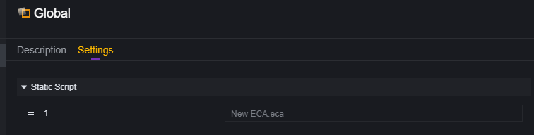
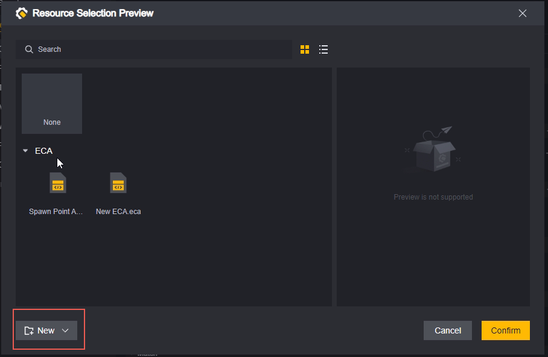

# Kịch Bản - Hướng Dẫn Sử Dụng

Kịch bản dùng để kiểm soát tiến trình game, thực hiện các thao tác trên đối tượng cụ thể trong điều kiện phù hợp, từ đó đạt được logic mà các vật phẩm tự có không thể hoặc khó thực hiện.

## Phân Loại Kịch Bản

### Kịch Bản Đồ Họa và Mã Code

Chúng tôi cung cấp hai cách để chỉnh sửa kịch bản: Đồ họa và Mã code.

Kịch bản đồ họa sử dụng các phần tử hình ảnh để chỉnh sửa, trực quan và dễ thao tác. Tuy nhiên, khi viết logic phức tạp, độ phức tạp tăng nhanh và khó bảo trì.

Kịch bản mã code sử dụng mã để chỉnh sửa, có độ tự do cao và mạnh mẽ trong việc xử lý logic phức tạp.

### Kịch Bản Máy Chủ và Khách Hàng

Dù là đồ họa hay mã code, kịch bản cần phân biệt nền tảng chạy: Máy chủ và Khách hàng.
Kịch bản máy chủ chỉ có thể sử dụng các sự kiện và giao diện hỗ trợ bởi máy chủ, khách hàng cũng tương tự.

> Chỉ có thể chạy trên nền tảng máy chủ

### **Kịch Bản Tĩnh**

Kịch bản đều hỗ trợ cấu hình thành kịch bản tĩnh:

Kịch bản tĩnh luôn chạy dưới mô-đun toàn cục.

Kịch bản tĩnh cũng có thể gắn vào các thực thể khác, nhưng cần chú ý xem có xung đột với logic của thực thể toàn cục hay không.

> Gắn kịch bản tĩnh New ECA.eca lên thực thể toàn cục, các sự kiện bên trong sẽ kích hoạt hai lần. (Không khuyến khích cấu hình như vậy)

> Cấu hình New ECA.eca trên cả Global và Player, trong trường hợp hỗ trợ, các sự kiện bên trong sẽ kích hoạt một lần trên thực thể toàn cục và một lần trên thực thể người chơi.

## Tạo Kịch Bản

Nhấp chuột phải vào khu vực tài sản có thể chỉnh sửa để tạo mới kịch bản

Chọn tạo mới khi gắn kịch bản:

Kịch bản tạo mới theo cách này sẽ tự động gắn vào thực thể tương ứng và được đặt tên theo tên của thực thể hiện tại.

Khi tạo kịch bản, cần chọn/cấu hình loại kịch bản:

1. Kịch bản máy chủ hay khách hàng, điều này ảnh hưởng đến sự kiện và giao diện mà kịch bản có thể sử dụng.
2. Kịch bản đồ họa hay mã code, điều này ảnh hưởng đến cách chỉnh sửa kịch bản.

## Chỉnh Sửa Kịch Bản

Nhấp đúp vào file kịch bản để mở chỉnh sửa, tham khảo tài liệu sau cho việc chỉnh sửa kịch bản đồ họa và mã code:

[Hướng Dẫn Sử Dụng Kịch Bản Đồ Họa.md](Hướng Dẫn Sử Dụng Kịch Bản Đồ Họa.md) 

[Hướng Dẫn Sử Dụng Kịch Bản Mã Code.md](Hướng Dẫn Sử Dụng Kịch Bản Mã Code.md) 

## Gắn Kịch Bản

**Gắn vào mô đun**:

**Gắn vào vật phẩm**:

Chọn vật phẩm cần thêm kịch bản, trong bảng inspector của nó chọn thêm kịch bản:

Cũng có thể chọn kịch bản đã có hoặc tạo mới kịch bản.

**Sử dụng kịch bản để thêm kịch bản**:

Chúng tôi cung cấp một giao diện để gắn kịch bản cho thực thể:

Thêm kịch bản:

Khuyến nghị bạn sử dụng giao diện Kiểm Tra Có Kịch Bản trước khi thêm để xác nhận thực thể đã có cùng loại kịch bản chưa.

## Gỡ Kích Bản

Gỡ kích bản tĩnh trước khi game khởi động, chỉ cần tìm vị trí gắn và nhấp dấu trừ:

Gỡ kích bản động sau khi game khởi động, có thể sử dụng giao diện Xóa Kích Bản:

Tương tự, khuyến nghị xác nhận thực thể đã gắn kích bản cần xóa trước khi xóa:

## Quản Lý File Kích Bản

Khi thêm kích bản mới sẽ tự động tạo một thư mục ECA trong thư mục Assets để chứa kích bản mới:

> Chúng tôi cũng khuyến nghị bạn sử dụng thư mục để quản lý phân loại các kích bản đã tạo

### Xóa

Sử dụng phím Delete hoặc nhấp chuột phải vào tài sản chứa kích bản để xóa kích bản:

Đối với thực thể đã gắn kích bản đó sẽ xuất hiện lỗi dấu chấm than màu vàng:

### Sao Chép

Sử dụng phím Ctrl+C, Ctrl+V hoặc menu chuột phải để sao chép kích bản. Tên của kích bản sao chép là tên gốc cộng với (X), X là số lượng sao chép - 1.

### Đổi Tên

Sử dụng phím F2 hoặc menu chuột phải để đổi tên kích bản.

Tên kích bản không được trùng nhau. Khi đặt tên trùng với tên đã tồn tại sẽ báo lỗi và hủy đổi tên đó:

