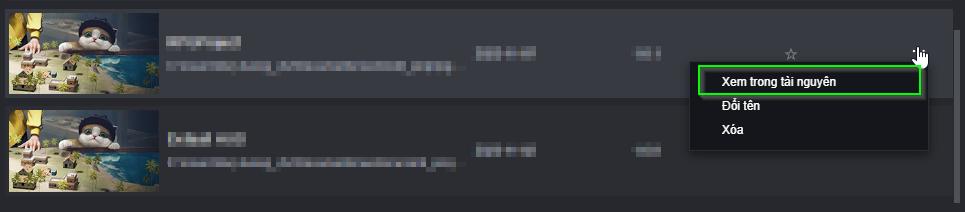
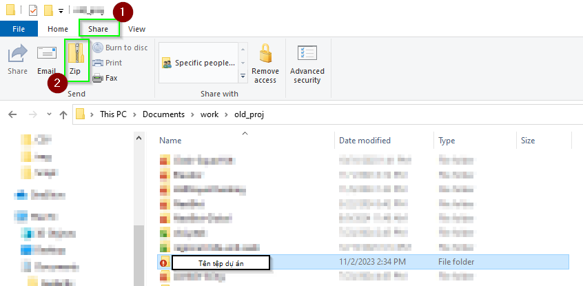
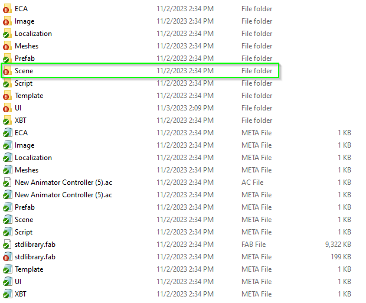

# Chia sẻ Dự án
## Cách tìm tệp dự án
***Bước 1***: Tìm tệp dữ án thông qua trình quản lý dự án  

***Bước 2***: Tìm tệp dự án

***Bước 3***: Nén tệp dự án

***Bước 4***: Gửi tệp dự án đã được nén bằng những phương thức tùy ý (Cloud, App chat, v.v)

## Cách gửi và nhập liệu file map
***Bước 1***: Tìm file map

***Bước 2***: Gửi tệp map bằng phương thức tùy ý.

***Bước 3***: Nhập liệu map vào một dự án khác.
