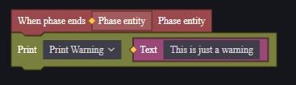

# Debug - Gỡ Lỗi

Gỡ lỗi là một cách trực quan để xem nội dung game và xác nhận xem các hành vi trong đó có đúng với mong đợi hay không. Khi sử dụng gỡ lỗi, ít nhất một tiến trình game sẽ được mở, bạn có thể kiểm tra xem quá trình chạy game có đúng như dự kiến không.

Khi sử dụng gỡ lỗi, toàn bộ dự án sẽ được tự động lưu.

## Cách Thức Gỡ Lỗi

Bạn có thể thực hiện gỡ lỗi ở phần trên của giao diện chỉnh sửa dự án.

## Cài Đặt

Nhấp vào nút bên phải để thiết lập cài đặt gỡ lỗi.

### Gỡ Lỗi Đa Khách Hàng

Nhấp vào khu vực khách hàng, bạn có thể chọn số lượng khách hàng sẽ tham gia vào lần gỡ lỗi này. Gỡ lỗi đa khách hàng giúp kiểm tra sự tương tác giữa các người chơi trong game nhiều người.

Hỗ trợ tối đa tám khách hàng tham gia gỡ lỗi cùng lúc.

> Gỡ lỗi đa khách hàng có thể gây áp lực lên hiệu suất của thiết bị của bạn.

Nếu gỡ lỗi đã bắt đầu, nút này sẽ chuyển thành tùy chọn thêm khách hàng mới.

Có thể thêm tối đa tám khách hàng tham gia gỡ lỗi cùng lúc. Khi thêm khách hàng mới, số lượng khách hàng đã mở sẽ được cập nhật và số lượng khách hàng có thể thêm sẽ giảm đi tương ứng. Như trong hình trên, khi thêm ba khách hàng, nó sẽ thay đổi thành:

Khách hàng mới tham gia được coi là người chơi tham gia giữa chừng. Điều này có thể ảnh hưởng đến việc xác nhận thiết kế của bạn về việc người chơi tham gia giữa chừng.

Khi đóng một cửa sổ gỡ lỗi, nó sẽ được coi là người chơi tương ứng rời khỏi giữa chừng. Số lượng khách hàng hiện tại và số lượng có thể thêm sẽ thay đổi theo. Khi cửa sổ gỡ lỗi cuối cùng bị đóng, lần gỡ lỗi này cũng sẽ kết thúc.

Nhấp vào nút dừng trên trình chỉnh sửa dự án sẽ đóng tất cả các cửa sổ gỡ lỗi đang mở và kết thúc quá trình gỡ lỗi.

### Cài Đặt Gỡ Lỗi

Nhấp vào biểu tượng menu bên phải của gỡ lỗi để mở menu gỡ lỗi.

#### Ngôn Ngữ Khởi Động

Ngôn ngữ khởi động xác định ngôn ngữ hiển thị trong cửa sổ gỡ lỗi.

#### Tổ Đội

---------------------------------Chưa rõ ràng--------------------------------------------

#### Công Cụ Gỡ Lỗi

##### Chế Độ Nghiêm Ngặt

Trong chế độ nghiêm ngặt, khi tiến trình xảy ra lỗi, quá trình gỡ lỗi sẽ kết thúc ngay lập tức, giúp dễ dàng xác định vấn đề hơn.

##### Chế Độ Debug

Chỉ trong chế độ Debug, các điểm ngắt (breakpoints) mới có hiệu lực.

Các điểm ngắt sẽ được giới thiệu trong phần dưới đây.

##### Hiệu Suất

Hiển thị lượng bộ nhớ lưu trữ cục bộ mà bộ nhớ đệm ảnh UI đang sử dụng. Bạn có thể giải phóng không gian bằng cách xóa bộ nhớ đệm, nhưng các hình ảnh UI sẽ cần phải tải lại vào lần sau.

Nên thực hiện khi mở nhiều dự án hoặc khi bộ nhớ đệm chứa nhiều nội dung không còn sử dụng nữa.

## Cửa Sổ Gỡ Lỗi

### Cửa Sổ Game

Trong cửa sổ gỡ lỗi, bạn có thể mô phỏng việc chơi thử bản đồ mà bạn đã tạo. Ở trạng thái mặc định, chuột của bạn có thể di chuyển tự do, và bạn có thể nhấp hoặc giữ chuột trái để mô phỏng thao tác trên màn hình điện thoại (điều này có thể hơi vụng về). Nhấp chuột phải vào khu vực màn hình sẽ chuyển vào chế độ điều khiển giả lập, trong đó di chuyển chuột sẽ điều khiển góc nhìn, và chuột trái sẽ trở thành lệnh tấn công, đồng thời bạn có thể sử dụng bàn phím để điều khiển. Các phím tắt có thể được tham khảo ở giao diện "Phím Tắt" ở góc trên bên trái:

Nhấp chuột phải một lần nữa để thoát khỏi chế độ điều khiển giả lập.

### Menu

Chúng tôi cung cấp một số hướng dẫn mặc định và chức năng GM cho bạn sử dụng:

**Phím Tắt:** Hướng dẫn về phím tắt cho việc điều khiển giả lập.
**Bất Tử:** Bật/tắt trạng thái bất tử. Người chơi bất tử sẽ không bị tổn thương và sẽ biến thành màu vàng để báo hiệu trạng thái đang bật. Lưu ý rằng lệnh này chuyển đổi trạng thái bất tử, khi người chơi đang ở trạng thái bất tử, sử dụng lệnh này sẽ tắt trạng thái bất tử.
**Phục Hồi Máu:** Đặt máu của người chơi về giá trị tối đa. Không có hiệu lực đối với người chơi đã chết.
**Tự Sát:** Giết người chơi hiện tại.
**Dịch Chuyển Đến Điểm Sinh:** Dịch chuyển người chơi đến vị trí sinh của họ. Nếu bạn đã cấu hình điểm sinh mà người chơi hiện tại có thể sử dụng, người chơi sẽ sinh ra tại điểm sinh. Nếu không cấu hình bất kỳ điểm sinh nào hoặc điểm sinh được cấu hình không thể sử dụng (ví dụ như yêu cầu đội nhóm của điểm sinh không khớp với người chơi), người chơi sẽ sinh ra ở gần (0,0,0), tọa độ Y có thể sẽ được điều chỉnh một chút.
**Thêm Bot:** Thêm một robot vào đội của người chơi hiện tại. Nếu đội của người chơi đã đầy, lệnh này sẽ không được thực hiện.

### Bảng Điều Khiển và Giám Sát Hiệu Suất

Bạn có thể sử dụng các nút ở góc trên bên phải và ở giữa bên dưới để chuyển đổi giữa bảng điều khiển hoặc giám sát hiệu suất:

**Bảng Điều Khiển:**

Tại đây, bạn có thể xem các nhật ký, cảnh báo và lỗi của máy chủ. Hỗ trợ tìm kiếm thông tin đã hiển thị:

Nhấp vào nút bên phải để lọc các loại thông tin hiển thị:

> Chỉ hiển thị lỗi
> Tìm kiếm sẽ thay đổi số lượng mục được hiển thị, trong khi lọc sẽ không. Hai thao tác này có thể ảnh hưởng lẫn nhau, làm bạn không tìm thấy thông tin mình muốn.

Sử dụng nút in trong script, bạn có thể xuất thông tin bạn muốn vào danh mục tương ứng.

**Giám Sát Hiệu Suất:**

Nhấp vào nút trên cùng bên phải để bắt đầu kiểm tra hiệu suất.

Khi kiểm tra hiệu suất được bật, các dữ liệu hiệu suất khác nhau sẽ được hiển thị theo thời gian thực, giúp bạn theo dõi tình hình tiêu thụ tài nguyên của bản đồ đang chỉnh sửa.

Bạn cũng có thể điều chỉnh độ trễ và tỷ lệ mất gói để kiểm tra hiệu suất của game trong điều kiện mạng kém.

> Độ trễ và tỷ lệ mất gói điền vào đây là các giá trị bổ sung, độ trễ và tỷ lệ mất gói thực tế trong game sẽ bằng độ trễ và tỷ lệ mất gói ban đầu của bạn cộng với giá trị đi