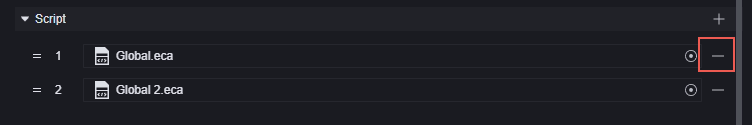

# Global - Toàn Cục

Thực thể toàn cục là một thực thể trừu tượng duy nhất, đại diện cho toàn bộ trò chơi. Là một thực thể trừu tượng, nó chỉ có thể được chỉnh sửa trong menu mô-đun của trình chỉnh sửa trò chơi. Bạn cũng có thể sử dụng script để lấy hoặc chỉnh sửa các giá trị thuộc tính của nó, nếu các giá trị đó cho phép chỉnh sửa.

Trong bài viết này, chúng tôi sẽ giới thiệu các thuộc tính của thực thể toàn cục mà bạn có thể chỉnh sửa trong menu mô-đun, cũng như cách sử dụng mô-đun toàn cục trong script đồ họa.

## Mô-Đun

Bạn cần chỉnh sửa thực thể toàn cục trong menu Mô-đun - Toàn cục.

### ECA Tĩnh và Script

ECA tĩnh và script được gắn vào thực thể toàn cục có thể được xem là các script toàn cục. Khi trò chơi bắt đầu, các script được gắn sẽ chạy.

Sự khác biệt là, khi một ECA tĩnh được tạo ra, nó sẽ luôn được gắn vào thực thể toàn cục.

Trong khi đó, các script có thể tự do chọn sử dụng hoặc gỡ bỏ script đã được gắn.

Gắn vào:

> ECA tĩnh sẽ không hiển thị trong giao diện chọn script.

Gỡ bỏ:

Script đã gỡ bỏ vẫn tồn tại trong dự án của bạn và có thể được gắn vào bất kỳ thực thể hoặc thành phần nào được hỗ trợ.

Trong các script toàn cục, chúng tôi khuyên bạn thực hiện các công việc khởi tạo, như thiết lập biến toàn cục và thiết lập hàm công cộng.

### Tham Số Phòng Tùy Chỉnh

Tham số phòng tùy chỉnh là một thuộc tính tùy chỉnh đặc biệt. Nó có thể được sử dụng như một thuộc tính tùy chỉnh của thực thể toàn cục và có thể được chỉnh sửa sau khi tạo phòng nhưng trước khi bắt đầu trò chơi. Ví dụ: nếu bản đồ này cho phép thiết lập máu của kẻ địch từ 50% đến 100%, bạn có thể tùy chỉnh một tham số máu và thiết lập giá trị của nó trước khi vào game.

Vì tham số phòng tùy chỉnh là một thuộc tính tùy chỉnh, việc tạo một tham số phòng mới cũng giống như tạo thuộc tính tùy chỉnh cho thực thể toàn cục, đều trong phần thành phần của thực thể trò chơi:

Sau khi tạo thuộc tính tùy chỉnh trong phần thành phần của thực thể trò chơi, nó sẽ xuất hiện ở phần dưới của thực thể trò chơi:

Trong phần tham số phòng tùy chỉnh, nhấp vào dấu cộng để thiết lập thuộc tính này làm tham số phòng tùy chỉnh:

Chọn thuộc tính này, giao diện cài đặt thuộc tính sẽ xuất hiện:

1. Tên thuộc tính, không thể chỉnh sửa trong giao diện này.
2. Tên tham số phòng, tên mà bạn muốn hiển thị trong phòng và KEY dùng để dịch ngôn ngữ.
3. Cách hiển thị tham số, cách bạn muốn tham số này hiển thị trong phòng, trong trường hợp này chúng ta muốn chọn một số nguyên từ 50 đến 100.

Bạn có thể nhấp chuột phải vào tham số phòng tùy chỉnh để mở lại giao diện chỉnh sửa hoặc xóa tham số này:

Thuộc tính tùy chỉnh được thêm làm tham số phòng tùy chỉnh sẽ không còn xuất hiện trong phần thực thể trò chơi nữa, còn khi xóa tham số phòng tùy chỉnh, thuộc tính sẽ trở lại phần thực thể trò chơi.

### Tốc Độ Khung Hình

Phần tốc độ khung hình chỉ có một tùy chọn: liệu có bật chế độ khung hình logic thấp hay không.

Khung hình logic mặc định của trò chơi là 30, tức là thực hiện 30 lần kiểm tra logic mỗi giây, chủ yếu ảnh hưởng đến sự kiện "khi cập nhật" trong script.

Khi bật chế độ khung hình logic thấp, sự kiện "khi cập nhật" chỉ thực hiện 15 lần mỗi giây.

> Nút "khi khung hình cố định được cập nhật" không bị ảnh hưởng bởi cài đặt này, luôn chạy 30 lần mỗi giây.

### Navmesh Động

Navmesh là hệ thống tìm đường tự động. Chỉ ảnh hưởng đến các đơn vị cần tìm đường, chẳng hạn như quái vật, NPC hoặc một số kỹ năng dựa trên tìm đường.

Khi tắt, đường đi trong cảnh sẽ được xác nhận tự động khi bắt đầu trò chơi, các vật cản được thêm hoặc bớt sau đó sẽ không thay đổi đường đi. Nếu bạn tạo vật cản động trên đường đi, có thể các đơn vị sẽ đi xuyên qua vật cản.

Khi bật, trò chơi sẽ nhận dạng các vật cản trong cảnh theo thời gian thực, và điều chỉnh đường đi tự động dựa trên các thay đổi đó.

Tắt cấu hình này có nghĩa là tiết kiệm tài nguyên hiệu suất.

### Ghép Đội

Số người bắt đầu ghép đội: Trò chơi sẽ bắt đầu khi số người tham gia ghép đội đạt đến con số này.

Ưu tiên đầy đội: Khi được chọn, trong khoảng thời gian đầu tiên của quá trình ghép đội (khoảng 10 giây), ngay cả khi số lượng người chơi đã đạt đến số người bắt đầu ghép đội, trò chơi vẫn sẽ chờ để đội được đầy người. Sau thời gian này, trò chơi sẽ bắt đầu ngay khi đạt đủ số người.

Thêm người giữa chừng: Cho phép người chơi tham gia vào trò chơi trong quá trình đang diễn ra. Nếu được chọn, sẽ mở rộng các cài đặt thêm:

​	Thời gian giới hạn thêm người: Giới hạn thời gian để thêm người chơi. Nếu bật, dòng cấu hình tiếp theo sẽ được mở, thiết lập thời gian thêm người chơi.
​	Thời gian thêm người chơi: Bao lâu kể từ khi bắt đầu trò chơi cho phép thêm người.
​	Giới hạn số lượng người thêm: Giới hạn số lượng người chơi có thể thêm. Nếu bật, dòng cấu hình tiếp theo sẽ được mở, thiết lập số lượng người chơi thêm tích lũy.
​	Số lượng người chơi thêm tích lũy: Số lượng tối đa người chơi có thể thêm.

Cho phép rời giữa chừng: Rời giữa chừng là hành động người chơi chủ động thoát khỏi trò chơi. Khi bật, người chơi rời giữa chừng sẽ không bị phạt.

Tắt kết nối lại: Khi bật, không cho phép kết nối lại sau khi mất kết nối. Khi tắt, cho phép kết nối lại và trò chơi sẽ tự động kết nối lại với trò chơi hiện tại nếu nó được mở lại.

### Treo Máy và Gian Lận

Thời gian phán đoán treo máy: Bao lâu người chơi không hoạt động trước khi bị phán đoán là treo máy. Người chơi bị phán đoán là treo máy sẽ bị đ

uổi khỏi trò chơi.

Có bật chức năng chống gian lận: Cho phép bật chức năng chống gian lận.

## Mô-Đun Toàn Cục Trong Script

Trong script đồ họa, có một mô-đun toàn cục có thể được sử dụng để thực hiện một số thao tác trên cơ chế toàn cục.

### Điều Khiển Vòng Độc

Thay vì điều khiển vòng độc, thực tế là điều khiển khu vực an toàn.

Di chuyển vòng độc: Khu vực an toàn di chuyển từ điểm bắt đầu đến điểm kết thúc trong khoảng thời gian đã chỉ định. Bán kính của nó sẽ từ từ thay đổi từ bán kính ban đầu đến bán kính cuối cùng. Người chơi ở ngoài khu vực an toàn sẽ nhận sát thương mỗi giây bằng giá trị sát thương được thiết lập.
Bật vòng độc: Khu vực an toàn ban đầu được tạo ra tại trung tâm của điểm trung tâm với bán kính được thiết lập. Sau khoảng thời gian chờ đợi, khu vực an toàn sẽ di chuyển dần dần về điểm trung tâm và biến mất sau đó. Người chơi ở ngoài khu vực an toàn sẽ nhận sát thương mỗi giây bằng giá trị sát thương được thiết lập.
Tắt vòng độc: Hủy vòng độc đang gây sát thương liên tục. Giao diện này chỉ tắt vòng độc do hệ thống tạo ra và không ảnh hưởng đến vòng độc tạo ra từ đối tượng khu vực an toàn tùy chỉnh trong cảnh. Tuy nhiên, cách thực hiện của giao diện này là tạo ra một khu vực an toàn lớn, do đó người chơi sẽ ở trong khu vực an toàn và không bị ảnh hưởng bởi các vòng độc khác. Vì vậy, không khuyến khích sử dụng đồng thời vòng độc hệ thống và đối tượng khu vực an toàn tùy chỉnh.

> Các giao diện di chuyển vòng độc và bật vòng độc đều thiết lập một khu vực an toàn mới, thay thế khu vực an toàn trước đó.
> Sau khi di chuyển vòng độc và bật vòng độc bắt đầu thực hiện trong script, script sẽ tiếp tục thực hiện các thao tác phía dưới. Hãy chú ý logic liên kết giữa các thao tác.

### Tạm Dừng và Khôi Phục Trò Chơi

Hai nút này chỉ ảnh hưởng đến sự kiện khi khung hình cố định được cập nhật.

Sau khi tạm dừng trò chơi, sự kiện khi khung hình cố định được cập nhật sẽ không còn được kích hoạt. Sau khi khôi phục trò chơi, sự kiện này sẽ tiếp tục kích hoạt.

Tạm dừng và khôi phục trò chơi cũng sẽ kích hoạt hai sự kiện khi trò chơi tạm dừng và khi trò chơi khôi phục:

> Khi đang tạm dừng, lệnh tạm dừng trò chơi sẽ không có hiệu lực, khôi phục trò chơi cũng tương tự.