# 地形编辑器-用户手册

本篇文章将提供地形编辑器相关的教学参考。

## 地形物件

地形是一种特殊场景物件，可以创建出一片自定义的地表。地形是一种平面，具有碰撞，但是没有厚度。

如果选择浮空放置，从下向上是看不到地形的，但是能看到地形的影子。

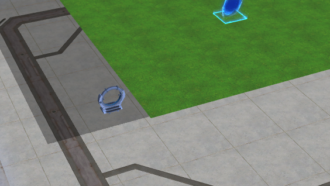

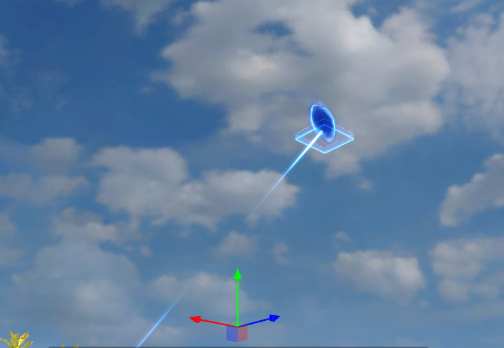

作为场景物件，地形也可以在场景界面进行编辑，但是只能改变位置。

## 创建和删除地形

在地形编辑菜单选择新建进入预新建模式：

此时场景中出现了一块蓝色的地形预览：

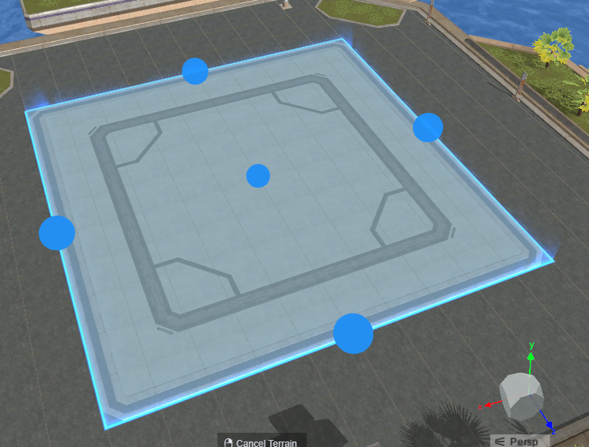

可以在预创建界面调整参数或通过拖动蓝色圆球调整地形大小和位置：

地形位置后续可以更改，但是大小和长宽比一经确定无法更改。

选中地形区域，使用快捷键Delete或在层级菜单可以删除选中的地形区域。

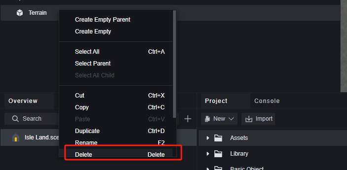

## 雕刻

雕刻是对地形起伏的修改，一共有四种雕刻选项：

升高、降低、平滑、平整。

### **升高**

笔刷经过的地形会抬升，持续点击一处会使该处持续抬升。笔刷大小影响每次点击或拖动时升高的范围。笔刷强度决定了地形升高的速度。每块地形能升高的范围是有限的，笔刷强度只影响达到最高高度的速度。

### **降低**

与升高相反，笔刷经过的地形会下降。同样，地形下降也是有下限的。笔刷大小影响点击或拖动时影响的范围，笔刷强度影响达到最低深度的速度。

### **平滑**

使笔刷影响区域的高度升高或降低至周围高度的平均值，以达到平滑的效果。笔刷大小影响点击或拖动时影响的范围，笔刷强度影响达到目标高度的速度。

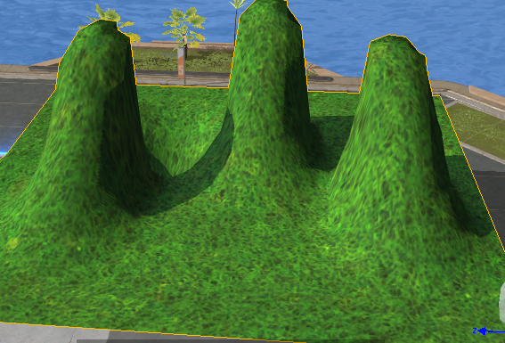

> 因为笔刷移动时会影响地形的高度，所以之前已经达到平滑目标高度的地形又会生成新的目标高度，所以反复使用平滑的最终结果是地面整体高度变化，值为所有升起和降落部分的和。

### **平整**

平整会使笔刷影响到的地形变为目标高度，平整目标即为目标高度，笔刷大小影响点击或拖动时影响的范围。此外，平整提供了三种模式：

第一种会处理所有地形，第二种只会处理那些高于目标高度的地形，第三种只会处理那些低于目标高度的地形。

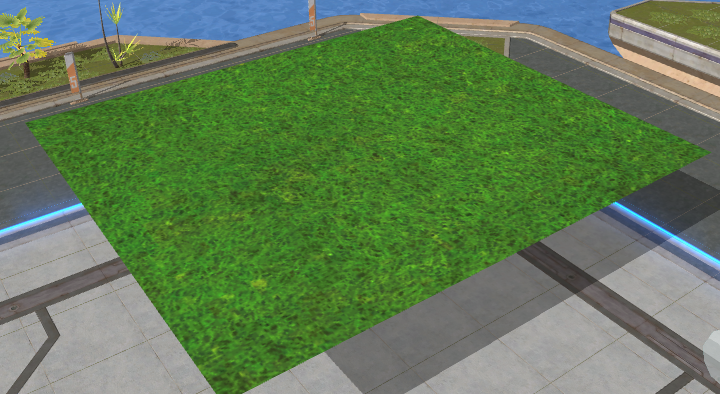

## 绘制

绘制提供两种编辑：植被刷和纹理。

### 植被刷

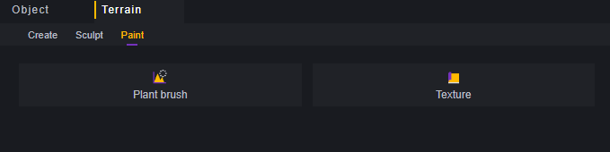

在地形上摆放一些装饰植物或石头。

笔刷大小对草皮和擦除生效，决定了每次点击或拖动影响的范围。

笔刷密度对草皮生效，决定了每次点击时生成的草皮数量，和拖动时草皮生成速率。

对于树和石头、每次点击生成一个对应物体，拖动时连续生成该物体。

使用笔刷时按住Ctrl，会从地形上擦除选中的植物，按住Shift，会擦除所有笔刷碰到的植被或石头。

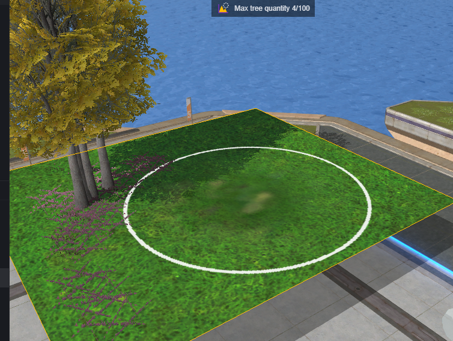

植被刷对于每种装饰都有数量限制。

### 材质

材质决定了地形本身的外观。

通过导入、替换、删除选项，可以编辑备选的地形材质。

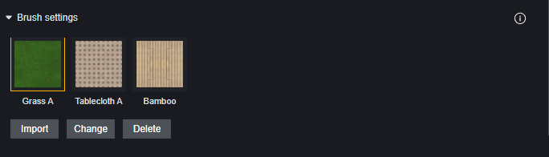

笔刷大小影响点击或拖动时影响的范围。全部覆盖勾选后会填充整块地形。

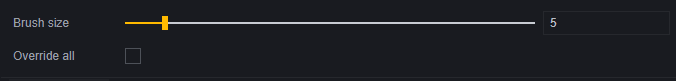

使用新的材质会覆盖旧的材质。

## 地形属性设置

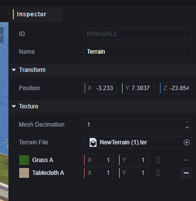

地形具有若干属性：

**位置**：地形整体所处的位置。

**减面比例**：可以通过减少地形的面数来提高性能，范围0.1-1，1代表着不减面，0.1代表着面数减至默认的1/10

**地形文件**：每块地形编辑后会生成一个地形文件，可以通过修改地形文件直接取用其他地块的设置。

**材质像素**：每种材质的像素，修改任一轴向的数值另一轴向也会跟随改变。数值越大地形越密集。以桌布材质为例：

(1,1)的情况下：

(3,3)的情况下：

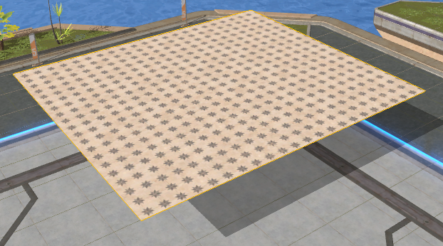
