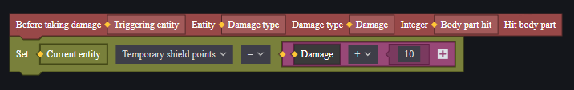
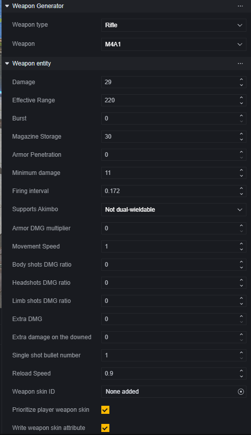
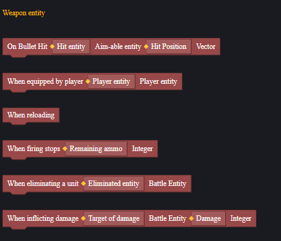
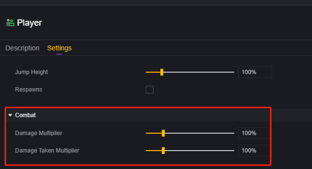
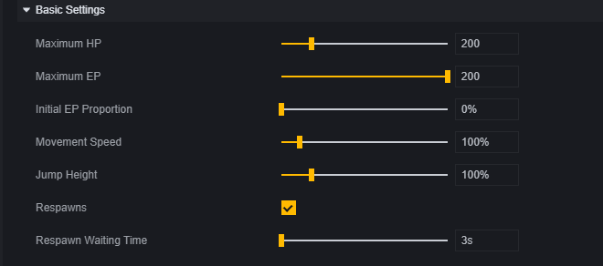
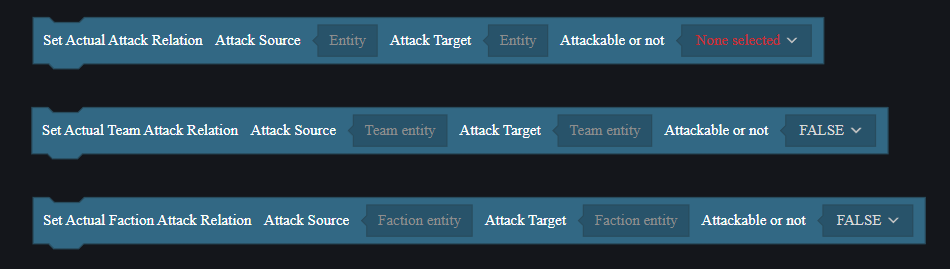
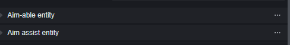
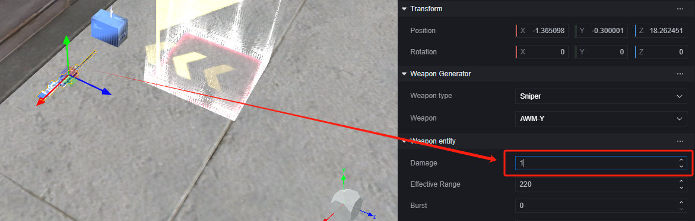
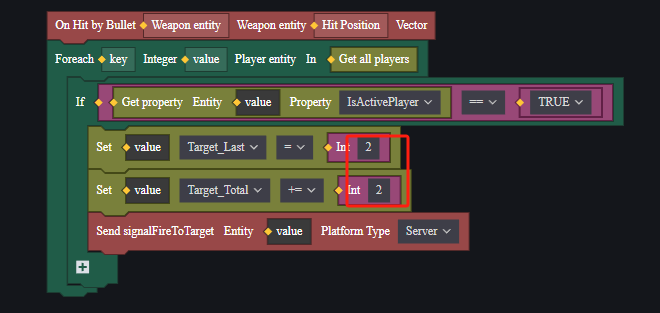

# 战斗-用户手册

战斗系统是游戏中至关重要的系统。

默认情况下，玩家、AI僵尸和防御塔是可战斗实体，天然地带有血量、伤害能力等战斗用属性。

自定义战斗目标依赖于可瞄准实体，并且和辅助瞄准、是否可攻击等概念息息相关。

灵活使用战斗系统，您可以创造一套自定义的战斗，甚至可以超越射击游戏的限制。不过，使用FF原生的枪械进行射击战斗是支持较为全面的，如果您想制作一个不使用枪械的战斗（比如剑与魔法的战斗），可能会需要更多精力和资源。所以本文主要是介绍在使用官方提供的枪械战斗的前提下的战斗系统，不过也许您会获得更多启发。

在本文中，将依次介绍以下内容：

1. 可战斗实体
2. 自定义战斗实体
3. 如何创建战斗实体。
4. 如何制作一场战斗实例。
5. 拓展：自制靶子和发射AOE弹药的枪械。

## 可战斗实体

可战斗实体是默认会参与战斗的实体，目前只有玩家、AI僵尸、防御塔是可战斗实体。

可以使用战斗相关的事件和接口，可战斗实体组件并不支持自定义添加。

可战斗实体都具备造成伤害的能力，且都拥有血量属性，血量归零则会死亡/摧毁。

### 脚本

可战斗实体可以使用一些依赖于自身的事件和接口。

玩家、AI僵尸、防御塔同时也可以各自使用依赖自身具有的其他实体组件的事件和接口。

灵活使用这些脚本内容，可以一定程度上对FF战斗内容进行自定义和扩展。

> 每次受到伤害前为自己添加一个临时护盾，伤害量是进行增幅减伤前的值，所以无法完全抵挡爆头伤害。

### 枪械和道具

战斗离不开枪械和道具，玩家造成的伤害绝大多数都要依赖于枪械和道具。

在战斗中，只有玩家可以直接使用枪械和道具。

#### 枪械和道具发放

可以通过脚本为玩家发放枪械和道具，每位玩家默认可以携带两把主武器、一把副武器、一个近战武器和若干道具。

超过携带数量限制的道具在发放时会掉落在玩家位置。

此外，可以使用关卡物件直接在场上摆放武器和道具或其的生成器。也可以通过商店将武器或道具售卖给玩家。使用何种方式为玩家发放道具取决于游戏设计需要。

#### 属性配置

对于通过生成器和关卡物件放置在场景中的枪械和道具，可以在开始游戏前直接配置属性面板。

> 枪械单位和其配置

对于在游戏运行后调整枪械和道具属性的需求，可以通过脚本的设置属性来实现。

> 修改玩家主武器属性

试图通过脚本修改枪械属性时，需要注意如何取到正确的枪械目标。

武器本身也支持一些脚本事件：

使用这些事件时，该脚本需要挂载在武器实体上。在下文的爆炸弹示例中会有实战说明。

### 玩家

对于战斗中的玩家而言，玩家模组提供了以下配置：

这决定了玩家造成和受到的伤害比率。

除了战斗的配置外，玩家的基础属性配置也会对战斗产生影响，比如生命值、能量、移速、是否可以重生。

同样的，在游戏运行时也可以通过设置属性的方法修改玩家的属性。

也可以通过战斗专用的事件来接受参与战斗的玩家的触发信号，或者对玩家执行伤害操作。

> 设置属性的方式来修改血量与造成伤害不同，无法触发伤害相关事件，也无视无敌、减伤等状态。

玩家相关的其他说明可以参考对应文档。

### AI僵尸

AI僵尸是一种怪物，它具有AI实体专有的一套属性。

AI僵尸会主动攻击阵容不同的玩家，但是不会攻击其他僵尸或防御塔。

有关AI僵尸的其他介绍，请参考对应文档。

### 防御塔

防御塔类似于AI僵尸，也拥有自身特有的属性配置。

防御塔同样只会攻击阵容不同的玩家，不会攻击另一个防御塔或僵尸。

## 自定义战斗实体

### 可瞄准实体

在不考虑完全从零自定义一个战斗系统的前提下，使用官方提供的枪械进行战斗，在战斗中可以被击中的单位需要挂载**可瞄准实体**组件。

挂载了可瞄准实体组件的单位可以触发相关事件，进而完成战斗逻辑。

> 玩家、僵尸、防御塔这些可战斗实体天然地带有这个组件。

可瞄准实体组件的事件实现实际依赖于碰撞，请确保添加了碰撞组件并开启了碰撞。

### 可辅助瞄准实体

对于玩家来说，游戏内提供了一个辅助瞄准的功能。在开火时，准星会自动吸附到可瞄准实体上。

可辅助瞄准实体组件依赖于**可瞄准实体**组件。

但是要使可辅助瞄准实体组件生效，需要该目标实体必须为**玩家可攻击实体**。对于AI僵尸、其他玩家和防御塔来说，只要**阵营**不同就是当前玩家的可攻击实体；而对于其他可瞄准实体来说，需要在脚本中手动设置可攻击关系。

## 如何创建战斗实体

除了默认的可战斗实体外，您也许需要在地图中添加一些可被射击的目标，例如标靶。

> 稍后会介绍如何创建一个带有功能的标靶。

以一个基本球体作为例子，您需要在创建这个物件后，为其添加可瞄准实体组件，并确保碰撞生效。

如果需要该物件可以触发玩家的辅助瞄准功能，则需要额外添加可辅助瞄准实体，并在脚本中处理其和玩家的攻击关系。

## 如何制作战斗实例

下面通过一个简单示例来介绍如何制作战斗内容。

1.**创建工程**

2.**设置场景物件**

我们需要一个出生点来指定玩家的出生位置、一些僵尸、和一些自定义战斗物件。

为自定义战斗物件添加可瞄准实体组件。

使用武器和道具单位，在玩家出生点前摆设一把枪和弹药。

调整枪的属性，使其每次射击只能造成1点伤害。

调整僵尸的属性，使其阵营为中立，追踪距离远，且生命值有200之多。

> 中立阵营的僵尸会主动攻击范围内的玩家

此时您应该发现，玩家没办法通过枪械消灭僵尸，我们现在要为自定义战斗实体添加一些功能：

圆锥：被玩家瞄准时将玩家当前主武器伤害调整为500后摧毁自身。

立方体：被子弹攻击后使所有玩家获得无敌状态并摧毁自身。

圆柱：被攻击时对所有**可战斗实体**造成500油桶爆炸类型伤害后摧毁自身。

**圆锥脚本**：

**立方体脚本**：

**圆柱脚本**：

**直接攻击僵尸**：

**实战方式1**：

通过瞄准圆锥获得伤害提升，并击杀所有僵尸。

> 圆锥已经通过瞄准摧毁掉了

**实战方式2**：

通过攻击立方体获得无敌，并通过攻击圆柱消灭所有僵尸。

> 摧毁立方体后获得无敌。

> 摧毁圆柱后消灭所有僵尸。

## 拓展示例

### 简易标靶

在场景中制作标靶。

建立一个父物体，下方拖入五个基本球体，分别代表2、4、6、8、10环。

将球体缩放调整为X=0.01，Y和Z均依次为1、0.8、0.6、0.4、0.2。这样得到五个圆饼，用于检测子弹击中的环数。

并调整位置的X值，使环数大的更靠前。

> 2环球体的Transform

> 10环球体的Transform

修改球体渲染，使相邻的两环表现不同。

修改所有子物体的碰撞类型为Mesh，这样可以使碰撞紧贴物件外形。

为所有子物体添加可瞄准实体组件。

这样我们就得到了一个标靶物件，环数越大的碰撞检测就越靠前，子弹击中时会优先检测当前位置环数最大的碰撞体。

在标靶后方放置一个巨大的背景，关闭其可见性，只保留碰撞和可瞄准实体，作为脱靶检测。

创建一个UI，用于提示当前玩家的成绩。

为玩家添加三个自定义属性，分别为：当前打靶分数、总打靶分数、是否为激活玩家。

> 是否为激活玩家用于判断当有多个玩家时，哪一位是正在打靶的玩家，其他非激活玩家的打靶行为不会计入成绩。
>

为所有标靶子物件和用于判定脱靶的物件添加脚本，它们的脚本结构类似，区别只是修改玩家打靶积分属性的值不同：

> 2环子物件的脚本

> 脱靶背景的脚本

为全局模组添加脚本，当玩家加入比赛时，设为激活玩家，并创建自定义UI。

> 实际应用时可以根据条件修改激活玩家。

当标靶或背景被子弹击中时，会发送给玩家一个事件。

为玩家添加脚本，收到标靶被击中事件时，修改自身自定义UI上的文字。

在场景中摆放枪械，进入游戏测试。

> 在这个示例下，并没有处理攻击地面导致的脱靶。

### 爆炸弹

下面介绍如何制作会发射AOE伤害子弹、且有爆炸特效的枪械。

首先进行分析，造成伤害、击中特效都应该发生在子弹实际击中目标时，所以选用当子弹击中时事件。

这个事件依赖武器实体，所以该脚本应该挂载在武器上。

添加击中时的爆炸特效

> 对于每个玩家来说，这个特效都是可见的

添加AOE伤害

> 这里只会对AI僵尸和玩家造成伤害

这样武器脚本制作完毕，将其挂载在对应武器上。

> 这里是玩家脚本，任何一个玩家装备武器，该武器都会获得AOE能力。

在场景中添加一些AI僵尸，并用多端测试。

