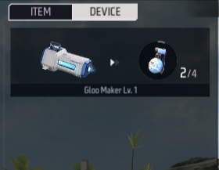

# 物品-用户手册

一把枪械、一颗手雷、一些子弹，这些都是物品，在游戏过程中，涉及到装备或道具就离不开物品的概念。

物品在玩家身上时依赖于玩家背包存在。玩家背包容纳了这些物品。

## 物品的分类

物品拥有以下分类：

### 装备

装备包含武器、防具、背包、配件、功能装备。

其中背包指的是具体的背包的道具，而不是上文提到的容纳物品的概念。

> 背包

### 道具

道具包含手雷、治疗道具、特殊道具、各类子弹。

## 玩家背包

这里的玩家背包区别于背包，是指玩家所拥有的物品空间的抽象概念，而背包可以增加玩家背包的空间，并提供外观皮肤的变化。

> 玩家背包

### 背包内容分类

#### 装备栏

上图中1.的部分，是玩家背包中的装备栏。装备栏内是玩家当前装备的武器、防具、背包和功能装备。

#### 道具栏

上图中2.的部分，是玩家背包中的道具栏按钮，正下方的区域显示道具。

> 有道具时

所有的可见道具都会存放在这里。

#### 装置栏

背包图中的3.部分，是装置栏按钮。对于编辑器来说，目前只有冰墙生成器一个装置。

装置可由脚本开启，开启后的装备显示在背包中该分类下。

#### 黑洞空间

背包界面不展示的装备、道具会存在于黑洞空间中，玩家不可以直接在背包中查看该道具。

### 使用背包内物品

通常来说，大多数的物品都可以在背包外使用或自动使用。包括武器、配件、手雷等。

但是仍然可以在背包中进行一定的操作。

使用指定物品：

拆卸/更换/安装配件：

> 拆卸配件

丢弃背包内的物品：

## 在场景中布置物品

有两种方式可以在指定位置生成物品：生成器和单位。

使用生成器生成物品，可以设定为每回合刷新，但是只能指定类型。如果刷新时上一次生成的物品没有被取走，则会替换为新生成的物品。

使用单位放置物品，可以精确设定生成的武器或道具类型，默认状态下只会生成一份对应的物品。

### 生成器

根据类型选择对应的生成器，以武器为例：

在配置中可以选择生成的武器类型：

在每回合重置组件中可以设定该生成点会不会在每个回合开始时刷新。

特别的，当选择生成武器时，会生成配套的一组弹药和配件。

### 单位

使用单位中的武器和道具，可以在指定位置生成配置的武器或道具。

以这种方式摆放的物品可以修改属性：

## 物品事件

您可以监听一些物品相关的事件，来实现您想要的逻辑。

下面介绍一些常用事件：

| 名称         | 脚本名       | 说明                                   | 参数1                    | 参数2                                  | 参数3                                                        | 依赖实体      |
| ------------ | ------------ | -------------------------------------- | ------------------------ | -------------------------------------- | ------------------------------------------------------------ | ------------- |
| 当获取物品时 | OnObtainItem | 玩家从任意途径获得物品时触发           | 物品ID，玩家获取的物品ID | 物品实体，玩家获取的物品实体，可以为空 |                                                              | Player        |
| 当使用物品时 | OnUseItem    | 玩家使用物品时触发                     | 物品ID，玩家使用的物品ID | 物品实体，玩家使用的物品实体，可以为空 | 使用后创建的新道具实体。类似随身炮塔一类的道具，可以通过这个参数取到创建出实体。 | Player        |
| 当丢弃道具时 | OnDropItem   | 玩家丢弃物品时触发                     | 物品ID，玩家丢弃的物品ID | 物品实体，玩家丢弃的物品实体，可以为空 |                                                              | Player        |
| 当被拾取时   | OnPickup     | 物品被拾取时触发，需要挂载在物品实体上 | 拾取物品的玩家           |                                        |                                                              | InventoryBase |
| 当被使用时   | OnUsed       | 物品被使用时触发，需要挂载在物品实体上 |                          |                                        |                                                              | InventoryBase |
| 当被丢弃时   | OnDrop       | 物品被丢弃时触发，需要挂载在物品实体上 | 丢弃物品的玩家           |                                        |                                                              | InventoryBase |

## 物品API

使用物品API可以对物品进行操作。

下面分类介绍一些常用API：

**增添物品**

| 名称     | 脚本名          | 说明                 | 入参1            | 入参2      | 入参3    | 回参1                                                |
| -------- | --------------- | -------------------- | ---------------- | ---------- | -------- | ---------------------------------------------------- |
| 添加物品 | AddItemToPlayer | 将物品发送至玩家背包 | 被添加物品的玩家 | 添加的物品 | 物品数量 | 添加的物品列表。无论数量等于多少，都以列表形式返回。 |
| 创建物品 | AddItemInScene  | 将物品创建至指定位置 | 物品位置         | 创建的物品 | 物品数量 |                                                      |

**删除物品**

| 名称         | 脚本名           | 说明                                                       | 入参1            | 入参2        | 入参3    | 回参1        |
| ------------ | ---------------- | ---------------------------------------------------------- | ---------------- | ------------ | -------- | ------------ |
| 删除物品     | PlayerRemoveItem | 删除玩家身上的物品                                         | 被删除物品的玩家 | 被删除的物品 | 物品数量 |              |
| 摧毁玩家物品 | DeleteEquipment  | 根据槽位摧毁玩家已装备的物品，只能删除那些可以被装备的物品 | 被删除物品的玩家 | 槽位         | 物品数量 | 是否成功摧毁 |
| 清空背包     | ClearInventory   | 清空玩家身上所有物品，包括已装备的物品                     | 被删除物品的玩家 |              |          |              |

**查询物品**

| 名称                 | 脚本名        | 说明                         | 入参1          | 入参2  | 回参1          | 回参2            |
| -------------------- | ------------- | ---------------------------- | -------------- | ------ | -------------- | ---------------- |
| 获取背包装备栏中物品 | GetEquipments | 根据槽位获取玩家装备的物品   | 携带物品的玩家 | 槽位   | 装备物品实体   | 该物品的配件列表 |
| 获取物品数量         | GetItemCount  | 获取玩家背包里某个物品的数量 | 携带物品的玩家 | 物品ID | 这个物品的数量 |                  |

**修改物品**

| 名称               | 脚本名         | 说明                               | 入参1 | 入参2 | 入参3      | 回参1    | 回参2    |
| ------------------ | -------------- | ---------------------------------- | ----- | ----- | ---------- | -------- | -------- |
| 为玩家发放武器配件 | AddAttachments | 为玩家发放指定槽位的武器的配件     | 玩家  | 槽位  | 配件物品ID | 是否成功 | 配件实体 |
| 切换玩家武器       | SwitchWeapon   | 将指定槽位的武器切换为玩家当前武器 | 玩家  | 槽位  |            | 是否成功 |          |

