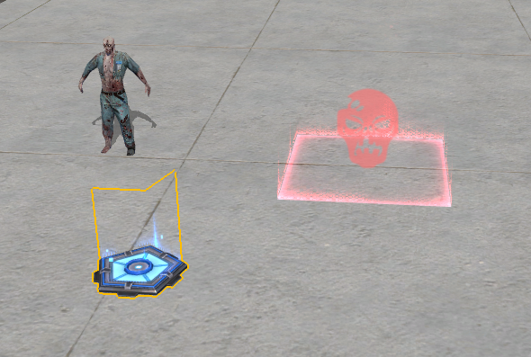
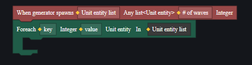

# AI僵尸-用户手册

严格来说，AI是指AI实体组件，如果其他功能组件一样，挂载在任何实体上该实体都会是一个AI单位。

但是目前AI实体只挂载在僵尸实体上，且不可自定义挂载与否。所以本篇文章将从如何配置和控制僵尸的角度介绍AI。

## 配置AI僵尸

您可以通过单位配置僵尸个体，通过僵尸生成器周期性地生成并配置僵尸，或者通过单位生成器批量地生成设定好的僵尸模板。

对于生成器和僵尸，它们都可以配置僵尸的属性。而对于生成器具有一些额外的关于如何生成僵尸的配置。

### **单位僵尸的配置**

这些条目也同时在僵尸生成器出现。

**血量**：AI僵尸的血量。

**攻击伤害**：基础攻击伤害。技能伤害单独计算，不受此配置影响。

**索敌范围**：AI僵尸检测敌人的基础范围。如有加成会在此基础值上修改。

**移动速度**：基础移速。如有加成会在此基础值上修改。

**是否开启战利品掉落**：是否在被击杀后掉落战利品。战利品掉落种类不可配置。

**受伤倍率**：受到伤害的百分比，范围10-10000，最低10代表受到伤害时只承受原伤害的10%。

**类型**：AI类型。也就是僵尸的种类。

**自动索敌**：是否自动检测索敌范围内的敌人。

**阵营**：AI僵尸的阵营。

**攻击模式**：主动攻击：主动攻击检测出的敌人。被动攻击：被攻击时才会攻击敌人。不攻击：不会进行攻击。+

> 对于那些有技能的僵尸，它们不一定会严格遵守索敌和攻击配置，而是总会以技能去攻击范围内的敌人。
>
> BOSS类型的僵尸都是自带技能的：屠夫、Mr.V、武士。

**行进路径**：默认行进路线，与路径点结合使用。

使用路径点物件在场景中设置好行进的路径：

设定好路径后，就可以在AI僵尸的配置中选择对应的路径。

### **僵尸生成器特有的配置**

**每波僵尸数量**：每次生成的僵尸数量。

**生成波数**：非连续生成时，每回合生成多少波僵尸。

**连续**：连续生成，无视生成波数设置，持续生成僵尸。

**开始生成时间**：回合开始多久后开始生成第一波僵尸，单位为秒。

**每波间隔时间**：每两拨生成的僵尸中间间隔的时长，单位为秒。

> 由生成器生成的僵尸，会在下一回合开始时全部消灭，并不产生掉落。

### 单位生成器的配置

**每波生成单位数量**：每波生成多少个配置的单位。

**波次**：共生成几波。

**模板**：从场景中选择生成的单位模板。与模板（Prefab）互斥。

**开始生成时间**：游戏开始后多久开始生成第一波单位，单位为秒。

**持续**：勾选后，无视波次配置，持续生成每波的单位。

**每波间隔时间**：每两波生成单位的间隔，单位为秒。

**模板（Prefab）**：从Prefab中选择要生成的单位。与模板互斥。

## 通过图元控制AI僵尸

在场景中静态配置好AI僵尸或它的生成器后，还可以通过脚本来在游戏进程中控制它们。

这里主要介绍图元脚本，代码脚本可以使用图元脚本对应的API和事件来进行同样的操作。

### 生成器操作

不止限定于AI僵尸，生成器API和事件可以对所有生成器进行操作。

> 使用此组合可以取到生成器每波生成的单位实体

### AI僵尸操作

除了AI实体外，僵尸同时也是战斗实体、可瞄准实体、实体等。

使用对应的事件可以监控AI僵尸对应的行为，使用API可以控制AI僵尸进行行动。

> AI实体的事件

### 示例

以一个简单例子，说明如何使用图元脚本控制AI僵尸。

假设需求为：每当玩家瞄准僵尸时，僵尸都会躲闪。

将此脚本挂载在僵尸实体上。

即可实现僵尸被瞄准时会水平方向上随机移动。

