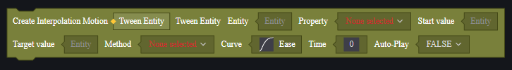
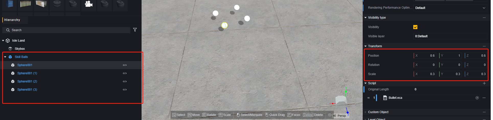
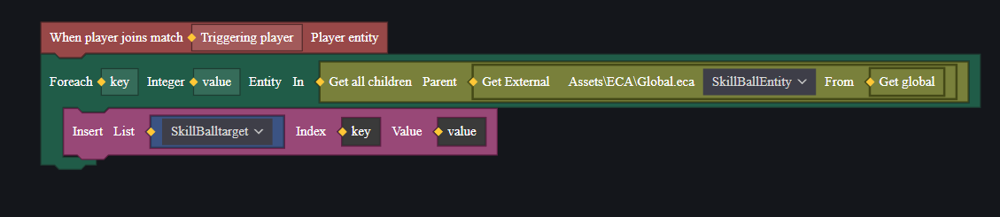

# 播放系统-用户手册

播放系统是一类可以播放的概念的集合，包括播放音效、播放特效和播放运动。

借助播放系统，可以完成一些自定义的表现。

其中运动较为复杂，将着重介绍。

## 音效与特效

音效与特效实体可以由单位实体创建。

并通过属性面板修改配置。

> 音频实体的配置

> 特效实体的配置

通过这种方式创建的实体是静态的。

需要动态修改音效/特效时，可以使用脚本。通常通过图元脚本创建并控制音效和特效实体。

通过服务器脚本创建时，需要指定玩家，创建出的特效/音效只有该玩家才可以看到/听到。

通过客户端脚本创建时，只在运行逻辑的客户端上创建。

创建出的实体位置默认为(0, 0, 0)，可以通过设置属性的方式调整位置和其他可修改属性。

> 音效的部分属性

希望结束特效/音效时，可以选择删除对应实体。

有关音效与特效的应用，会在最后示例部分和运动一并说明。

## 运动

运动是实体某项运动属性不断变化的过程，除了常见的位置外，旋转、缩放等也是运动播放系统可以控制的属性。

> 可以进行运动的属性

运动实体必须由图元脚本创建，并且挂载在某个实体上。该实体会以规定的规则运动，以实现诸如加速、旋转的运动模式。

运动共有六种播放模式：

1. **插值运动**

   实体运动速率以规定曲线变化，需要规定起点和终点。

2. **弹道运动**

   直线加速运动。

3. **相对自身运动**

   类似插值运动，但是始终以自身上次变化后作为起点。

4. **相对自身每帧运动**

   类似相对自身运动，但是变化频率是每帧一次。

5. **位置跟随运动**

   位置上跟随目标实体。

6. **注视跟随运动**

   朝向上始终朝向目标实体。

### 运动播放系统图元

#### 创建运动实体

每种运动播放模式都有对应的创建图元，且配置各不相同。

以下参数按照从左到右从上到下的顺序介绍

##### **插值运动**

1. 插值运动实体：输出参数，创建出的插值运动实体。

2. 实体：挂载的实体，使该实体插值运动。

3. 属性：使挂载实体的哪个属性运动，需要先填入实体才可以读取其可以运动的属性。一般为位置、旋转、缩放等。

4. 起始值：挂载实体的属性以什么值作为运动起点。

5. 目标值：单次运动结束后，挂载实体的属性会变为什么值。

6. 方式：播放方式，可以选择单次、循环和往复。循环表示每次运动完成后，实体会从起始值再进行一次运动。往复表示从起点到终点运动完成后，实体会从终点再向起点运动一次，然后重复这个过程。

7. 曲线：属性变化的速率曲线。速率曲线是线性贝塞尔曲线，由固定的起点、终点和两个控制点组成。

   

   曲线提供了若干个模板，也可以自定义控制点的坐标。

   你可以将图中曲线的横坐标视为时间，纵坐标视为属性值，起点时**时间为0**时的**4.起始值**，终点是时间为**8.时间**时的**5.目标值**，变化速率则为曲线的切线。

   如果曲线为直线，即控制点坐标都为(0, 0)时，速率恒定。图中所示的情况下属性变化会先慢，然后加快，然后再放慢。

8. 时间：一次变化的时长，单位是毫秒。

9. 创建后自动播放：创建后是否自动开始播放。

##### **弹道运动**

1. 弹道运动实体：创建出的弹道运动实体。
2. 实体：挂载的实体，使该实体弹道运动。
3. 初速度：初始速度，三维向量，表示速度方向和速度大小。
4. 加速度：加速度，三维向量，表示加速度的方向和大小。
5. 最大距离：弹道运动的距离，到达距离后运动完成。
6. 创建后自动播放：创建后是否自动开始播放。

##### **相对自身运动**

1. 相对自身运动：创建出的相对自身运动实体。
2. 实体：挂载的实体，使该实体相对自身运动。
3. 属性：使该实体的哪个属性运动。
4. Delta：每次运动的变化量，要求与**3.属性**选择的属性数据类型相同。比如选择位置时，Delta内要填入一个三维向量，表示位置较自身的变化值。
5. 曲线：参考插值运动的曲线说明，表示整个变化过程中的速率。
6. 方式：参考插值运动的方式，决定运动的方式：单次、循环还是往复。
7. 时间：每次运动花费的时间，单位为毫秒。
8. 创建后自动播放：创建后是否自动开始播放。

##### **相对自身每帧运动**

1. 相对自身每帧运动：创建出的相对自身每帧运动实体。
2. 实体：挂载的实体，使该实体相对自身每帧运动。
3. 属性：使该实体的哪个属性运动。
4. Delta：每帧运动的变化量，要求与**3.属性**选择的属性数据类型相同。比如选择位置时，Delta内要填入一个三维向量，表示位置较自身的变化值。
5. IsSwitch：与其他运动模式组合使用时的配置，为真的时候可以与相对运动组合使用，为假的时候可以与绝对运动组合使用。有关组合使用规则请见下文。
6. 创建后自动播放：创建后是否自动开始播放。

##### **位置跟随运动**

1. 位置跟随运动实体：创建出的位置跟随运动实体。
2. 实体：挂载的实体，使该实体位置跟随运动。
3. 跟随目标：跟随的目标。
4. 偏移坐标：填入偏移坐标，运动实体的位置会与跟随目标保持偏移坐标的方向和大小。
5. 坐标系：可以选择世界坐标或相对坐标。这决定了**4.偏移坐标**是哪个坐标系中的偏移量。
6. 创建后自动播放：创建后是否自动开始播放。

##### **注视跟随运动**

1. 注视跟随运动实体：创建出的注视跟随运动实体。
2. 实体：挂载的实体，使该实体注视跟随运动。
3. 注视目标：注视的目标。
4. 偏移坐标：填入偏移坐标，注视中心会从目标中心偏移对应的方向和大小。
5. 坐标系：可以选择世界坐标或相对坐标。这决定了**4.偏移坐标**是哪个坐标系中的偏移量。
6. 创建后自动播放：创建后是否自动开始播放。

#### 控制运动实体播放

可以使用API播放或暂停运动实体。

播放中的是否重新播放，是指是否使该实体的运动从起始值重新开始。

暂停运动并不会删除运动实体。

删除运动实体需要使用删除实体接口，不过要注意填入的参数是运动实体还是挂载的实体，前者会删除创建出的运动，后者会将挂载实体本身删除。

#### 运动实体事件

运动开始、运动结束、运动暂停、运动恢复会分别触发相应的事件。但是这些事件都依赖运动实体，所以使用时应该在创建运动实体后再在运动实体上挂载对应的脚本。

#### 运动实体组合

运动实体是可以组合使用的，一般来说这些组合没有限制，被挂载多个运动实体的实体会同时执行多个运动，但是在使用**相对自身每帧运动**时，需要注意和其组合使用的运动类型。

在创建**相对自身每帧运动**时，有一个IsSwitch选项，选择真时，其可以与相对运动组合使用，选择假时，其可以与绝对运动组合使用。

**相对自身运动、相对自身每帧运动、位置跟随运动、注视跟随运动**是相对运动，**插值运动、弹道运动**模式是绝对运动。

使用错误的组合方式，会导致运动不符预期。

## 示例

下面展示一个例子，用来说明运动实体、特效和音效的使用方式。

我们将创建四个圆球，它们始终在玩家身边旋转，并在玩家开火时添加特效、播放音效，并向玩家朝向射击出去，并在3秒后刷新射击出去的圆球。

### 准备工作

首先创建一个Prefab，它是由一个父物体和四个圆球组成，这方便旋转的配置。

圆球使用基本物件的白色圆球，缩放设为0.3，位置分别相对于父物体（±0.6, 1, ±0.6），关闭碰撞。

再创建一个子弹实体，配置与旋转实体的球一致，用于特殊处理发射出去的逻辑。

音效和特效均选择使用官方提供的资源的默认配置，不提前准备。

创建全局脚本，将父物体创建出来，并使用脚本变量储存起来。

创建玩家脚本，将全局脚本中创建出的父物体使用外部链接取到，并将四个子物体登记在列表中，方便后续处理子弹发射逻辑。

### 创建旋转运动

父物体需要时刻跟随玩家，并自身旋转，这是两个运动的组合。

我们在全局脚本中选用**相对自身每帧运动**和**位置跟随运动**

> 第一个运动使用插值运动或相对自身运动也可以满足需求。

**相对自身每帧运动**的运动属性设为旋转角，Delta设为(0, 10, 0)，这意味着每帧该物体会自转10度，每秒自转330度，略小于一圈。

因为与另一个相对运动组合，IsSwitch设为真。

跟随目标设为触发事件的玩家，也就是每位加入游戏的玩家都会获得这四个神奇的球。因为使用的是父物体，子物体已经拥有了偏移，所以不设偏移量。

### 创建射击运动

射击需要玩家射击事件来触发，我们回到玩家脚本。

这里通过一个整数变量检测已经发射的球，如果大于四个则不可以继续发射。

该变量每次开火会加1，范围是-1到2，在实际使用时，FireBall方法中获得的值是0到3，对应着列表中储存的4个球。

而每次FireBall方法结束后，该值会减1，这样始终会发射身边球中编号最小的那个，防止越界。

在FireBall方法中，我们使用一个小技巧来处理复杂的多项运动组合逻辑：每次应该发射时，只隐藏要发射出去的实体，并在该实体的位置创建一个子弹实体，给它挂载弹道运动，把创建出来的子弹发射出去。并在运动一段时间后，销毁这个子弹，再将隐藏的实体显示回来。

再给发射出的子弹附加特效，我们使用球形特效，并将特效设为子弹的子物体，修改一下特效的位置和大小。

因为特效实体是子弹的子物体，所以会随着子弹的销毁而销毁，所以不必特殊处理销毁特效的逻辑。

但是音效我们选择单独创建，并给予一个销毁逻辑。

> 只是为了教学演示，音效也可以使用特效一样的处理方法。

在玩家开火时调用一次音效方法。

这里有一个函数先后的问题需要注意，两个方法都使用了异步图元：等待。那么两个函数均为异步函数，但是需求上需要音效播放与子弹发射并行，子弹必须发射之后立刻发射下一刻，每颗子弹的逻辑均是独立的。所以音效方法选择执行方式为执行，并在子弹方法前，子弹方法执行方式设为等待，即子弹销毁后才会使计数器加1，使其可以重新被发射。

### 运行检测

符合预期。

> 本示例只用于展示播放系统内容，实际类似的需求可以有其他方式来进行实现。
