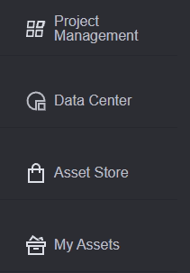
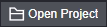
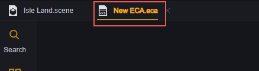
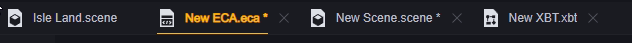
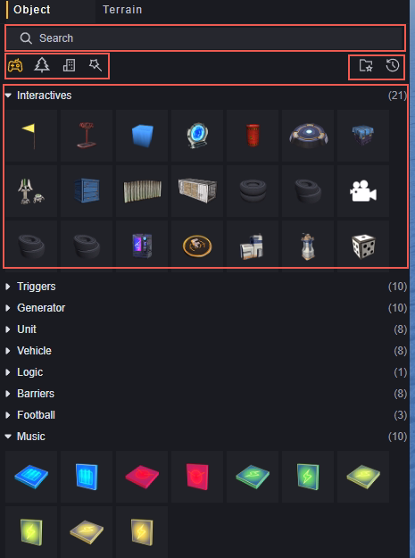
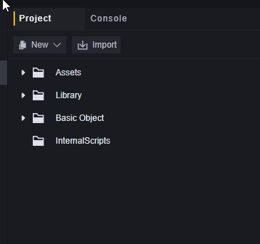
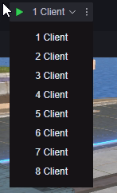

# 认识编辑器的窗口

## 工程管理界面

### 布局

### 布局介绍

#### 1.工程和其他界面

在工程管理器窗口，有四个页签，他们分别是：

1. 工程管理，对本地工程进行管理。
2. 数据中心，当前账号已发布地图的数据。
3. 资源商城，提供游戏开发所需要的各种资源。
4. 我的资源，当前账号已购买的资源管理。

本篇主要介绍**1.工程管理**中的内容。

#### 2.新建/打开工程

##### 新建工程

点击新建工程按钮会打开新建工程界面。

1. **模板类型**，我们为您准备了若干模板大类，其中：

   基础模板，是一些不含代码的模板。我们提供了一些初始地图，它们的大小和预设场景会有区别，可以根据需求选用。

   玩法模板，是一些带有玩法代码的模板，它们提供了一些热门的游戏扩展玩法，可以供您直接使用或在其基础上进行自定义修改。

2. **模板选择**，在选好模板大类后，可以选择具体的模板，模板的简介可以在3.处查看。

3. **模板简介**，该模板的简略介绍。

4. **项目名和项目存放路径**，您可以自由命名和修改路径，但是需要保证同路径下不能有同名项目（无论是否使用相同模板），不然会提示：

   

   

5.**取消和创建**，取消会关闭此窗口，您进行的一切编辑都不会保存。创建会按照当前设置创建一个新的项目并自动打开。

##### 打开工程

打开工程会打开您本地已有的工程，并将其添加到您的工程管理列表中。
点击**打开工程**按钮会展开系统的文件选择界面，您需要选择工程文件夹，它通常是以工程名命名的，并且下一级即为您工程中的文件夹和文件。
例如这个 My project 文件夹即为一个工程文件夹：

它的下一级目录应该是：

> 这是一个刚刚创建的空白工程，如果是已经编辑过的工程可能结构会有不同

选择My project或者在展开其层级后不选择任何文件或文件夹都可以顺利打开工程。如果打开的层级不对或工程不完整会提示：

在一些情况下可能还会弹出一些提示，提示不会阻止您打开工程，但是您对该工程的修改可能会遇到一些问题。

#### 3.工程排序

所有您创建的打开的工程会保存在工程管理界面的主界面上，您可以对其进行排序。

根据工程名称排序，可以切换顺序和倒序。

根据修改时间排序，可以切换顺序和倒序。

根据工程版本排序，可以切换顺序和倒序。

可以点击项目中的星星按钮收藏工程：

激活菜单中的收藏可以使收藏了的工程置顶显示

收藏工程和未收藏工程会分别以修改时间倒序排序

> 同时只能使用一种排序规则
> 收藏也是排序的一种规则，不能与其他排序同时生效

#### 4.搜索已有的工程

可以对已保存的工程进行搜索，搜索会同时匹配工程名和工程路径，只有工程名或工程路径中包含搜索框中输入内容的工程才会显示出来。

搜索出来的工程以修改时间倒序排序，即最后修改的在最上面。

> 搜索时其他排序设置不生效

#### 5.设置和用户

##### 设置

​	**语言**，可以实时改变工程管理界面和工程编辑界面的语言显示。不过实时改变的语言不会作用于自定义的字段。

​	**检查更新**，可以检查是否有更高版本的编辑器。

​	**更新日志**，可以查看更新内容。

​	**关于**，敬请期待。

##### 用户

可以对登录的用户进行操作。您需要登录才能正常使用工程编辑器。

### 操作工程

右键点击工程可以打开操作工程面板

**在资源管理器中打开：**在本地资源管理器中浏览工程

**重命名：**重新命名工程。

> 工程名不能含有提示的特殊符号

**删除：**删除工程

点击删除会弹出二次确认界面

点选**同时删除本地文件**，会将工程文件夹从您的本地存储中一并删除。
不点选**同时删除本地文件**，工程文件夹仍然存在于您的本地，您可以随时通过打开工程重新将其加入回管理面板中。

### 工程文件多开

点击工程即会打开工程，支持同时打开多个工程。

> 多开工程时需要注意自己编辑的是否是需要编辑的工程

## 工程编辑界面

### 布局

> 其中，3-7是场景编辑特有的元素，会在其他文章详细说明
>
> 所有窗口支持拖动边缘以修改大小，这有助于您在某一方面更专注地进行编辑。

### 布局介绍

#### 1.菜单

菜单是对整个工程进行的操作，有若干个分类：

1. 文件：对工程文件进行操作、进行系统设置、退出工程编辑。
2. 编辑：对工程整体进行保存、撤销、恢复操作，对选中的物件进行编辑操作。
3. 资产：资产导入导出及线上购买相关的操作。
4. 工具：向开发者提供的使用工具，可根据需求选择使用。
5. 帮助：提供用户手册、说明、以及其他帮助。

#### 2.文件页签

所有打开的文件，无论类别，都会在页签处依次排列。

已修改未保存的文件会使用“*”标记出来。只有文件内容的修改（或删除文件）才会标记，文件存放位置、页签顺序的修改不会标记。

正在选中的文件会以黄色加下划线标记出来。

根据选中文件类型的不同，主页面会变为对应文件类型的编辑界面。包括但不限于：

1. 场景编辑
2. 图元脚本编辑
3. 行为树编辑
4. 动画控制器
5. 玩家数据
6. UI文件

拖动页签可以调整页签的排列顺序。

当打开的文件达到一定数量时，使用滚轮可以滚动页签目录。页签首尾也会出现快速跳转至第一个/最后一个页签的按钮。

右键页签上的文件，可以打开操作菜单。

其中关闭右侧选项卡会将该文件右侧的所有页签关闭，关闭其他选项卡会将除了本页签外的所有页签关闭。

> 主场景不会关闭。
> 有修改未保存的文件会依次弹出提示。

查看文件位置会在9.工程资产界面定位到该文件。

打开本地文件位置会在您本地定位到该文件。

#### 3.物件选择器

物件选择器是场景文件的编辑器，您可以在此选择场景中要铺设的物件。

我们提供了若干种分类，它们分别是

带功能物件：

自身具有一定逻辑的物件，可以用来搭建玩法。

结构及装饰：

单独的结构体或装饰物，不带逻辑。

建筑相关：

完整的建筑或家具，不带逻辑。

主题物件：

各种主题的结构或装饰，以主题分类。可以用于渲染特定主题的氛围，不带逻辑。

常用物件：

您可以右键将一些物件设为常用，然后在常用物件处查看：

已设为常用的物件可以取消此设置。

物件支持搜索。

> 关于物件如何在场景中摆放会在其他文章中进行详细说明。

#### 4.地形编辑器

可以对场景地形进行编辑，例如构造出山峰谷地。

> 会在其他文章中详细说明。

#### 5.场景编辑器

场景编辑器可以直观地展示当前场景内的元素。
你可以通过3.物件选择器和4.地形编辑器对场景进行修改。

> 会在其他文章中详细说明。

#### 6.层级(Hierarchy)

层级展示的是场景中所有自定义物件和其层级关系。可以通过层级菜单构建物件的父子关系.

> 会在其他文章中详细说明。

#### 7.属性(Inspector)

在5.场景编辑器中选中一个物件，属性面板就会展示这个实体的所有组件。

您可以在这里修改组件参数、增删自定义组件。

> 会在其他文章中详细说明。

#### 8.总览

总览展示的是您工程中的某一类文件，这取决于您在2.文件页签中选择的文件类型。图中是选择了图元脚本文件的情况：

在总览中中双击任一文件，会对此文件进行编辑。2.文件页签中若没有打开这个文件会打开这个文件，若已打开未选中该文件会跳转选中该文件。

在页签中对任何文件进行编辑，会自动高亮总览中的对应文件。这种高亮会比在总览中手动选中要亮一些：

正在编辑的是New ECA(12).eca，在总览中选中的是New ECA(11).eca。

在总览中右键任一文件，可以进行如下操作：

保存、重命名、删除或在本地浏览该文件资源。

总览支持搜索，这主要用于该类文件过多时锁定指定的某个文件。

在总览中点击加号按钮，会创建一个新的该类型文件。新的文件会存放于对应的指定文件夹：

| 文件类型   | 后缀        | 文件夹             |
| ---------- | ----------- | ------------------ |
| 图元脚本   | .eca        | Assets/ECA         |
| 行为树     | .xbt        | Assets/XBT         |
| 场景       | .scene      | Assets/Scene       |
| 动画控制器 | .ac         | Assets             |
| 玩家数据   | .playerdata | 不支持在总览中新建 |
| UI文件     | .ui         | Assets/UI          |

#### 9.工程资产

工程资产显示的是您工程内的资产文件。您可以在这里对文件的位置进行分类处理，以便更好地找到需要的资源文件。

其中，Assets文件夹的内容是可以自定义的，其他文件夹是不可以修改的。您可以查看这些不可修改的官方资产。
编辑器也只会识别本地文件中对应的文件夹，工程中的其他文件夹不会在编辑器中出现。

新建的空白工程中Assets文件夹如图所示

图中左边的区域是文件夹结构，只有文件夹才会出现在左边。右边是具体的文件，文件夹和文件都会显示在右边。右侧可以通过Ctrl+滑轮的方式进行显示缩放。我们新增一个ECA文件并将其缩小。

在文件夹结构处，可以通过新建按钮新建内容，或者通过导入按钮导入您本地的资产。

对于新建操作，在文件夹结构处右键文件夹选择新建，或者在文件区域空白处右键新建，都是在指定文件夹中新建内容。

> 这是基于v1.9.0版本的新建内容列表，支持的文件类型可能根据版本不同而不同

#### 10.控制台

用于展示游戏整体的提示、警告和报错。在12.调试中也有一个控制台，它主要用来展示游戏单次运行中的信息。

使用控制台，可以获得各个节点发生的时间点，和警告、错误信息，有助于进行调试。

点击分类，会开关该分类的显示

使用搜索，会匹配显示了的分类中含有搜索内容的提示信息，右侧分类显示也会变为搜索结果的分类情况。

#### 11.模组

模组中可以对工程的模组进行管理。模组已经预先载入了一部分关键模组，还提供了一些可以根据需求选用的可选模组。

对于未装载的模组，可以通过装载按钮进行装载。页面分类会在切换标签时进行刷新。

已装载的模组，一部分是不支持卸载的，支持卸载的模组可以通过卸载按钮进行卸载。页面分类会在切换标签时进行刷新。

卸载模组时需要注意是否已经使用了该模组的API、事件或者资产，直接卸载模组可能会引起不符合期望的表现。

> 重要模组内容的介绍，会分别在其他文章进行说明。

#### 12.调试

调试是一种直观地查看游戏内容并确认其中表现是否符合期望的方式。使用调试会打开至少一个游戏进程，您可以查看游戏运行的情况是否符合预期。

使用调试时自动保存整个工程。

调试支持多个客户端同时进行调试，选择客户端数量，会打开相应数量的客户端，它们会视为参与该游戏的不同玩家。最多支持八个客户端同时运行。

调试拥有一些配置项，可以进行修改以达到您需要的调试环境。

> 调试会在其他文章进行详细说明。

#### 13.基础信息 

基础信息显示了当前的工程名和工程ID。
