# 物理-用户手册

物理系统帮助您模拟现实中的碰撞和受力等物理表现。

## 物理模组

物理是一个默认加载的模组。

您可以在这里修改全局的物理设置：

1. **重力的方向和大小**。
2. **默认的物理材质**。请参考下文碰撞-物理材质的部分。
3. **全局能量阈值**。计算物体的动能，公式为

$$
Ek=1/2*m*v^2
$$

​	m表示物体的质量，单位为kg。

​	v表示物理的速度，单位为m/s。

​	当物体具有的动能小于这个阈值时，便不再运动。如阈值设定为0.5，一个1kg的物体在速度小于1m/s后便不再运动。

4. **角色控制器碰撞阈值**。仅适用于玩家模组打开【是否使用带物理效果的玩家控制器】或完全自定义的角色控制器。

   动量公式为：
   $$
   p=mv
   $$
   m为质量，单位为kg。

   v为速度，单位为m/s。

   在发生碰撞时，将玩家与被撞刚体的动量相减，并取动量差在碰撞法线上的分量的模，与角色控制器碰撞阈值进行比较。如果小于这个阈值，则会稳定地推动该刚体，否则会发生剧烈碰撞。

​	粗略地说，影响是否剧烈碰撞的参数是：

​	1.玩家或角色质量越大，则越容易发生剧烈碰撞。

​	2.玩家或角色与被撞刚体的相对速度越快，则越容易发生剧烈碰撞。

​	3.角色控制器碰撞阈值设定越大，则越不容易剧烈碰撞。

​	例如角色控制器碰撞阈值设定为50时，一个50kg的玩家以1m/s的速度可以在正面碰撞时与任何静止的、质量与玩家或角色相近的刚体发生剧烈碰撞。

5. **物理层级**。不同层级的碰撞是否发生取决于物理配置。

   为玩家配置一个非默认物理层级：

   

   在物理配置中取消Custom层级和默认层级的碰撞：

   

​	会发现玩家可以无感穿过任何默认物理层级的物体：

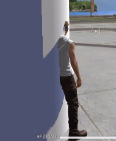

​	依赖碰撞触发的物件也不会触发：

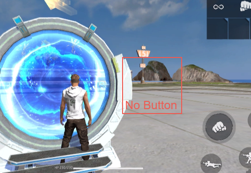

## 碰撞形状和碰撞

自定义物件应用于物理系统需要两个基本组件：

碰撞形状组件和碰撞组件。

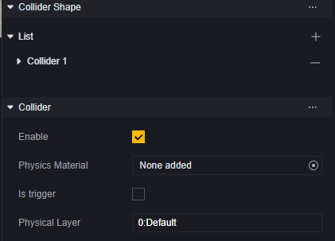

对于绝大多数物件来说，您只能在其上发现一个碰撞组件。

因为它们一般不带有自定义物件组件：

对于需要自定义碰撞形状和物理材质的需求，我们建议您新建一个空节点，并对这个空节点进行操作：

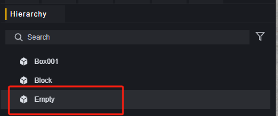

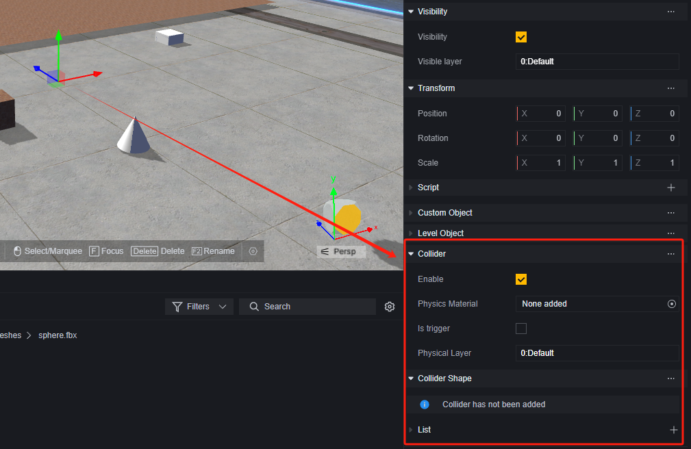

### 碰撞形状

碰撞形状组件决定了物体发生碰撞的边界。

碰撞类型：

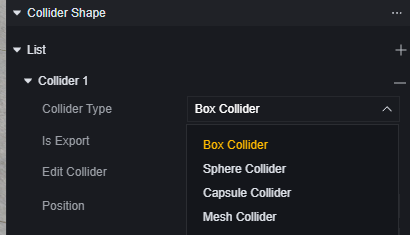

碰撞类型决定了碰撞的基本形状，我们提供了立方体、球形、胶囊体三种基本形状，和网格碰撞体。

网格碰撞体是根据模型的边界模拟的与模型视觉外观近乎一致的碰撞形状。

对于创建的空节点，需要添加自定义渲染组件来规定其网格形状和大小。

对于基本形状的碰撞形状，可以修改他们的位置、大小或通过手动的方式微调其外形：

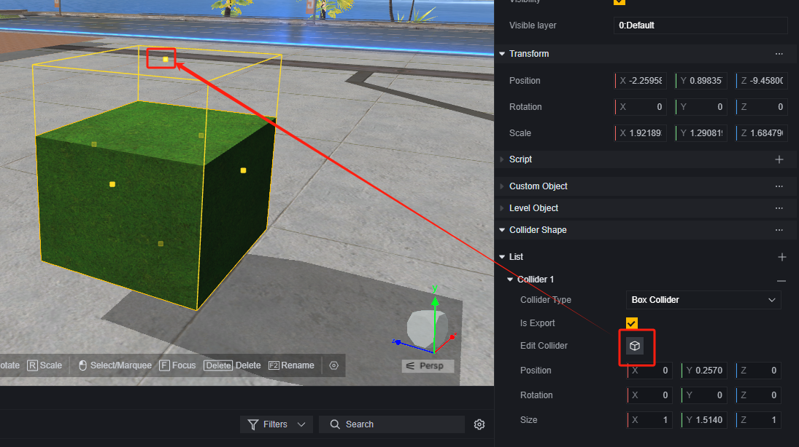

> 拖动碰撞盒上的黄点可以微调碰撞形状

网格碰撞外形具有一个是否为凸多边形的选项

凸多边形：是否与其他网格碰撞体碰撞。未启用凸多边形的网格碰撞体仅在没有刚体组件的游戏对象上受支持。要将网格碰撞体用于刚体组件，请勾选凸多边形选项。

### 碰撞

#### 物理材质

物理材质决定了该碰撞体的一些物理属性。

对于自定义物件来说，碰撞的物理材质支持您自定义。而对于大多数官方提供的物体来说，物理材质是不支持修改的。

物理材质文件可以创建得来。

您可以在物理材质文件的inspector面板修改如下属性，从而使所有挂载该物理材质的物体获得对应的物理属性。

#### 是否是触发器

当勾选是否是触发器复选框时，该碰撞体无视物理碰撞，但是可以触发事件。

这意味着该物体不会参与默认的物理碰撞逻辑：

但是可以触发碰撞事件：

#### 物理层级

决定物理所在层级，不同层级的碰撞是否发生取决于物理模组中的配置。

## 刚体

刚体组件会使物体受物理控制，使其接受力的影响。

要添加刚体组件，必须先拥有碰撞组件。

刚体分为静态、动态、运动学的。

**静态刚体**是指没有速度、不受力的物体，例如地面、墙壁等不会移动的物体。修改这些物体的位置、缩放会加大性能开销。

**动态刚体**有质量、速度等力学特性的物体，可受力的影响。

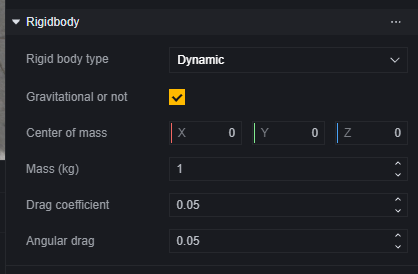

您可以在动态刚体选项下修改物理相关的参数、如重心、质量。

运动学刚体可以手动控制移动和旋转，但是不受其他刚体的碰撞或力的作用，常用于动画、特效的制作。

## 角色控制器

### FF玩家控制器

默认情况下，玩家对玩家角色的操作继承于FreeFire的玩家控制器。

### 带有物理效果的玩家控制器

在玩家模组中，勾选【是否使用带物理效果的玩家控制器】后，即可修改部分玩家控制器的物理参数。这种情况下玩家一定程度参与游戏内的物理模拟，如物理模组中的【角色控制器碰撞阈值】配置会开始生效。

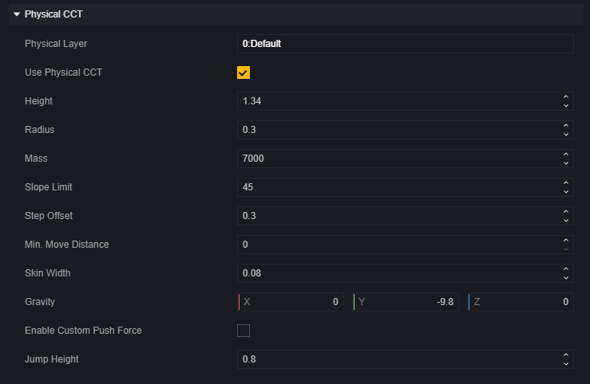

​	**是否使用带物理效果的玩家控制器：**勾选则使用带自定义物理效果的控制器，并展开相关配置。

​	**总高度，包括上下半球：**人物胶囊碰撞体的高度。

​	**上下半球的半径：**胶囊体半径，不能超过高度的1/2。

​	**质量：**玩家质量。

​	**最大上坡角度：**超过该角度的斜坡无法走上去，玩家会开始滑落。

​	**步距垂直偏移：**允许玩家偏离该配置的距离而不脱离地面或被阻挡，常用于在楼梯上移动时。

​	**最小移动距离：**如果角色控制器要移动的距离小于这个值，玩家则会一动不动。

​	**皮肤厚度：**允许其他物体嵌入角色碰撞体的深度，用于避免抖动或卡住。

​	**自身受到的重力加速度：**在三维方向上所受的重力加速度。对于玩家角色来说，这个设置会覆盖全局物理设置。

​	**启用自定义推力：**开启后，角色推动刚体时施加的力可以自定义。开启后展开相关配置。

​	**自定义推力力量：**角色推动刚体时施加的力大小。

​	**多段跳高度：**进行多段跳时跳跃的高度。

​	**多段跳的最大次数：**每次多段跳最多支持的跳跃次数。

​	**空中移动：**开启后，玩家可以在空中改变移动速度和朝向。

### 完全自定义的角色控制器

在完全自定义的角色控制器中，您可以抛开所有限制完全自定义任何操作和效果，但是没有任何默认的功能。

要使用完全自定义的角色控制器，需要使用角色控制器组件，并且作为被控制的角色的物体不能带有碰撞、碰撞形体、刚体等组件。

具体使用方法请参考下方示例。

## 示例

我们将通过制作一个简单的横板模式的角色控制器来进行说明自定义角色控制器的使用方法。

### 搭建场景

简单搭建一个场景。

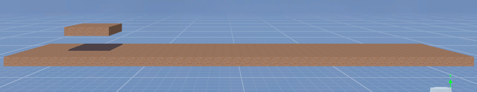

### 制作玩家角色

这里我们只制作一个简单玩家角色。

创建一个空物体：

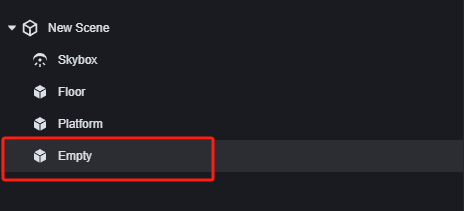

为这个物体添加角色控制器组件。

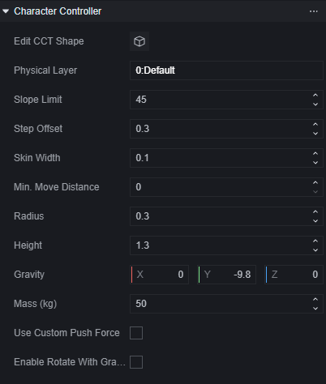

为角色控制器添加自定义属性：状态。我们后续将使用状态来控制玩家角色的左右移动。

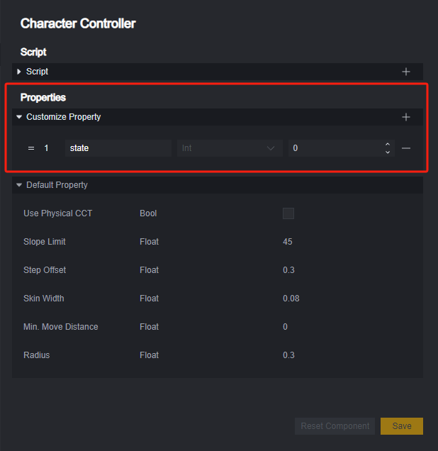

现在角色并没有外观，所以为这个空节点添加一个空的子节点用以显示外观。

为空的子节点添加自定义渲染组件。

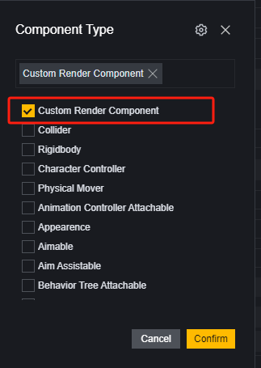

选择Mesh为圆柱体。

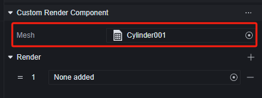

此时选中父节点，在场景编辑器观察我们的角色。

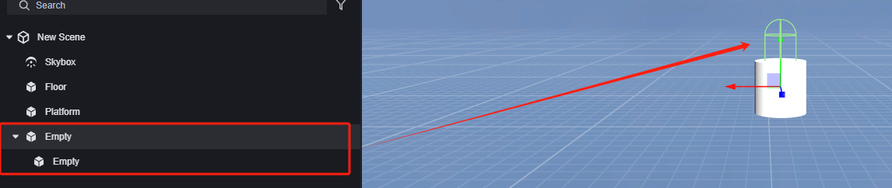

胶囊体是父物体的角色控制器组件，圆柱是子物体的自定义渲染组件。我们发现角色控制器似乎比外观要高出一些，并且范围比模型要小。

调整子物体的相对高度与角色控制器外观，达到二者大概匹配的程度。

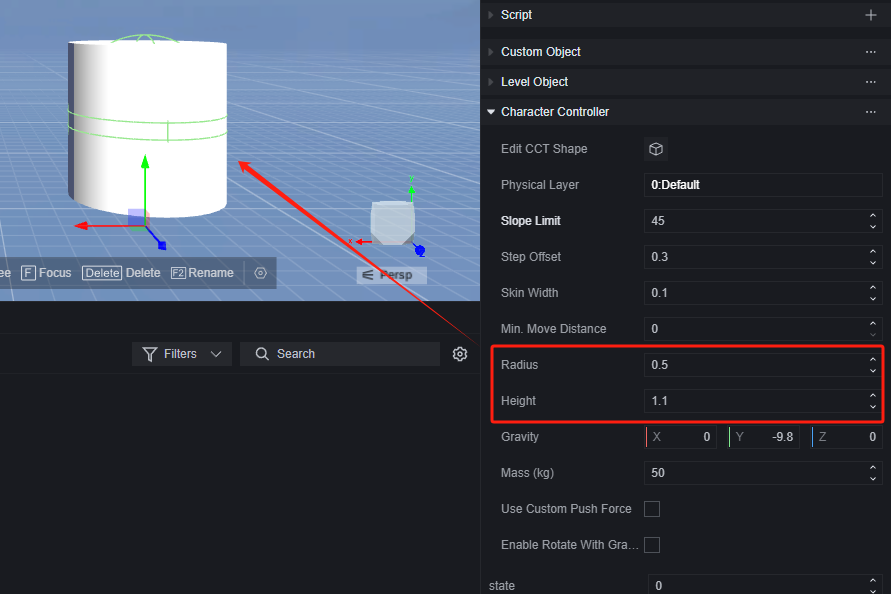

请特别注意，对于角色控制器来说，它的高度必须要大于半径的二倍。

将制作好的角色设为预制体，重命名为New_player（或者任何你喜欢的名字）。在场景中删除制作使用的空物体。

### 初始化

创建一个全局脚本，用来屏蔽默认玩家、创建新玩家、设定移动方法。

#### 1.清空默认UI

要使用自定义角色控制器，就先要解决自带的玩家控制器。玩家角色是不可以从游戏中删除的，不过我们可以使用一些办法使玩家角色无法被操控也无法被看见。

使用关闭默认UI接口，我们可以屏蔽掉所有可以直接操控默认玩家的UI。

#### 2.使用自定义相机

默认的相机是跟随默认玩家角色的，我们需要使用一个新的自定义相机只用来观察我们创建的新玩家角色。

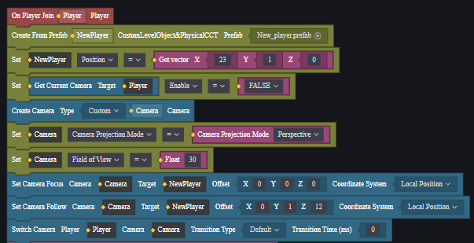

#### 3.储存玩家数据

创建一个全局变量，用于储存每个玩家的自定义角色控制器。

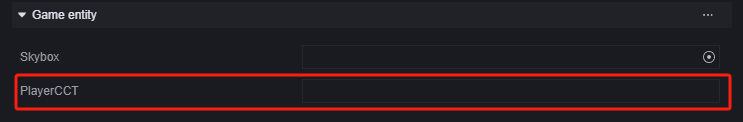

#### 4.设定移动方法

我们采取通过判断角色控制器状态的方法控制移动，设定0代表不动、1代表向左、2代表向右。

每次更新时都让所有自定义控制器执行一次移动方法，移动方法内检查玩家控制器的状态，若其处于移动状态，使其移动一个小的位移。

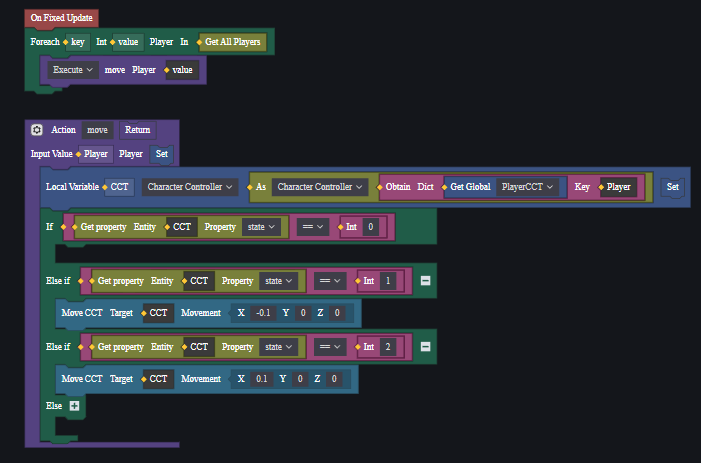

> 当固定帧更新时事件以每秒30次的频率触发，相当于角色控制器以30*0.1=3m/s的速度移动。

### 创建自定义操作UI

创建一个UI，用于控制自定义角色控制器移动。

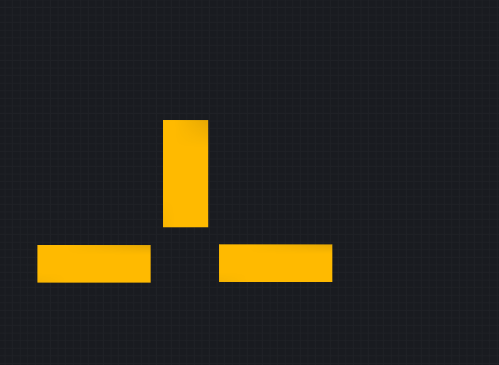

三个按钮分别用于使玩家向左移动、向右移动和跳跃。

为UI实体添加脚本，使用回调处理逻辑：

1. 跳跃

   通过为自定义角色控制器施加力的方式实现跳跃。

   

   > 施力接口可以直接选择施加速度，避免了力和质量的运算。

2. 移动

   我们通过改变状态来控制移动，分别处理玩家在按下和放开按钮时的状态即可。

   

在按钮上添加回调，分别调用这些方法。

1. 跳跃

   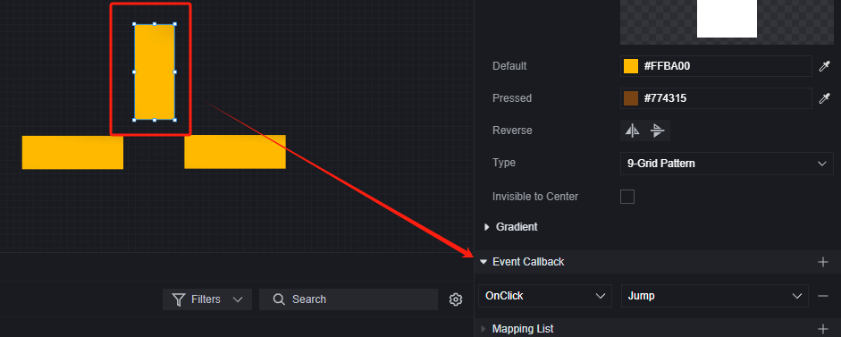

2. 移动

### 调试

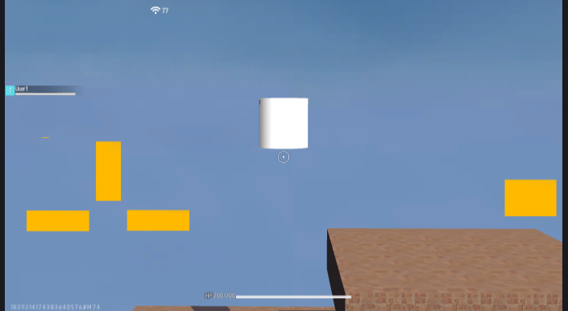

逻辑正常运行。

不过在使用自定义镜头时，有时很难确定一个合适的镜头参数。

我们可以通过添加一个控制镜头的UI来在开发阶段调整镜头。使用相同的思路可以帮助您在调试阶段不断优化自己的角色控制器表现。

#### 1.创建UI

我们使用按钮来控制镜头上下左右前后移动，并通过一个按钮打印当前的镜头偏移量。

#### 2.编写脚本

为UI实体添加脚本。

移动镜头，以向上移动为例：

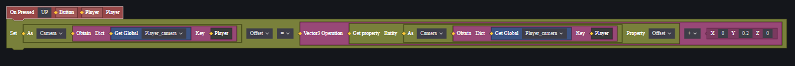

打印镜头参数：

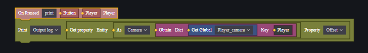

#### 3.添加回调

为每个按钮添加回调：

移动，以向上移动为例：

打印镜头参数：

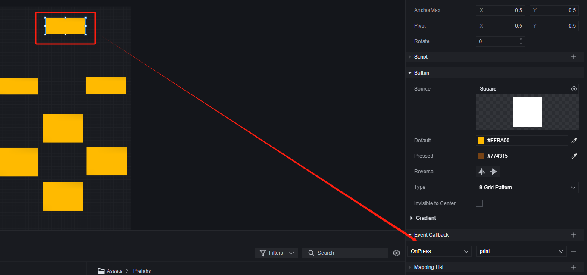

这样就可以在游戏调试时调整镜头以达到您想要的效果了：

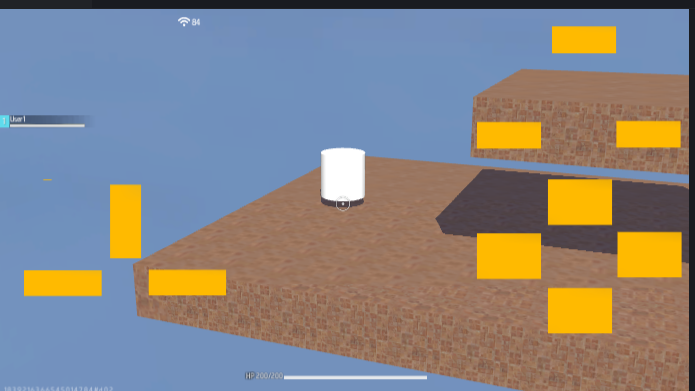
