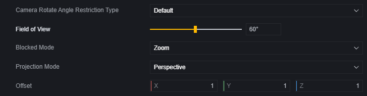
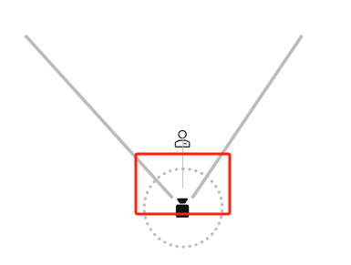
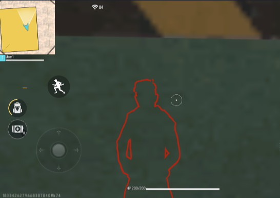
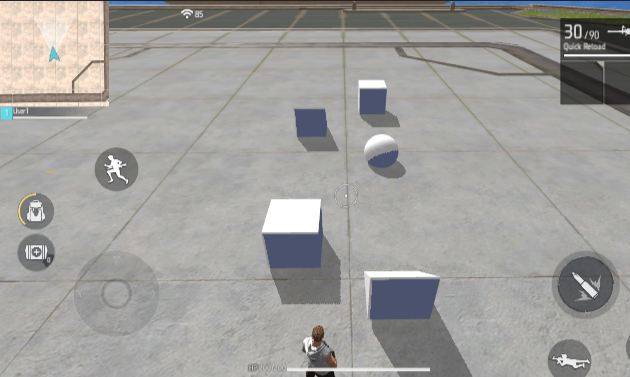
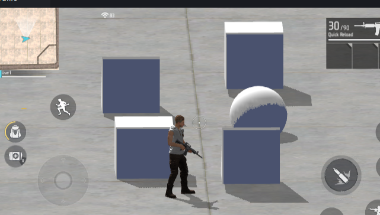
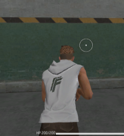
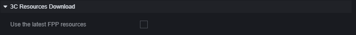
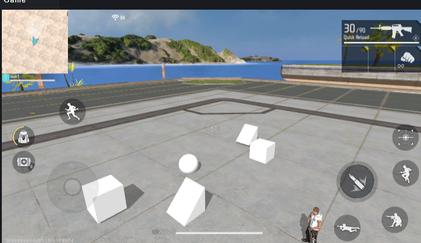
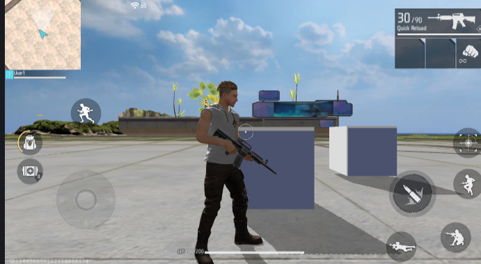

# 摄像机-用户手册

玩家通过摄像机来观察游戏对局，使用不同模式的摄像机和摄像机参数可以提供不同的游戏视觉表现。

## 摄像机模组

摄像机模组是一个默认模组，无需额外加载。

您可以在摄像机模组中对主摄像机进行配置。

## **摄像机模式**

在摄像机模组中，在选择摄像机模式后，可以对该模式的参数进行进一步设置。

在参数中，具有部分摄像机模式共通的参数：

### 通用配置

**镜头转动角度限制类型**：选择保持原逻辑，摄像机会限制玩家操作转动的角度。选择WideRange，这个限制会被放宽。

**视野范围**：摄像机能看到的角度。

**遮蔽模式**：除第一人称相机外，摄像机和玩家角色之间出现遮挡物时的处理方式。有固定、推近和透视三种方式。

> 此时摄像机继续旋转，会被墙壁阻挡。

固定模式下，摄像机与玩家角色之间即使有遮挡物也不会处理。

推近模式下，摄像机会改变自身位置，像是被遮挡物挤压一样靠近玩家角色。

透视模式下，玩家角色会以红色描边标记出来。

**投影模式**：透视模式下，摄像机处理事物时使用如同现实一般的近大远小规则。正交模式下，摄像机处理事物时不使用近大远小的规则。

> 透视模式

> 正交模式，一般来说，正交模式适用于横板过关游戏等对场景有特殊要求的情形。

**偏移量**：在支持设置偏移量的相机中，偏移量为(0, 0, 0)时为摄像机的初始默认位置，通过设置这个参数，可以调整相机的默认位置。

### 第三人称相机

第三人称相机距离玩家有一定距离，会将玩家角色渲染出来。在默认的第三人称相机模式下，玩家可以自由旋转相机，玩家的向前移动指令会使玩家角色向摄像机所观察的方向前进。

> 玩家会先转向移动方向然后再前进。

#### FF经典

FF经典是如同FreeFire游戏内的第三人称相机，FF经典模式不可更改参数。

#### 追背

追背相机会始终注视玩家背部。在这个模式下，玩家角色的水平朝向始终等于相机的水平朝向，转动相机的操作也同时会转动玩家角色。

### 第一人称相机

第一人称相机的位置与玩家角色重叠，像是以玩家角色的视角去观察游戏世界。默认的第一人称相机不支持调整视野范围。

#### 新版第一人称资源

在模组的下方，可以为第一人称使用新版资源。

在新版第一人称资源被勾选时，相机会始终显示双手，而非原先的只有进行动作时才展示双手。

#### FF经典

FF经典的第一人称相机与FreeFire游戏内第一人称视角一致。FF经典的第一人称相机拥有一个移动时更改视野范围的动态效果。

### 俯视角相机

俯视角相机默认状态下始终朝向水平面，在玩家移动时会跟随玩家移动。

### 横板视角相机

横板视角相机默认状态下会始终朝向世界坐标系下的Z轴正向，会随着玩家移动而移动。

横板视角相机拥有独特的配置：

**俯仰角和水平角**：可以调整相机的初始角度，相机在配置后会保持这个角度。

**是否允许玩家X轴运动**：开启后，玩家向屏幕里侧和外侧的移动指令会被屏蔽，玩家只能向屏幕左右两侧进行移动。

### 自由视角相机

自由视角相机模式下，玩家的移动指令会操作相机而非玩家角色。默认状态下，自由视角相机垂直视角操控是翻转的。

### 自定义相机

自定义相机只会跟随玩家，没有其他功能，由您的配置决定玩家使用相机时的表现。

## 脚本

除了对主相机进行配置，使用脚本可以对相机参数进行动态调整、创建或切换相机。

### 创建&切换相机

通过创建相机，可以创建一个额外的相机，但是该相机并没有投入使用，玩家的相机并不会发生变化。

创建相机后可以通过设置该相机的属性调整相机表现。

使用切换相机，可以切换到指定的相机，玩家才会开始使用新的相机。

### 遮罩

摄像机可以通过修改遮罩层级来选择性地渲染地图上的物件或玩家。在所有可见到的单位中，都带有可见性组件。

在该组件中设置层级，然后在摄像机的遮罩中修改该摄像机会进行渲染的层级。

> 默认情况下，摄像机会渲染所有层级（0-15），图中为不渲染层级为1的物件。

通过修改遮罩层级，可以达到隐藏指定类别单位的可见性、节省性能等目的。

但是，单位即使不可见，但是碰撞等其他功能还是存在的，玩家依然会被非渲染层级的物件阻挡或触发某些碰撞事件。
