# 动画系统-用户手册

# 动画系统概述

动画系统的基本概念是动画片段（Clip），一个动画片段是特定对象随时间改变位置、旋转或其他属性的信息。通过这段线性的记录信息，可以实现门的开关、人的走路或跳跃等动画效果。通常来说，一个动画片段只会包含较短时长的动画信息。

通过动画控制器，动画片段可以有组织地播放，从而实现更有逻辑、更复杂的动画使用场景。

动画系统支持您导入自定义的动画片段、并用以制作独特的动画或替换默认的角色动画。

# 支持的格式

Craftland Studio PC只支持FBX格式的动画导入。

# 导入动画

和导入任何其他资源一样，您可以直接拖动动画资源至Assets文件夹或使用导入功能。

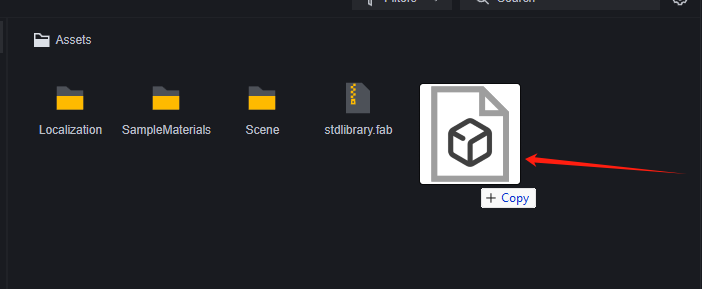

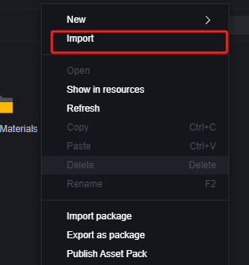

# 预览动画

打开导入的动画FBX文件，其中应有动画片段文件。

双击该动画，提示需要模型来播放动画。

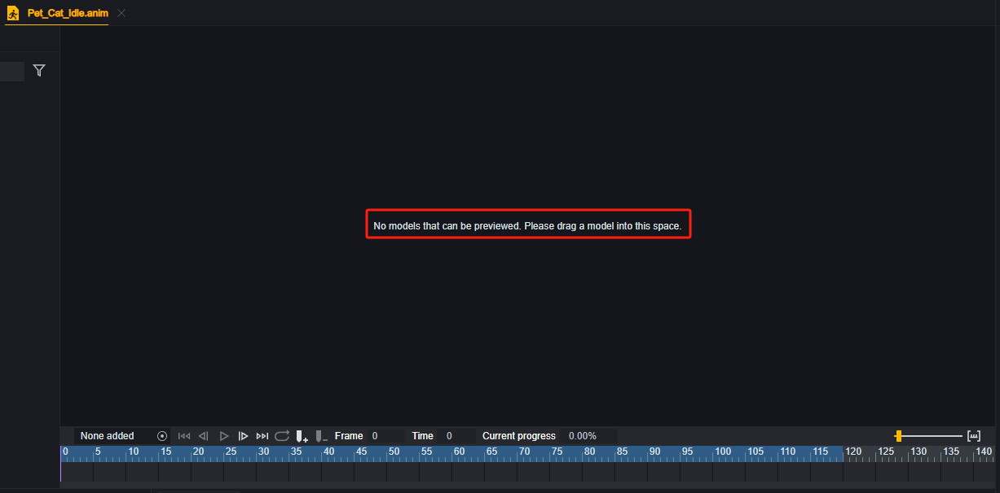

拖入准备好的对应模型，即可预览该动画。

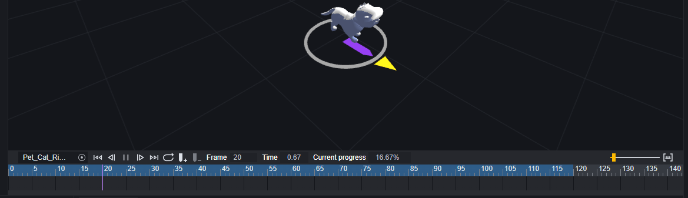

# 使用动画

导入的动画即成为了您游戏工程中的资产，下面介绍两种主要的使用动画的手段。

## 替换玩家动作

在玩家数据中，可以使用动画替换原本的玩家默认动作动画。

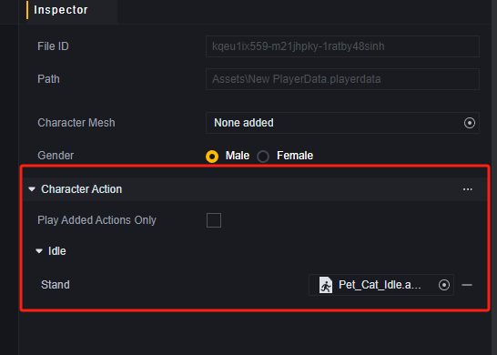

替换动作动画时，需要保证动作动画与玩家数据中使用的骨骼匹配。在这个例子中，使用了一只猫的idle动作，那么也需要将玩家模型替换为猫的模型。

在这种设置下，玩家会被替换成一只猫，并且只有在idle状态下才会播放动作，在进行其他行动时不播放任何动作。

有关玩家数据在【玩家】用户手册中有进一步说明。

## 动画状态机

通过动画状态机，可以规定一组动作的播放顺序，并在需要时播放整组动作。

### 创建动画状态机

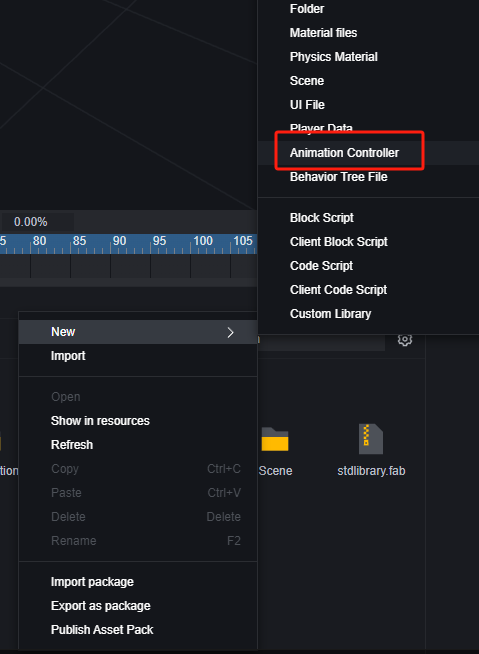

### 编辑动画状态机

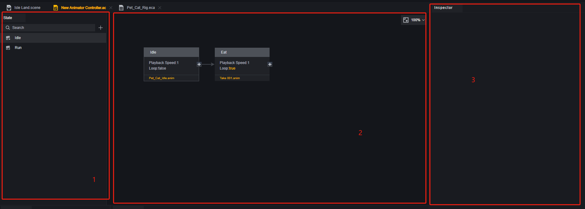

1. 状态栏，在这里可以为动画状态机设置若干个状态，便于在合适的条件下切换至对应状态。动画状态机至少要有一个Idle状态。
2. 当前状态中的动画片段，在这里可以编辑一个状态下播放的动画片段和它们的播放顺序。
3. 属性面板，在这里可以修改状态或动画片段的配置。

在状态的属性中，您可以修改名字、设定整组状态是否循环。

> 默认的Idle状态的属性是不可编辑的。

状态的循环属性，意味着当该状态中所有动画播放完毕时，会从第一个动画开始重新播放。需要注意的是，如果您在状态中设置了某个片段的播放方式为循环的话，它所在的状态通常来说不会自动播放完成，也就不会进入下一个循环。

> 循环的动画片段不会自动进入下一个动画片段，也不会使当前状态循环。

### 动画状态机应用示例

我们在场景中摆放一只猫的模型，并想让它在回合开始时跑向指定地点，然后循环播放Idle+吃饭的动画组合。

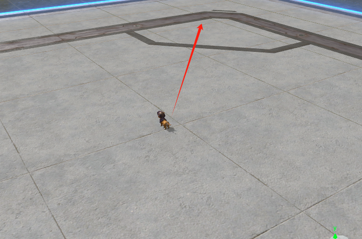

1. 添加组件

   动画状态机依赖于可添加动画状态机组件：

   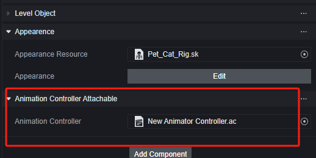

2. 编辑动画状态机

   编辑添加至组件的动画状态机。

   为其添加两个状态：Idle和Run。

   

   在Idle状态中添加两个动作，分别是Idle和Eat。

   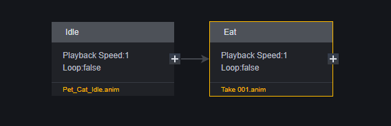

   这里idle状态的播放模式为循环的，所以将两个clip都设定为不循环，以满足不断播放idle+Eat的需求。

   在Run状态中添加一个跑的动画片段，将该动画片段设为循环或将Run状态设为循环，两种设置方式会影响后面脚本图元的一个参数，这里我们仅将动画片段的播放模式设置为循环。

   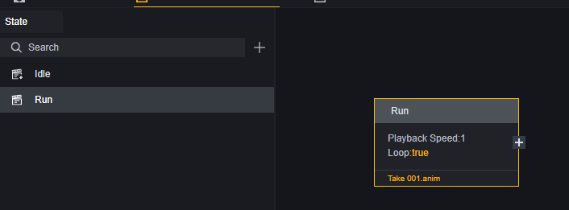

3. 编辑脚本

   为这个猫的模型添加脚本，并编写逻辑。因为添加的动画并不包含实际的位移，所以我们需要使用playable来为模型添加朝向和位移：

   

   > 我们在地图上添加了一个隐形的Box001在位移的终点，方便猫保持朝向始终向着位移终点。

4. 测试

   准备阶段，因为添加了动画状态机所以自动开始播放Idle状态。

   

​	移动阶段。

​	到达目的地后。

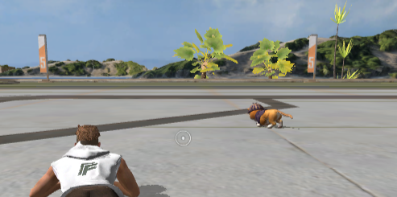

