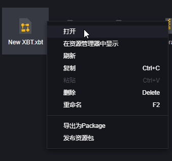
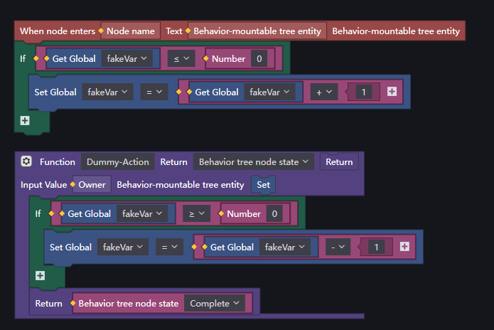
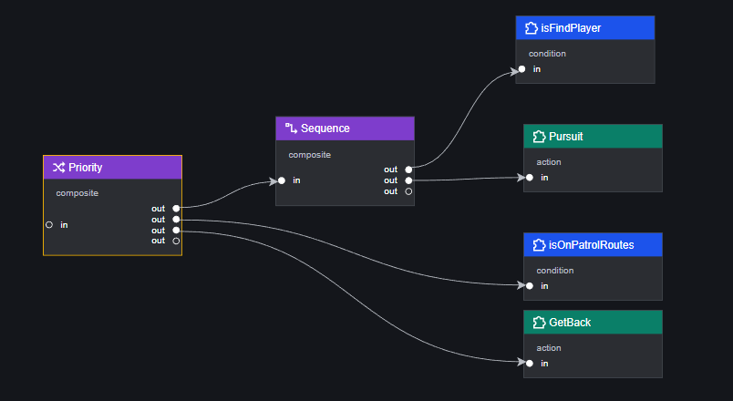
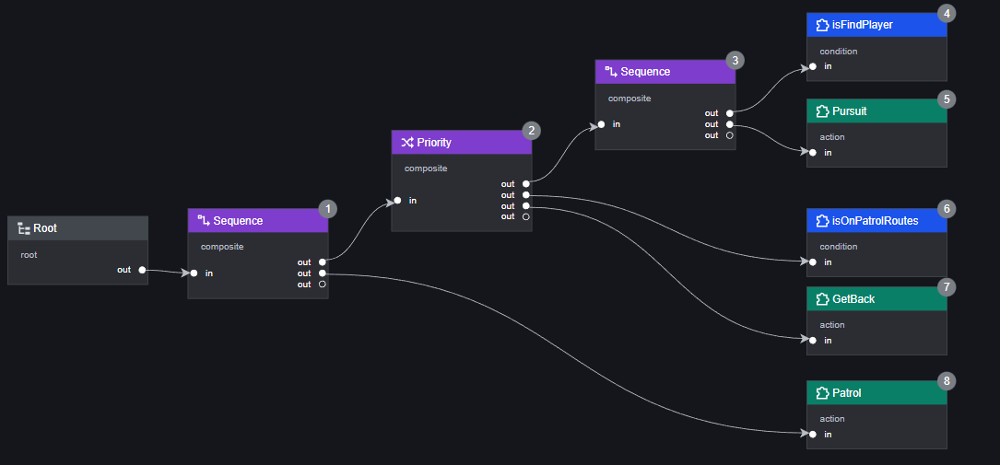
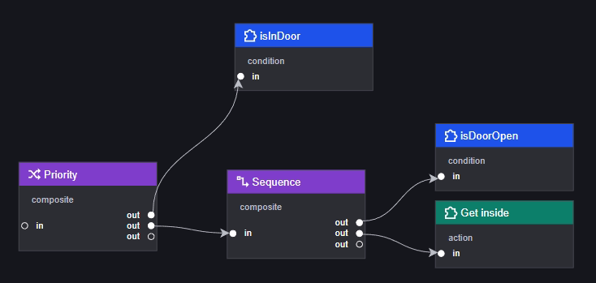

# BehaviourTree-行为树

行为树是一种行为决策模型，可以用来设定任何可挂载行为树实体组件的对象的行为，例如怪物或自定义的NPC。
行为树采用的树状结构符合人类的思考方式，可以更直观地进行行为设计。模块化也有助于开发者进行修改和调整。
在本篇教程中，将会教您行为树的运行原理和如何创建一棵行为树。在示例中，会展示如何创建一个可以巡逻和追击玩家的僵尸使用的行为树。

## 行为树的构成和运行逻辑

行为树由逻辑节点和叶子节点和一个特殊的根节点构成。

行为树会在每一Tick（一帧或多帧，可以在该行为树的属性中修改）按照定义顺序遍历该行为树中可执行的所有节点，并最终停在一个节点上。

行为树会从根节点开始，按照从左到右，从上到下的顺序，依次执行到停止节点或遍历所有相连接的行为树节点为止。

> 行为树总是固定的从根节点开始执行，因此只有与根节点直接或间接连接的节点才会被执行。
> 节点执行顺序会在编辑器中以数字序号标出，不会被执行的节点没有序号。
> 每一Tick，当行为树停止在某一节点上时，执行顺序在该节点以后的节点，均不会被执行。

## 行为树的节点

根节点：每棵树都具有的初始节点，所有逻辑均由根节点开始运行。根节点自动创建，不可删除。

逻辑节点：分类为Composite、Decorator的节点。逻辑节点决定子节点的运行逻辑。逻辑节点不能作为一条分支的最后一个节点使用。

叶子节点：分类为Condition、Action的节点。叶子节点决定实体的实际行为。叶子节点必须作为一条分支的最后一个节点使用。

## 创建行为树

可以在Assets窗口中右键创建行为树文件。并可以在Assets窗口中管理行为树文件。行为树文件的后缀是.xbt。

## 挂载行为树

为任意实体挂载行为树前，必须在inspector面板先为其添加“可挂载行为树实体”组件。
添加“可挂载行为树”组件后，即可快速挂载行为树文件。

每个实体只可以挂载一棵行为树。

## 编辑行为树

打开行为树文件即为打开编辑行为树面板。

行为树编辑面板分为三个部分：

1.节点列表

2.画布

3.检视面板（inspector）

### 节点列表

所有官方提供、自定义和导入的节点都会在这里显示。
拖拽节点进入画布即可创建一个全新的对应节点。
支持节点搜索。
右上角的按钮可以创建自定义节点或导入节点。

#### 自定义节点

点击右上角的“+"打开创建节点面板，在创建节点面板中，可以对节点的以下属性进行自定义：

1. 节点名称。
2. 节点类型，目前只支持自定义Action和Condition类型的节点。
3. 节点脚本，目前在创建节点面板只支持添加已有的脚本至自定义节点，在创建后支持编辑。
4. 节点变量类型，可以为该节点创建自定义属性，以便脚本调用。
5. 节点描述。

以上内容中，除了2.节点类型外，均支持创建后进行修改。

#### 导入节点

点击右上角的导入按钮可以打开导入文件选择界面。
可以导入其他工程中的节点，节点后缀为.xbttemp。
导入时应当注意，导入的节点可能带有此工程不存在的脚本。

> 重要！对节点列表中的节点进行修改，不会作用于已拖入画布的节点。

### 画布

画布是编辑行为树的主体区域，将节点列表中的节点拖入画布后，可以任意排列行为树节点，并通过“out”到“in”的方式，用连接线连接任意两个节点，从而编辑他们的执行顺序。画布中总会包含一个固定的根节点。

当从一个节点的“out”选项卡连接至另一节点的“in”选项卡时，我们称“out”被连接的节点为父节点（输出节点），而“in”被连接的节点为子节点（输入节点）。
根据节点类型不同，节点可以有一个或多个“out”，但是有且只能由一个“in”。（根节点除外，根节点没有对应的输入节点）

行为树只会执行直接或间接与根节点相连的节点，称之为激活节点。画布中会自动识别激活节点，并按照从左到右，从上到下的顺序为这些激活节点排序，节点右上角灰色数字即为被调用的顺序，没有激活的节点不会显示数字。

> 可以通过鼠标左键或中键按住拖动面板。
> 通过Ctrl+鼠标滑轮缩放面板。

### 节点检视面板

画布中的每个节点包含以下信息或其中一部分：节点基本信息、脚本、节点变量列表。

节点基本信息：包括节点ID、节点名、节点类型、节点描述。
脚本：该行为树节点所挂载的脚本，一个行为树节点仅能挂载一个脚本。由脚本控制行为树运行到该节点时需要执行的行为。
节点变量列表：该节点运行所需的一些变量，部分由官方提供，部分由创作者在创建节点时添加。

> 节点基本信息中ID为自动分配，其他信息在左侧节点列表中可以进行全量修改，但是拖入画布的节点就只能修改节点名。
> 脚本可以在创建节点时添加、也可以在画布中进行编辑，不过一个节点只能挂载一个脚本。
> 节点变量列表可以在创建时设定也可以在画布中设定。
>总是要注意变量列表中的节点和画布中的节点并不相等，具体行为树使用的数据须以画布上的节点为准。

## 行为树节点类型

行为树节点有4种类型：Action、Condition、Composite、Decorator。

其中Composite、Decorator分类的节点为逻辑节点，不能作为一条分支上最后一个节点使用。
Action、Condition为叶子节点，只能作为一条分支上最后一个节点使用。

### Action

Action类型的节点代表需要行为树执行的“行为”，除官方节点“Wait @ms”外，其余的行为均由创作者创建并定义。Action常用于让行为树实体或其所属实体执行特定行为。利用Action节点可以制作模块化的自定义行为，例如走向特定地点、释放特定技能、激活指定效果。
Action节点的执行结果有且仅有两种：完成（Complete）和运行中（Running）。

- Wait @ms：该节点包含一个变量“WaitTime”，用于在行为树执行过程中，等待特定的时间（以毫秒计算，具体等待时间为“WaitTime”变量的值）。在等待时间未结束时，该节点会始终返回“运行中”，而在等待时间节点后，该节点会返回“完成”。

> 注意：由于行为树是每Tick执行一次，因此在行为树节点中使用“等待”图元时，可能会在每一Tick重复等待，造成行为树运行卡死。因此建议使用Wait @ms节点代替行为树脚本中的“等待”行为。

### Condition

Condition类型的节点代表需要行为树进行的条件判断。所有的Conditon节点均由创作者创建并定义。Condition节点常用于判断特定条件是否成立。
Condition节点的执行结果有且仅有两种：真（True）和假（False）。

### Composite

Composite类型的节点仅有四个，他们都是官方节点。该类型节点主要用于控制子节点的执行顺序。

- Priority：实现子节点或关系，按定义顺序遍历子节点，直到有一个子节点返回true时停止，并返回true。如果子节点全部返回false，则返回false。不支持在将单次执行的结果存储到下一次执行。
- Sequence：实现子节点与关系，按定义顺序遍历子节点，直到有一个节点返回false时停止，并返回false。如果子节点全部返回true，则返回true。不支持在将单次执行的结果存储到下一次执行。
- MemPriority：与Priority相同，但支持将单次执行的结果存储至下一次执行。
- MemSequence：与Sequence相同，但支持将单次执行的结果存储至下一次执行。

> 注意：Composite控制子节点执行顺序的功能，仅对与该Composite节点相连接的全部“子节点”生效。
> 不支持对Composite节点的自定义。

### Decorator

Decorator类型的节点主要用于控制行为树的执行逻辑。目前仅有五个官方Decorator节点。

- Repeat @X：该节点包含一个变量“MaxLoop”，主要功能为让直接相连的子节点重复执行“MaxLoop”次，并返回最后一次执行的结果。
- Repeat Until Failure：该节点能让直接相连的子节点重复执行，直到返回结果为“Failure”也就是“假”。
- Repeat Until Success：该节点能让直接相连的子节点重复执行，直到返回结果为“Success”也就是“真”。
- Max @Ms：该节点包含一个变量“MaxTime”。在执行直接相连的子节点时，该节点会判断是否超时，若超时则返回 “假”。
- Inverter：该节点会将与其直接相连的子节点的执行结果取相反值。例如将“假”取反为“真”。

> 不支持对Decorator节点的自定义。

## 行为树节点脚本基本规则

行为树上每个可编辑节点支持添加最多一个脚本。
可编辑的节点均为Action或Condition类型，根据类型不同，节点脚本必须返回指定的返回值。

Condition节点的脚本必须返回一个Bool值。
Action节点的脚本必须返回类型为“行为树节点运行状态”的值，即“完成”或“进行中”。

> 假设脚本中返回了多个返回值给行为树，行为树默认会以第一个返回的返回值为该节点的运行结果。
> 官方提供的基础节点已经预设好返回值，详情见节点类型。
> 逻辑节点会根据叶子节点返回值进行逻辑判断，详情亦见节点类型。

节点中需要带有一个特殊的函数，该函数必须指定的输入输出参数类型，以便行为树进行调用。
有关特殊函数的要求，会在下文进行说明。

推荐使用“当节点进入时”事件进行初始化工作，将节点逻辑写入特殊函数中。
这样在节点返回”进行中“结果时每tick可以直接执行特殊函数，而不必重复进行初始化。

### 如何在节点中返回运行结果

行为树通过读取一个特殊函数的值来进行返回值的判断，该类型函数在同一节点的脚本中有且只能有一个。

在Condition脚本和Action脚本中，这个函数的写法不同。

Condition节点下的写法如图：

其输入参数为：可挂载行为树实体（Owner，即被我们挂载了相应行为树文件的实体）。

返回值为：Bool（该节点运行结果）。

Action节点下的写法如图：

其输入参数为：可挂载行为树实体（Owner，即被我们挂载了相应行为树文件的实体）。

返回值为：行为树节点运行状态（该节点运行结果）。

> 行为树会自动读取节点脚本中的该类型函数（需要确保有且仅有一个同格式的函数），并在每一Tick调用该函数，得到一个返回值。不需要单独调用该特殊类型的函数。
> 行为树节点每次运行时，各事件的触发顺序依次为：节点进入时、调用特殊函数、节点退出时。
> 这种特殊函数每个脚本只能存在一个，不要设计与其输入值返回值类型相同的函数。可以在该函数内编入你希望执行的其他图元逻辑，只需要确保该函数最终能返回对应类型的返回值即可。
> 非特殊格式的函数可以在脚本中有无限多个，不会影响行为树的正常运行和逻辑判断。
> 在这个特殊函数中，暂时不支持调用异步函数，必须当tick立刻返回结果。

## 示例

以一个简单需求为例，创建并应用一个行为树。

> 关于脚本的实际编写不会出现在此示例中

假设一个需求：
场景上有：一个僵尸、两棵椰子树。使用行为树让僵尸在椰子树之间不断巡逻，附近存在玩家时进行追击，并在丢失玩家目标后继续回去巡逻。

首先，建立一个行为树文件，对其进行编辑：

分析需求，僵尸可能的行动有：

1. 巡逻
2. 追击玩家
3. 返回巡逻路径上

僵尸改变行动的条件有：

1. 发现了玩家
2. 弄丢了玩家
3. 发现自己不在巡逻路径上
4. 发现自己在巡逻路径上

其中1和2与3和4都是一个条件的正反面。因此只需要建立两个Condition节点。
建立所有自定义节点：

Action节点：

1. 巡逻
2. 追击玩家
3. 返回巡逻路径上

Condition节点：

1. 是否发现玩家
2. 是否在巡逻路径上

分析Action节点的条件：

| Action节点     | 执行条件1        | 执行条件2      |
| -------------- | ---------------- | -------------- |
| 巡逻           | 僵尸没有发现玩家 | 在巡逻路径上   |
| 追击玩家       | 僵尸发现玩家     |                |
| 返回巡逻路径上 | 僵尸没有发现玩家 | 不在巡逻路径上 |

将需要最少条件的行为：追击玩家取出，与其条件节点一起使用Sequence节点编成一个组：

> Sequence节点：子节点依序执行，直到子节点返回false时停止，并返回false；如果子节点均返回true，则返回true。

在这个组里，追击行为必须在是否发现玩家节点返回true后执行。

如果僵尸没有发现玩家，那么要根据另外一个条件：是否在巡逻路径上的结果来决定僵尸实际执行的行为，所以我们需要一个逻辑节点将之前的组和新的条件连接起来。
又因为此时处理的是僵尸没有发现玩家的逻辑，所以之前的组中的Sequence节点的返回值一定为false，所以我们新的逻辑节点需要一个收到false也能继续运行的节点。

正是Priority节点：

> Priority节点：子节点依序执行，直到子节点返回true时停止，并返回true；如果子节点均返回false，则返回false。

这个组在僵尸没有发现玩家的前提下，对是否在巡逻路径上进行了判断。根据Priority节点的特性，我们可以直接连接”是否在巡逻路径上“节点返回false时僵尸的行为：返回巡逻路径

那么”是否在巡逻路径上“节点返回true时，Priority节点就会因为收到true而终止运行，并返回一个true值，我们需要一个逻辑节点，在其子节点返回true时继续执行僵尸的最后一个行为：巡逻。

这样，一个行为树就建立完毕了。

接下来，我们需要将这个行为树挂载在僵尸实体上：

选中僵尸，为其添加”可挂载行为树实体“组件

为其添加刚刚编辑好的行为树：

大功告成

> 示例仅作一种制作方法的演示，仅供参考。
> 同样的逻辑可以有不同的思路去绘制行为树的画布，可以遵循自己的喜好来处理。
> 添加行为树到实体上后也可以继续对行为树进行编辑，并不一定要像示例一样的流程进行编辑。

## 补充

### 前置条件

当行为X必须在满足条件A后执行，此时我们称条件A为行为X的前置条件，使用Sequence节点可以构建逻辑单元。
前置条件用来满足类似if-then的逻辑需求，比如必须门打开才能进屋：

### 后置条件

当执行过行为X后，条件B必然成立，此时称条件B是行为X的后置条件，使用Priority节点可以构建逻辑单元。
后置条件用于保证逻辑块整体执行成功时该条件一定满足。例如如果进屋动作执行成功了，该单位一定在屋子里：

### PPA模式(Postcondition-Precondition-Action)

结合上面两种条件，我们可以使用一种广泛被使用的设计方法，PPA模式。

这种模式的好处是整棵行为树可以视为在后置条件的前提下进行的逻辑，这样可以更好地支持分层设计，比如门可能有锁上的状态：

新的逻辑主要会影响门是否打开，将门打开作为后置条件，对扩展的逻辑进行编辑即可。

