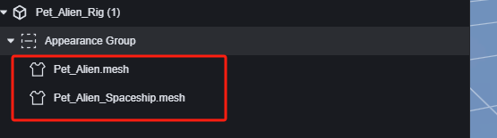
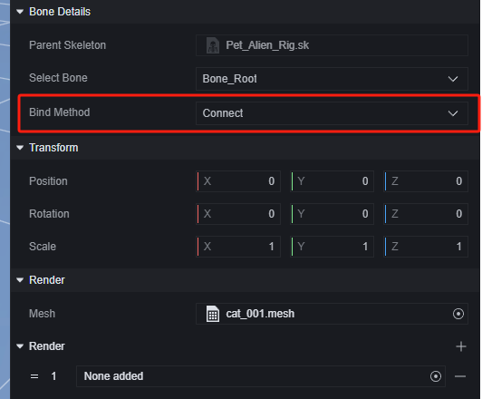
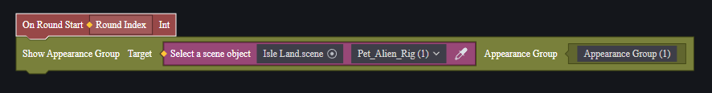
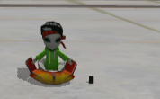

# AVATAR-用户手册

# 外观组

外观组是对模型中的外观mesh进行分类管理的概念。

  

将带有骨骼的模型添加为prefab，即可进入外观编辑：

在外观组设置中，可以将该外观组设置为一组互斥外观中的一个：

所有设置为同一个互斥组的外观组之间互斥，不会同时显示。这方便于切换皮肤等操作。

外观组内是以mesh为单位的部件，一个模型具有多少个mesh是创建模型时就确定了的。

在mesh的设置中，您可以修改其与骨骼的绑点、绑定方式；修改渲染方式等操作：

可以通过新建外观为模型添加新的mesh：

可以选择工程内已有的mesh资源：

如果新增的mesh并非与原骨骼相匹配，选择绑定方式为连接：

# 使用外观组

通过脚本可以控制指定外观组的显隐或切换外观组。

> 切换外观组会隐藏原先的外观组并显示新的外观组。

外星人宠物中有两个mesh，分别是外星人本体和飞碟：

我们创建新的外观组，可以将二者分开：

在默认状态下，我们使飞碟隐藏，并在游戏回合开始后显示飞碟：

> 全局脚本

在游戏准备阶段，可以看到只有外星人：

回合开始后，飞碟被显示出来：

灵活使用脚本控制外观组，可以在完成在特定条件下切换部件显示、更换皮肤、变身等操作。
