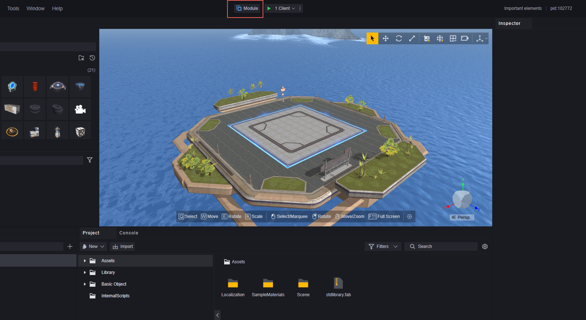
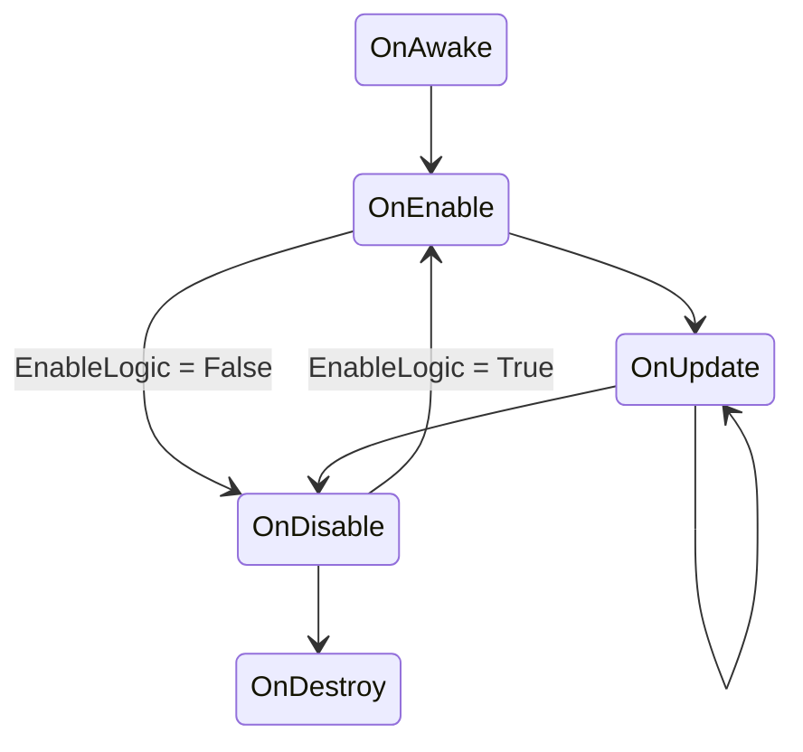
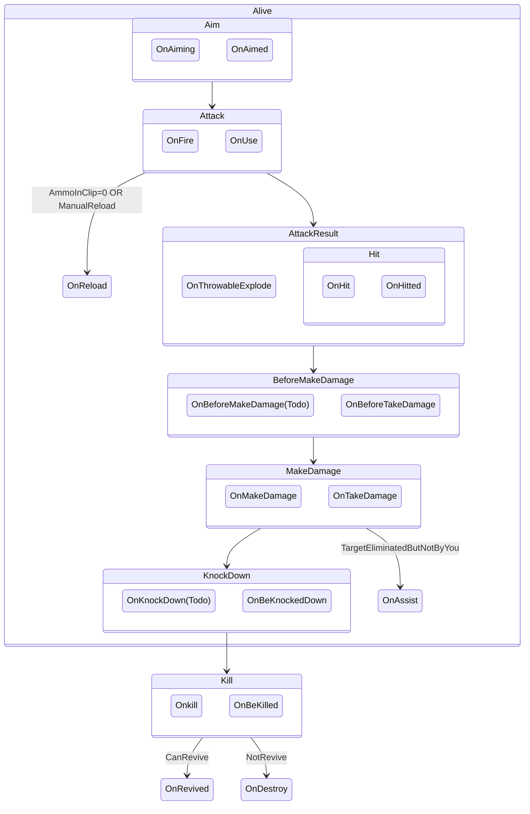
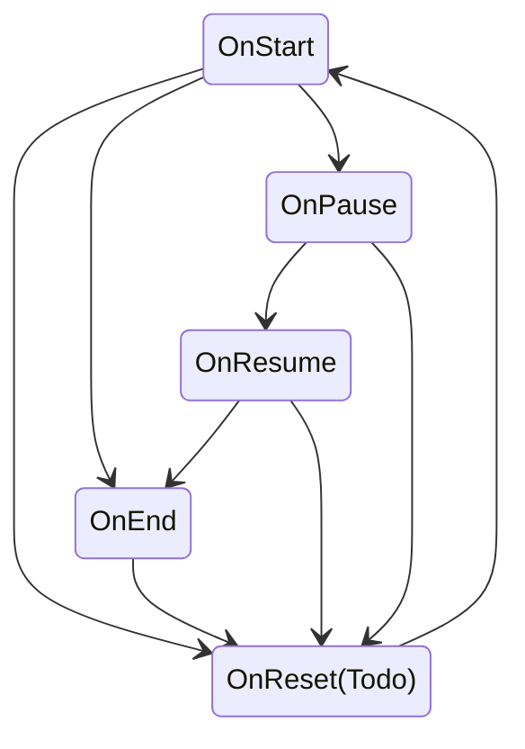
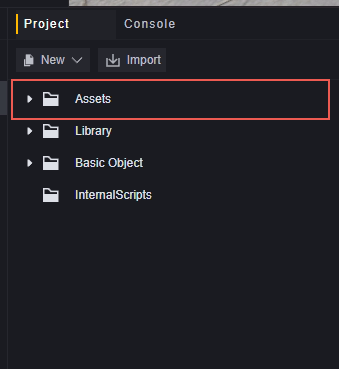

# 重要概念-用户手册

## 模组

模组是一个逻辑闭环的功能模块，它会封装内部复杂性，对外提供简单的接口。
模组一般来说包含互相具有关联性的一类配置、资产、功能等，加载模组后可以对游戏相关元素进行设置。

在编辑器中上位置可以打开模组管理器：

1.可以搜索所有的模组。

> 搜索的范围是所有模组，无论模组是否加载与当前选中的类别，都可以直接搜索对应的模组。

2.模组分类，分为已加载、未加载和所有。

3.模组列表，展示该分类下所有的模组，点击模组可以查看该模组的配置。

### 模组的装卸

默认状态下，我们已经为您加载了若干模组。在未加载分类下的模组即为可选模组。

#### 加载模组

模组后方的标志表示着该模组尚未加载。点击该标志即可加载模组。

也可以通过模组配置界面的加载按钮加载。

#### 卸载模组

对于那些可以卸载的模组，在其配置界面上会有一个卸载按钮，点击即可卸载。

部分模组为必要模组，不可以卸载，只可以改变其配置。这种模组没有卸载按钮。

> 对模组加载/卸载的操作不会立刻反映在分类显示上，可能会出现已加载的模组出现在未加载分类栏中，刷新分类页签后即会更新。

### 模组的配置

对于未加载的模组，只有一个可用操作：加载。加载后的模组可以进行具体的配置。

选中加载了的模组后，可以查看该模组的描述，以及具体的配置项。

重要模组的配置，请参考对应的手册文章。

## 实体

实体是UGC重要概念之一。
一个实体是一类具象/抽象的概念或概念的集合。实体具有属性，对属性的修改会影响该实体创建出来的实例。
实体的概念非常广泛，本游戏中绝大多数概念都是以实体形式存在的。

以“玩家”为例，“玩家”实体指的是玩家这个具象概念，生命值是玩家实体的属性，某局游戏中的特定玩家A和B是玩家实体的两个实例。
玩家A和B都具有玩家实体的生命值属性，不同的是，玩家A有150生命值，而玩家B有200生命值。
生命值是实体的属性，150和200的生命值是实例的属性。

除了玩家、载具、武器这种可以具象化的实体，还有一些不能直接具象化的抽象实体，比如全局、游戏流程。
抽象实体也具有属性，并且也会创建出实例。
比如游戏流程是一个抽象实体，准备阶段时长是其的一个属性，假设进行了两次游戏，每次游戏都会创建一个游戏流程的实例。
第一次游戏准备阶段时长为5秒，第二次游戏准备阶段时长为10秒。5秒和10秒的准备阶段时长是游戏流程实体的实例属性。

多数情况下，游戏中提到的实体实际上指的是实体的实例，例如删除实体、获得实体的属性、修改实体的属性。实际上操作的对象都是实体的实例。在下文及其他文章中，无必要不再特殊强调实体实例和实体的区分。

### 实体的生命周期

如上文所说，实际上生命周期作用对象是实体的实例。
生命周期意味着实体从创建到销毁，总是会经过特定的流程，您可以通过掌握需要编辑实体的生命周期，进而在特定的时点对实体进行操作，从而达到设计目的。所有实体都以Awake作为生命的开始，以Destroy标志着生命的结束。绝大多数实体在Awake之后都会经过Enable激活，并在销毁前使用Disable关闭激活。

> 也许会存在跳过enable或disable阶段的实体，但是awake和destroy总是存在。

**通用流程**

在Awake之前，所有属性的初始值已经就绪，对应的桥接实体也已经创建。

下面给出部分实体的生命周期的update部分，以供参考：

**战斗单位流程**

**可播放流程**

​    

## 场景物件、预制体与组件

在编辑器中，可以在场景中布置各种各样的物件，它们可以是纯装饰物、触发器、生成器等等。您也可以通过修改物件组件和其属性的方式对物件进行自定义。

我们在编辑器中提供了若干分类的预设物件，可以通过拖动到场景上进行配置。

以基本物件立方体为例，我们向场景上配置两个立方体。

配置的物件在层级页面管理。

组件定义了物件的行为，一些组件是必须加载在对应物件上的，一些是可选的。我们会为物件提供默认的组件配置，您可以根据需求进行修改。

以上文的立方体为例，选中任一立方体，可以看到其在inspector面板上已经默认配置了若干组件。

可以通过添加组件按钮对配置哪些组件进行编辑。

1. 对组件进行设置，对组件的设置会同步到所有加载了该组件的实体上。

2. 已经加载的组件。

3. 可选的组件，选中即为加载，取消选中即为卸载。

预制体是物件的模板，通过预制体可以同时对所有由预制体配置的物件进行修改。

将场景上的物件拖入资产栏，即可创建一个预制体。

1. 创建一个预制体文件夹，这一步非必须，但是推荐这样做，方便文件管理。

2. 编辑您需要作为预制体的物件，比如将两个立方体叠放，并建立层级结构，合并为一个整体。

   

3. 将修改好的物件从层级界面拖入创建好的prefabs文件夹。

   

   

   > 同一个物件可以创建多个预制体，但是只有最新创建的预制体会作为该物件的预制体。

4. 有预制体的物件会在层级中标记为蓝色。

   

5. 从资产文件中拖拽预制体到场景上，可以根据创建一个相同的物件。

   

6. 对预制体进行编辑，会同步到所有根据此预制体创建的物件。您可以通过单击预制体在inspector窗口进行快速编辑，或者通过双击预制体进入详细编辑界面。

   

   这里只有主物体的可见性被关闭了，这是因为在快速操作界面只是对结构中作为父物体的立方体进行编辑。可以通过双击预制体进入详细界面进行复杂的编辑。

   

   打开详细界面后，可以对预制体所有结构体进行编辑。

7. 对物件进行编辑，不会影响预制体，也不会影响其他同预制体物件。

   

8. 删除预制体，不会对已经创建的物体有影响，但是由此预制体创建的物件会在层级窗口以红色标注。

   

## 资产

资产是项目中用来创建游戏内容的文件。资源必须是编辑器支持的类型。支持编辑器内创建或者从外部导入，同时也支持导出并作为其他项目的资产。

资产可以在project界面确认，只有Assets文件夹下的内容才支持自定义。

### 支持的资产类型

| 资产类型   | 描述                                                         | 操作介绍                    |
| ---------- | ------------------------------------------------------------ | --------------------------- |
| 材质文件   | 材质可以改变物件的外观，总是通过着色器来使用材质。           | 【此处应有链接】            |
| 物理材质   | 物理材质可以改变物件的物理属性，如弹性、摩擦力。             | 【此处应有链接】            |
| Scene文件  | 场景是加工游戏内容的界面，包含游戏全部或部分内容的资源。对于较为复杂的游戏，你可能需要多个场景来实现设计。 | 【此处应有链接】            |
| UI文件     | UI是用于用户操作或为用户显示信息的界面。                     | 【此处应有链接】            |
| 玩家数据   | 玩家数据可以自定义玩家角色，包括其外观、动作等。             | 【此处应有链接】            |
| 动画控制器 | 动画控制器允许您为角色或对象安排和维护一组动画的过渡，对每个动画片段的播放进行设置。 | 【此处应有链接】            |
| 行为树文件 | 行为树文件可以设定角色或物体的行为。                         | 【此处应有链接】-文件已做完 |
| 脚本相关   | 可以通过图元或代码的方式编写脚本，为游戏增加自定义的逻辑。   | 【此处应有链接】            |
