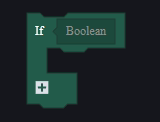

# 版本登记

| 版本 | 时间     | 备注                                 |
| ---- | -------- | ------------------------------------ |
| 1.1  | 20240723 | 初版，包含原用户手册中罗列说明的部分 |
|      |          |                                      |
|      |          |                                      |

# 脚本附加说明-用户手册

对一些项目进行逐条说明：

## 图元脚本

### 流程控制

#### **条件语句：**

if：



满足条件则运行IF下的节点。点击+号添加ELSE：不满足条件则运行ELSE下方节点：


再次点击+添加ELSEIF，不满足条件时继续判断下一个条件。


#### 循环语句：

Foreach：

对于参数列表/字典中的每一个KEY，执行一次下方的节点。


for index：

参数i从最小值开始，每运行一次下方节点则i增加步进值，直到i大于等于最大值。


> 此节点的[最小值,最大值)区间是左闭右开的，即i等于最大值那次不会运行下方的节点。以图中为例，此循环一共会运行十次，i的值分别为0至9。

while循环：


只要满足条件，就会循环运行下方的节点。

break：


中断循环，继续执行循环体后的节点。

continue：


跳过本次循环，进入循环体的下一次循环。

## 代码脚本

### 基本语法

#### 注释

##### 单行注释

```go
// 单行注释
```

##### 多行注释

```go
/* 

多行注释
多行注释

 */
```

##### 标识符

标示符用于定义一个变量，函数，类型名等用户定义的项。标示符由字母、数字、下划线构成，不能以数字开头。

##### 关键字

保留关键字不能作为用户自定义标示符：

| 关键字       | 说明                                                 | 示例                                                 |
| ------------ | ---------------------------------------------------- | ---------------------------------------------------- |
| define       | 定义基本类型                                         | define AssetID : string                              |
| alias        | 定义类型别名，支持或、且两种表达式                   | alias Number = int \| int64 \| float                 |
| enum         | 定义枚举                                             | enum SortType { AscIgnoreZero = 0 Desc = 1 Asc = 2 } |
| component    | 定义组件                                             | component XXX{ … }                                   |
| abstract     | 修饰组件定义，抽象组件                               | abstract component XXX { }                           |
| partial      | 修饰组件定义，扩展组件，在组件原定义基础上新增属性   | partial component XXX { }                            |
| accept       | 修饰类型定义，在赋值运算时被修饰类型可接受的其它类型 | [accept Vector3]                                     |
| combine      | 修饰组件定义，绑定组件                               | [combine Visibility]                                 |
| graph        | 定义脚本                                             | graph XXX{ … }                                       |
| import       | 导入脚本                                             | import "StdLibrary.fcc" as stdlibrary                |
| from         | 部分导入脚本                                         | import XXX from "EditorGenLib.fcc"                   |
| static       | 修饰脚本定义，静态脚本                               | static graph XXX                                     |
| readonly     | 修饰组件属性或变量，声明只读                         | [readonly]                                           |
| event        | 定义或监听事件                                       | event OnAwake(){ … }                                 |
| func         | 定义函数                                             | func Jump(){ … }                                     |
| start        | 异步调用函数                                         | start Jump()                                         |
| wait         | 同步调用函数                                         | wait Jump()                                          |
| async        | 异步函数声明                                         | async func Jump(){ … }                               |
| var          | 定义局部变量                                         | var int num = 0                                      |
| out          | 声明函数形参是否为输出参数                           | func Jump(var out speed){ … }                        |
| as           | 类型转换                                             | var hpFloat = GetHP() as float                       |
| thisEntity   | 指代当前实体                                         | var hp = thisEntity<Player>.HP                       |
| globalEntity | 指代全局游戏实体                                     | var tickCount = globalEntity<Globall>.TickCount      |
| typeof       | 获取类型的值                                         | TypeIs(100, typeof(int))                             |

其它关键字：

if、else、for、in、while、break、continue、return、

object、bool、int、float、string、Vector2、Vector3、Quaternion、List、entity、

true、false、nil

#### 成员访问符

成员访问符是`.`，基本语法如下，以点访问对象成员：

```golang
对象.成员
```

比如导入的脚本库、枚举类型、组件类型等, 也可以是某个具体的实例上组件成员或脚本成员等等。

#### 访问导入内容

导入内容在脚本中都是通过别名进行成员访问，别名是每个脚本内独立的。

以导入标准库举例：

```golang
import "StdLibrary.fcc" as std

graph HelloWorldGraph {
    func SayHello(name string) {
        //std就是标准库导入后的别名
        std.LogInfo("Hi, " + name)
    }
}
```

#### 访问组件数据

组件是挂在实体上的数据，当访问实体对象上组件的数据时，基本语法如下：

```golang
实体对象<组件限定>.成员
```

以访问当前实体的组件数据为例：

```golang
func EntityPropModify(input bool) bool {
    thisEntity<Entity>.EnableLogic = input
    return thisEntity<Entity>.EnableLogic
}
```

#### 访问脚本成员

脚本是挂在实体上的行为，当访问实体对象上脚本的成员时，基本语法如下：

```golang
实体对象<脚本限定>.成员
```

以访问当前实体的脚本为例：

```golang
func MyFunc(){
    //thisEntity是保留字, 指代当前实体
    if HasScript(thisEntity, Helper) {
        thisEntity<Helper>.MyHelpFunc()
    }else {
        //动态为实体挂脚本
        AddScript(thisEntity, Helper)
        thisEntity<Helper>.MyHelpFunc()
    }
}
```


### 数据类型

#### 基本类型

##### object

object是所有类型的基础类型

##### bool

布尔类型只有两个可选值：true（真） 和 false（假）

```golang
func Demo() {
    var isOK1 = false
    var isOK2 bool = true
    if isOK1 || isOK2 {
        //...
    }
}
```

##### int

整数类型取值范围是“-2147483648”到“2147483647”

```golang
func Demo() {
    var num1 = 0
    var num2 int = 5
    if num1 > num2 {
        //...
    }
}
```

##### float

小数类型取值范围大约是“-3.4e38”到“3.4e38”

```golang
func Demo() {
    var num1 = 0.5
    var num2 float = 5.6
    if num1 > num2 {
        //...
    }
}
```

##### string

字符串由一对双引号来表示，当需要表双引号本身时，可使用转义字符"

```golang
func Demo() {
    var str1 = "Hi, "
    var str2 string = "Tim"
    LogInfo(str1 + str2)
}
```

##### Vector2

二维向量由两个float分别表示X、Y构成

```golang
func Demo() {
    var vec1 = Vector2{0, 0}
    var vec2 Vector2 = Vector2{1, 1}
    var vec3 = vec1 + vec2
    LogInfo(vec3.Y)
}
```

##### Vector3

三维向量由三个float分别表示X、Y、Z构成

```golang
func Demo() {
    var vec1 = Vector3{0, 0, 0}
    var vec2 Vector3 = Vector3{1, 1, 2}
    var vec3 = vec1 + vec2
    LogInfo(vec3.Z)
}
```

##### Quaternion

四元数由四个float分别表示X、Y、Z、W构成

```golang
func Demo() {
    var qua1 = Quaternion{0, 0, 0, 1}
    var qua2 Quaternion = Quaternion{0, 0, 0, 1}
    LogInfo(qua1.W)
    LogInfo(qua2)
}
```

##### Enum

枚举是常量数据集合的概念，比如一个攻击方式枚举，它内部可以包含近战、射击、爆炸等选项。不同的枚举类型之间无法互相赋值，即便它们的值可能一样，因语义不同而无法赋值。

```golang
func Demo() {
    var element int = std.ItemGoodsIDType.AC80
    if element == std.ItemGoodsIDType.AC80 {
        LogInfo("suc")
    }
}
```

#### 动态类型

##### List<T>

列表，表示一组数据，其中的T是列表中元素的类型

比如List<int>，表示这是一个整数列表

```golang
func Demo() {
    var allItems = List<object>{"a", "b"}
    allItems[0] = "A"
    LogInfo(allItems[0])
    for index, element in allItems{
        LogInfo(element)
    }
}
```

##### Map<T1,T2>

字典，表示一组键值映射数据，其中的T1是键的类型，T2是值的类型

比如Map<string, int>，表示这是一个通过字符串Key查询int值的字典

```golang
func Demo() {
    var allItems Map<string, int> = Map<string, int>{"a":1, "b":2}
    allItems["a"] = 2
    LogInfo(allItems["a"])
    LogInfo(allItems)
}
```

##### entity\<T>

实体，表示一个对象，其中的T是实体附加的组件类型

比如entity\<Player>，表示这是一个带有Player组件的实体

```golang
func Demo() {
    thisEntity<Global>.EcoRoundMoney = 100
    LogInfo(thisEntity<Global>.EcoRoundMoney)

    RevivePlayer(thisEntity<Player>)
}
```

### 运算符

#### 算术运算符

假定 A 值为 10，B 值为 20。

| 运算符 | 描述 | 示例               |
| ------ | ---- | ------------------ |
| +      | 相加 | A + B 输出结果 30  |
| -      | 相减 | A - B 输出结果 -10 |
| *      | 相乘 | A * B 输出结果 200 |
| /      | 相除 | B / A 输出结果 2   |
| %      | 求余 | B % A 输出结果 0   |
| ++     | 自增 | A++ 输出结果 11    |
| --     | 自减 | A– 输出结果 9      |

#### 关系运算符

假定 A 值为 10，B 值为 20。

| 运算符 | 描述                                                         | 示例              |
| ------ | ------------------------------------------------------------ | ----------------- |
| ==     | 检查两个值是否相等，如果相等返回 True 否则返回 False         | (A == B) 为 False |
| !=     | 检查两个值是否不相等，如果不相等返回 True 否则返回 False     | (A != B) 为 True  |
| >      | 检查左边值是否大于右边值，如果是返回 True 否则返回 False     | (A > B) 为 False  |
| <      | 检查左边值是否小于右边值，如果是返回 True 否则返回 False     | (A < B) 为 True   |
| >=     | 检查左边值是否大于等于右边值，如果是返回 True 否则返回 False | (A >= B) 为 False |
| <=     | 检查左边值是否小于等于右边值，如果是返回 True 否则返回 False | (A <= B) 为 True  |

#### 逻辑运算符

假定 A 值为 True，B 值为 False。

| 运算符 | 描述                                                         | 示例              |
| ------ | ------------------------------------------------------------ | ----------------- |
| &&     | 逻辑 AND 运算符。 如果两边的操作数都是 True，则条件 True，否则为 False | (A && B) 为 False |
| \|\|   | 逻辑 OR 运算符。 如果两边的操作数有一个 True，则条件 True，否则为 False | (A \|\| B) 为True |
| !      | 逻辑 NOT 运算符。 如果条件为 True，则逻辑 NOT 条件 False，否则为 True | !(A && B) 为 True |

#### 赋值运算符

| 运算符 | 描述                                           | 示例                                  |
| ------ | ---------------------------------------------- | ------------------------------------- |
| =      | 简单的赋值运算符，将一个表达式的值赋给一个左值 | C = A + B 将 A + B 表达式结果赋值给 C |
| +=     | 相加后再赋值                                   | C += A 等于 C = C + A                 |
| -=     | 相减后再赋值                                   | C -= A 等于 C = C - A                 |
| *=     | 相乘后再赋值                                   | C *= A 等于 C = C * A                 |
| /=     | 相除后再赋值                                   | C /= A 等于 C = C / A                 |
| %=     | 求余后再赋值                                   | C %= A 等于 C = C % A                 |

#### 运算符优先级

有些运算符拥有较高的优先级，二元运算符的运算方向均是从左至右。下表列出了所有运算符以及它们的优先级，由上至下代表优先级由高到低：

| 优先级 | 运算符                   |
| ------ | ------------------------ |
| 5      | *、 /、 %                |
| 4      | +、 -                    |
| 3      | == 、!=、 <、 <=、 >、>= |
| 2      | &&                       |
| 1      | \|\|                     |

### 流程控制

#### 条件语句

条件语句需要开发者通过指定一个或多个条件，并通过测试条件是否为 true 来决定是否执行指定语句，并在条件为 false 的情况在执行另外的语句。

```golang
func Max(left Number, right Number) Number {
    if left > right {
        return left
    }else if left < right {
        return right
    } else{
        return left
    }
}
```

#### 循环语句

在不少实际问题中有许多具有规律性的重复操作，因此在程序中就需要重复执行某些语句。

##### for index

```golang
func OddNumSumV1(max int) int {
    var sum = 0
    for i = 1, max, 2 {
        sum += i
    }
    return sum
}
```

##### for range

```golang
func SumOfPrimesUpTo10V3() int {
    var sum = 0
    var nums = List<int>{2, 3, 5, 7}
    for i, num in nums {
        sum += num
    }
    return sum
}
```

##### while

```golang
func OddNumSumV2(max int) int {
    var sum = 0
    var loopIndex = 0
    while loopIndex < max {
        loopIndex = loopIndex + 1
        sum += loopIndex
    }
    return sum
}
```
