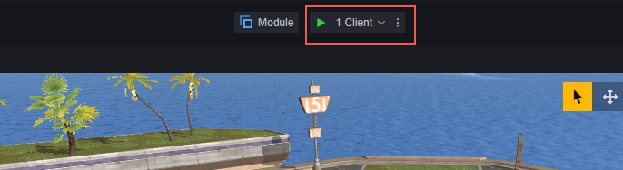
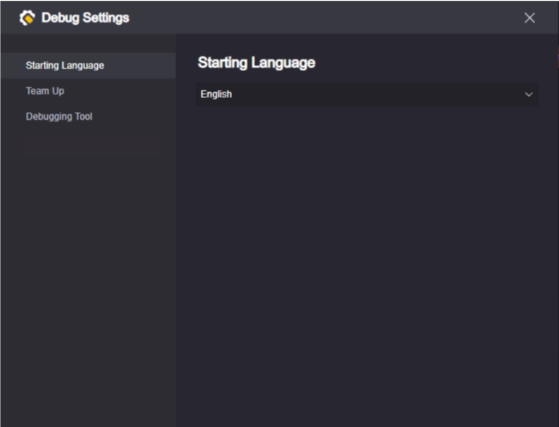
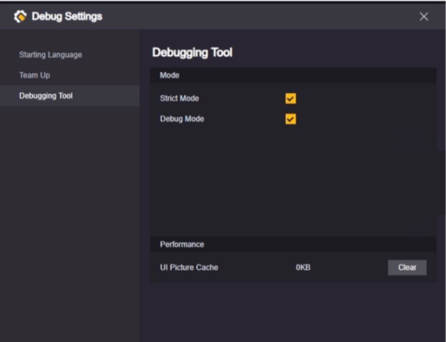
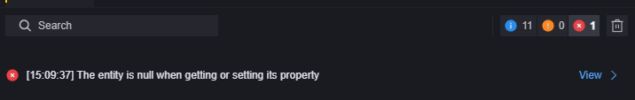
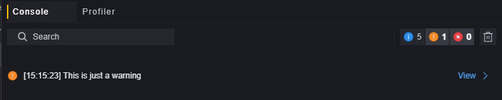
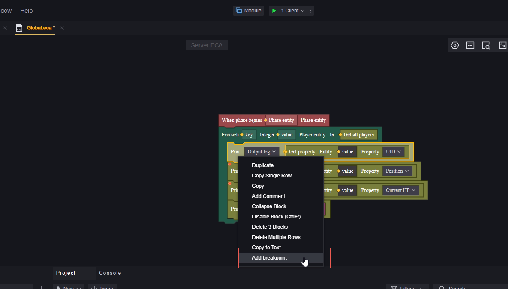

# Debug-调试

调试是一种直观地查看游戏内容并确认其中表现是否符合期望的方式。使用调试会打开至少一个游戏进程，您可以查看游戏运行的情况是否符合预期。

使用调试时自动保存整个工程。

## 调试入口

在工程编辑界面的上方可以进行调试。

## 设置

点击右侧的按钮，可以对调试进行设置。

### 多客户端调试

点击客户端区域，可以选择本次调试以多少个客户端开始。多客户端有助于对多人游戏时不同玩家之间交互的调试。

最多支持八个客户端同时开始调试。

> 多客户端调试可能会为您的设备带来性能压力

如果调试已经开始，此处的按钮会改为增加新的客户端。

最多增加**至**八个客户端同时进行调试。新增客户端后，最上方的客户端会更新显示为当前已经打开的客户端数量，可新增的客户端数量也会随之减少。
如上图中增加三个客户端，就会变为：

新加入的客户端视为中途加入的玩家。这可能会影响您关于中途加入玩家的设计验证。

关闭一个调试窗口，即视为对应玩家中途退出。当前与可增加的客户端数量也会发生变化。当最后一个调试窗口被关闭，本次调试也会就此结束。

点击工程编辑器上的停止键，所有打开的调试窗口都会关闭，本次调试也会结束。

### 调试设置

点击调试最右侧的菜单键，可以打开调试菜单。

#### 启动语言

启动语言决定了您的调试窗口中各种文字显示的语言。

#### 组队

---------------------------------有待理清--------------------------------------------

#### 调试工具

##### 严格模式

在严格模式下，一旦进程发生错误就会退出调试模式。可以更准确地定位到问题。

##### Debug模式

只有在Debug模式下，断点才会生效。

断点会在下文进行介绍。

##### 性能

显示当前UI图片缓存使用了多少本地存储空间，可以通过清除缓存释放空间，但是下一次使用UI图片要重新加载。

建议在打开较多工程，缓存里有大量不会再使用的内容时再清理。

## 调试窗口

### Game窗口

在调试窗口，你可以模拟试玩您制作的地图。在默认状态下，你的鼠标是可以自由活动的，您可以通过点按或长按鼠标左键模拟在手机屏幕上进行的操作（这可能会有些笨拙）。在屏幕区按下鼠标右键，可以进入模拟器操作模式，此时您的鼠标移动会操作视角旋转，左键变为攻击指令，同时可以使用键盘进行操作。具体键盘快捷键可以参考左上侧的“键位提示”界面：

再次点击鼠标右键即可退出模拟器操作模式。

### 菜单

我们提供了一些默认的说明和GM功能可以供您使用：

**键位提示：**模拟器操作的快捷键提示。
**无敌：**开关无敌状态，无敌的玩家不受到伤害，玩家会变为金色作为状态开启的提示。注意这个指令是切换无敌状态，玩家处于无敌状态时，使用此命令可以取消无敌状态。
**回复血量：**直接设置玩家血量至上限值。对于死亡的玩家无效。
**自杀：**杀死当前玩家。
**传送至出生点：**传送玩家至其出生的位置。如果您在场景上配置了当前玩家可用的出生点，玩家会默认出生在出生点上。如果没有配置任何出生点或者配置的出生点当前玩家并不可以使用(比如出生点要求的队伍与玩家不匹配)，玩家则会出生在(0,0,0)附近，Y轴坐标可能会有些许调整。
**添加bot：**为当前玩家的队伍添加一个机器人，如果当前玩家队伍人数已满则无法执行这个命令。

### 控制台和性能监控

您可以使用右上角和中下方两处的按钮切换控制台或性能监控显示：

**控制台：**

您可以在这里看到服务器日志、警告和报错。支持对已显示信息的搜索：

点击右侧的按钮，可以筛选显示的信息类型：

> 仅显示报错
> 搜索会改变显示项目的条数，而筛选不会。二者相互影响可能会导致您无法找到想要的信息。

在脚本中使用打印节点，可以将您想要的信息输出在对应分类。

**性能监控：**

点击右上角按钮开始性能测试。

开启测试后，会实时显示各种性能数据，方便您对编辑地图的资源消耗情况进行监控。

您还可以人为地调整游戏的延迟和丢包率，以测试弱网环境下游戏的表现。

> 这里填写的延迟和丢包率是额外增加的数值，实际游戏的延迟和丢包率等于您原本的延迟和丢包率加上此处填写的数值。

支持调试日志的导出，点击测试旁的日志按钮，会在您本地打开导出的csv文件。

## 逻辑和场景调试窗口

在开始调试后，在打开调试窗口的同时，同时还会打开一个逻辑和场景调试窗口。它默认是最小化的：

### 逻辑调试

您可以通过断点的方式对在意的脚本环节进行监控。通过在脚本编辑器内为节点添加断点或者在逻辑调试处添加断点，可以让您的游戏进程运行到断点处时暂停并输出该节点的变量值至下方的上下文列表。

对于已经添加了断点的节点，可以通过右键菜单关闭断点或者删除断点。

关闭断点意味着此断点不会生效，但是你仍然可以在节点上看到一个灰色的断点标志。

调试运行中对脚本进行的编辑不会立刻反映到游戏中，您需要重新启动调试才可以使新改动应用。
在逻辑调试中对断点的编辑也不会影响到脚本，逻辑调试中对断点的操作是为了检验当次调试中临时需要确认的内容。

当断点生效时，游戏会进入暂停状态。

逻辑调试窗口会默认显示当前断点所在的脚本并高亮显示的变量。

点击步进，游戏会以节点为单位，向下运行一个节点。

点击继续，游戏会运行至下一个断点。如果接下来没有断点则会按照正常游戏进程运行。

您还可以在断点列表处浏览所有断点，断点是按照脚本名-断点所在的节点名的规律排列的。

可以通过断点前方的勾选框快捷的修改断点的启用状态（仅作用于当次调试）。

断点前的圆点：红色代表当前正停止在这个断点，灰色的代表该断点没有触发。

### 场景调试

在场景调试中，您可以查看几乎所有游戏中的实体列表。

场景调试的层级面板不止显示您在场景中进行自定义的实体，抽象实体（例如全局、回合）和隐藏实体也会在这里显示。

您可以通过右侧检视面板实时修改实体的属性，并在调试窗口查看对应的表现。这有助您实时地确认一些设计的表现。

在左侧层级面板点击实体右侧的圆点，可以将实体加入监视列表。

加入监视列表的实体就可以在监视列表方便地查找。可以在监视列表中点击减号不再监视此实体。

监视列表只作用于当次调试。

点击场景调试右上角的重开按钮，游戏会重新开始。这相当于关闭调试后再开始一次调试。这意味着所有作用于当次调试的内容都会被刷新掉。

**控制台和性能：**

类似于调试窗口的控制台和性能监控界面。

场景调试中的控制台和性能监控主要是针对客户端信息的。

性能监控中开始监控可以实时观察实体数量，网络数据吞吐量和内存使用情况。

